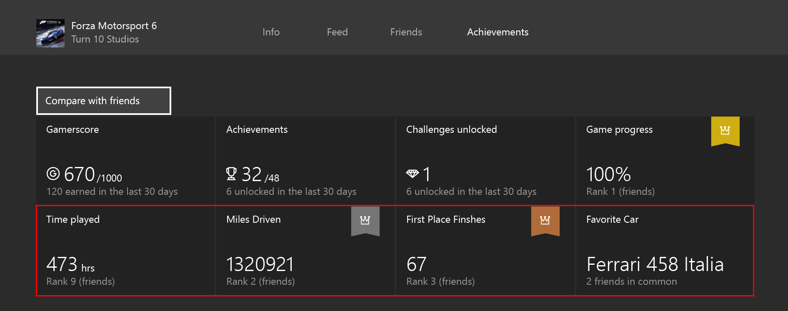
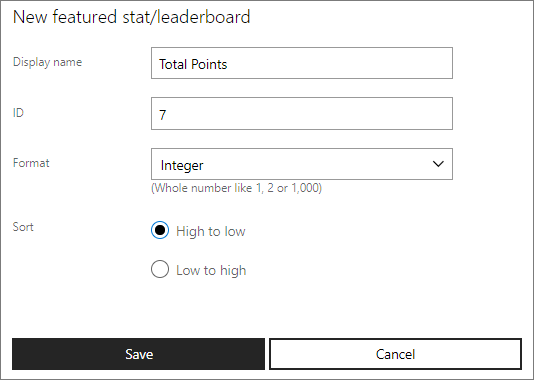

# Configuring Featured Stats and Leaderboards 2017 on Windows Dev Center

For a game to interact with the stats service, a stat needs to be defined in the [Windows Dev Center](https://developer.microsoft.com/dashboard). All featured stats will show up on the GameHub, which makes it automatically act as a leaderboard. We will store the raw value, however, the game will own the logic for determining if a new value should be provided.

With Data Platform 2017, you only need to configure a stat which is used for a global leaderboard that is featured on a player's GameHub page.

You can use Windows Dev Center to configure a featured stat and leaderboard that is associated with your game. Add configuration by doing the following:

1. Navigate to the **Featured stats and leaderboards** section for your title, located under **Services** > **Xbox Live** > **Featured stats and leaderboards**.
2. Click the **New** button which will open a modal form. Once filled out, click **Save**.

The **Display name** field is what users will see in the GameHub. This string can be localized in the **Localize strings** of the Xbox Live service configuration.

The **ID** field is the stat name and is how you will refer to your stat when updating it from your code. See the [Updating Stats](../../leaderboards-and-stats-2017/player-stats-updating.md) for more details.

The **Format** is the data format of the stat. Options include Integer, Decimal, Percentage, Short timespan, Long timespan and String.

The **Sort** field lets you change the sort order of the leaderboard to be either ascending or descending.

Please note the following requirements when configuring a featured stat and leaderboard:

| Developer Type | Requirement | Limit |
|----------------|-------------|-------|
| Xbox Live Creators Program | There is no requirement to designate any stats as Featured Stats | 20 |
| ID@Xbox and Microsoft Partners | You must designate atleast 3 Featured Stats | 20 |

## Next steps

Next you'll need to update the stats from your code.  See [Updating Stats](../../leaderboards-and-stats-2017/player-stats-updating.md) for more details.
