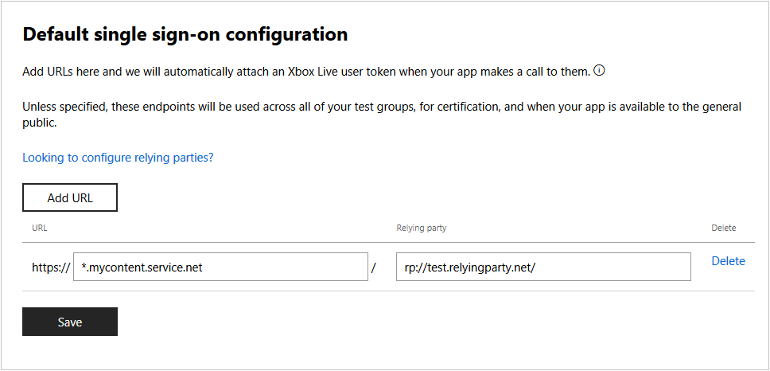

# Configure single sign-on in Dev center

Single sign-on allows a player using your title to sign into your services by using their Xbox Live sign-in. This lets a player that is signed into Xbox Live run an app or game for your service without having to log in a second time using a different account credential specific to your service.

> [!NOTE]
> This topic does not apply to titles in the Xbox Live Creators Program.

For example, your title might be an app that enables your service to stream content (videos, music, etc.) to their device, as long as they have a valid account with your service. If the user is logged into their Xbox Live account, they should be able to stream content without having to sign in to your service each time.

Also, if your app sends Kinect data to an external service, you can configure that here.

If your service requires that the user creates an account separate from Xbox Live, you should provide a way for the user to link their Xbox Live account with their account on your service as a one time action.

When you configure single sign-on, you can specify URLs and their relying party. Any time that your app calls any of the URLs specified, Xbox Live will automatically attach an Xbox Secure Token Service (XSTS) token. The service that receives the key is known as a *relying party*, and you must configure [relying parties](https://developer.microsoft.com/en-US/xboxconfig/relyingparties/index) before you can configure single sign-on. Each relying party configuration specifies what information is contained in the XSTS token, as well as a unique encryption key that the relying party can use to decode the XSTS token.

Add configuration by doing the following:

1. After selecting your title in [Dev Center](https://developer.microsoft.com/dashboard/windows/overview), navigate to **Services** > **Xbox Live**.

2. Click on the link to **Xbox Live single sign-on**.

3. Click on the **Add URL** button to create a new single sign-on entry. This will add a new row to the bottom of the list of configurations.

4. In the URL box, enter the URL for your service using a fully qualified domain name. You may replace the lowest-level subdomain with a wildcard character ('\*'). This will match any URL that has the same upper-level domains. For example, "*.example.com&quot; will match "bar.example.com" or "foo.bar.example.com".

5. In the Relying party box, select the relying party configuration that specifies how the XSTS token is encoded.

6. Click on the **Save** button to save your changes.

