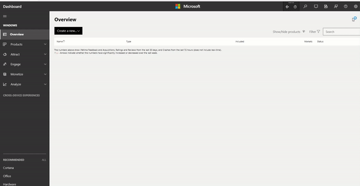

# Set up Web Services in UDC

> [!WARNING]
> The following article is for ID@Xbox and Managed Partner developers only due to restrictions placed on Web Service configuration. Web Services configuration is only available to developers with the Relying Parties account level permission granted. If you do not have control of your account level permissions contact your Development Account Manager (DAM) for assistance.

Publishers can create Web Services if they want to customize the way their apps/titles interact with Xbox Live services. Web Services are publisher-level configurations and can be called by any title within a sandbox owned by the publisher by configuring single sign-on.

Reasons to define Web Services:

1. Providing single sign-on to Xbox Live users - In order for your web service to provide single-sign-on to Xbox Live users, it needs to be configured as a relying party of Xbox Live. When configured that way, users who are authenticated to Xbox Live will automatically be authenticated to your service without having to re-enter a different set of credentials.
2. Making service to service calls from your service to Xbox Live services - If your product will use one of your web services to make calls to an Xbox Live service, either directly or on behalf of individual users, you'll need a business partner certificate.

1. ## Create a Web Service

1. Go to the [Partner Center Dashboard](https://partner.microsoft.com/dashboard/windows/overview)  
2. Click on the gear shaped icon at the top right corner of the page to access the **Settings** dropdown.
3. Within the dropdown, select **Developer Settings**.
4. On the left-side navigation bar, expand the option **Xbox Live** and select **Web Services**.

5. In the Web Services page, click on **New Web Service**.
6. Enter the Web Service Name and choose the access type as required.  
    * Telemetry access enables your service to retrieve game telemetry data for any of your games.
    * App Channel access gives the media provider owning the service the authority to programmatically publish app channels for consumption on console through the OneGuide twist.
7. Click **Save**

At this point, you have defined the service and Xbox Live is aware of the existence of the service. Depending on the reasons for creating the web service, you will be required to configure Relying Parties(Single Sing-On) or Business Partner Certificates(Service-to-service calls).  

## Configure Relying Party

A web service needs to be configured as a relying party of Xbox live in order to provide the Single Sign-On experience to Xbox Live users – users who are authenticated to Xbox Live will be automatically authenticated to the web service without having to re-enter a different set of credentials. To facilitate this, trust must be established between Xbox services and the web service. A set of claims (such as gamertag, device type, title ID) are used as part of relying party configurations to enforce this trust. This is the information exchanged between Xbox Live and the web service to help automatically authenticate users.

### Create a Relying Party

1. Go to the Partner Center Dashboard  
2. Click on the gear shaped icon at the top right corner of the page to access the **Settings** dropdown.
3. Within the dropdown, select **Developer Settings**.
4. On the left-side navigation bar, expand the option **Xbox Live** and select **Relying Parties**.
5. On the Relying Parties page, click on **New Relying Party**.
6. Enter a URI for the relying party in this format: *example.com*.
7. Select the encryption type to be used to ensure security of the relying party service.
8. If you selected Symmetric Encryption with shared keys in the previous step, click on **Generate new key** to get a new shared key. Follow the instructions on the screen to securely save the key.
9. Enter the **Token Life Time** in hours.
10. Under **Claims**, the dropdown offers a list of claims that your relying party service can use for the purpose of authentication. Select all the claims that you want to use. The selected claims will appear below the dropdown. Some standard claims will be populated in that space by default.
11. Click **Save** when you're done.  

## Configure a Business Partner Certificate

If your product will use one of your web services to make calls to an Xbox Live service, either directly or on behalf of individual users, you'll need a business partner certificate.

### Generate a Business Partner Certificate

Proceed with the steps below after successfully creating a Web Service.  

1. On the Web Services page, find the web service that you want to associate a Business Partner Certificate with.
2. Select the **Generate Certificate** link against the chosen web service.
3. Click on **Show Options** next to Generating a New Certificate. This will display commands that should be run from PowerShell with Administrator privileges.
4. Running all the commands one after the other should successfully give a Base64 encoded blob. This is the public key. Copy the public key from PowerShell and paste it in the placeholder for the CSP Blob.
5. Click **Download** and follow the instructions on the page for Binding the certificates.
    1. Use the same computer you used to generate the public key.
    2. Run this command in PowerShell: *mmc.exe*
    3. Select File and select Add/Remove Snap In.
    4. Select Certificates and select Add. Make sure to select Computer Account for the certificate snap-in and then click Finish and click OK.
    5. Open the Personal\Certificate store.
    6. Right click on Certificates and select All Tasks and select Import.
    7. Select the certificate you downloaded from UDC.
    8. Right click on the certificate in the UI after it was imported and select All Tasks and select Export.
    9. Follow the Export wizard and be sure to select to export the private key with the certificate.
    10. Finish the Export wizard.