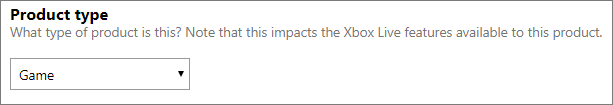
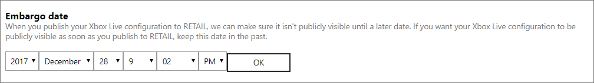

# Configure Xbox Live Setup on Windows Dev Center

You can use [Windows Dev Center](https://developer.microsoft.com/dashboard) to configure the initial set of Xbox Live properties that are associated with your game. Add configuration by doing the following:

1. Navigate to the **Xbox Live Setup** section for your title, located under **Services** > **Xbox Live** > **Xbox Live Setup**.
2. On this page, you can set the title names, default locale, product type, device families and the embargo date. Once you are done setting your configuration, click the **Save** button to submit the changes.

## Title names
By clicking on **Add localized title**, you can enter a name for your product and select a language to localize it to. Note here that the title name should map to the localized product names that you have defined on the properties page of the submission. Default is English (en-US).

## Default locale
This option allows you to set the default language to be used to configure all your strings in the Xbox Live service configuration. For example, if you set the default locale to Spanish (es-ES) and you want to configure an achievement, then at a minimum, the achievement name and description would have to be in Spanish. In other words, you cannot set this option to Spanish but only provide the achievement information in English. All of your Xbox Live service configuration must be provided in the same version as that of the default locale. By default, the default locale is set to English (en-US).
> [!NOTE]
> Additionally, all strings can be localized in the Localized strings page.  

## Product type
The drop-down menu allows you change the type of the product. It defaults to the type **Game**. The choice you make will impact the Xbox Live features available to you. You have three options to choose from:
1. App 
2. Game 
3. Game demo 

## Device families
This configuration allows you to choose the type of devices on which your title can access Xbox Live. By default, all device families are enabled. You can check the devices to enable them.

## Embargo date
The date you select will determine when your Xbox Live configuration goes live to the public. It is important to note that even if you published your changes to RETAIL they will not go live unless the embargo date has been met. To explain further:
1. If you select a date in the future, the changes will become available to the public on that date.
2. If you select a date in the past, the changes will become available to the public as soon as you publish your changes to RETAIL.

Click on the date-time picker and it will expand to allow you to select the precise date and time. Once you click **OK**, the embargo date will be set.

## Advanced settings

You can click **Show options** to set the **Multiple points of presence**. Multiple points of presence allows the same user to sign in to Xbox Live from multiple devices at the same time. Xbox Live features such as, achievements and multiplayer will have limited access. Hence, this option is not recommended for games. Enable this option by checking the box.
