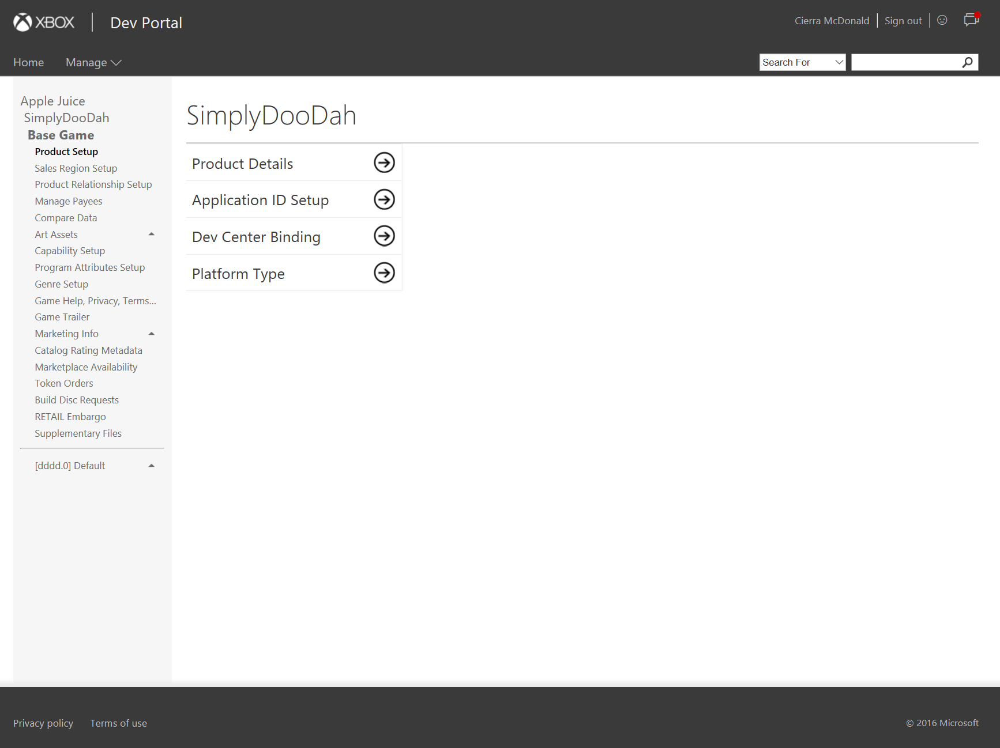
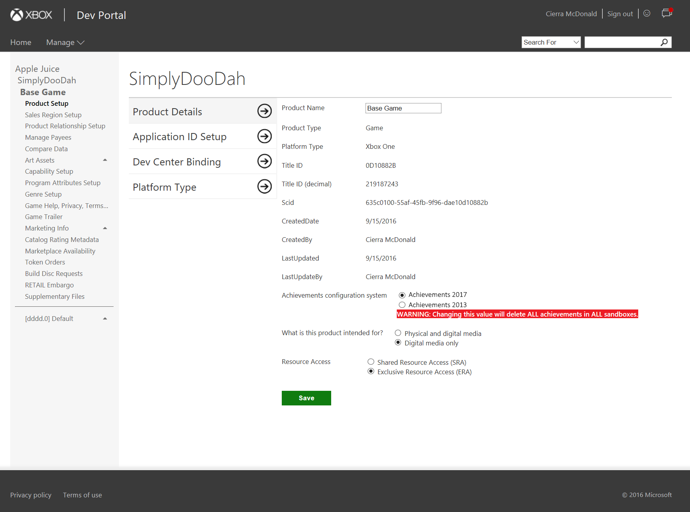
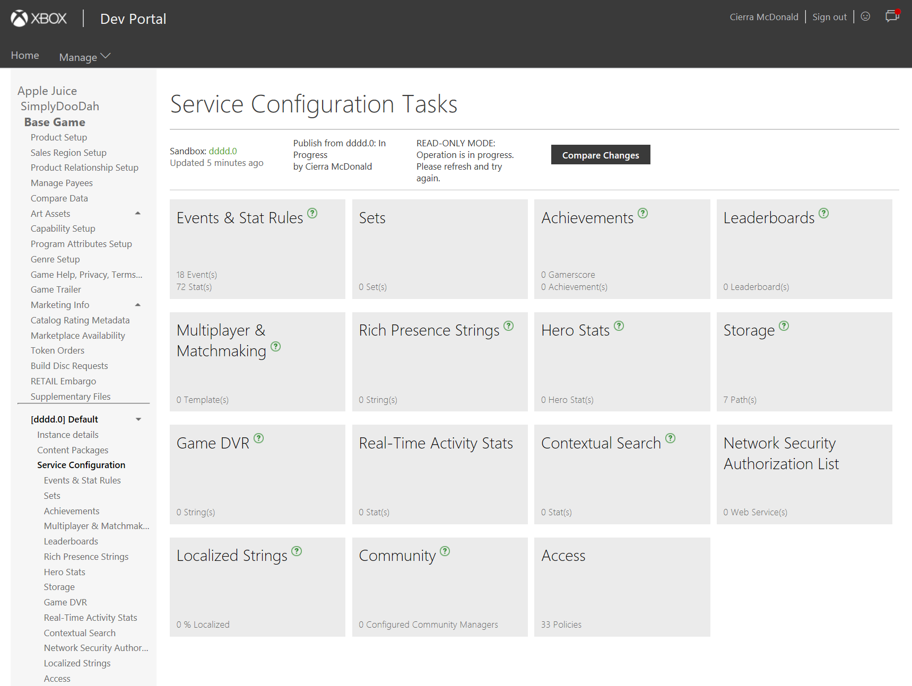
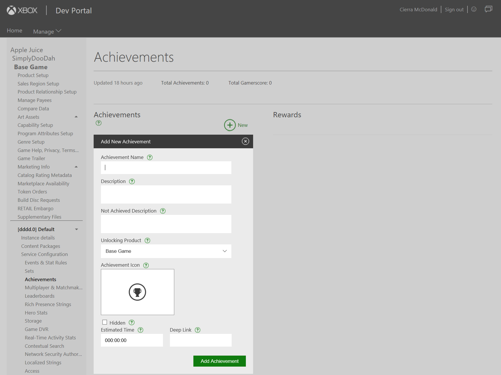
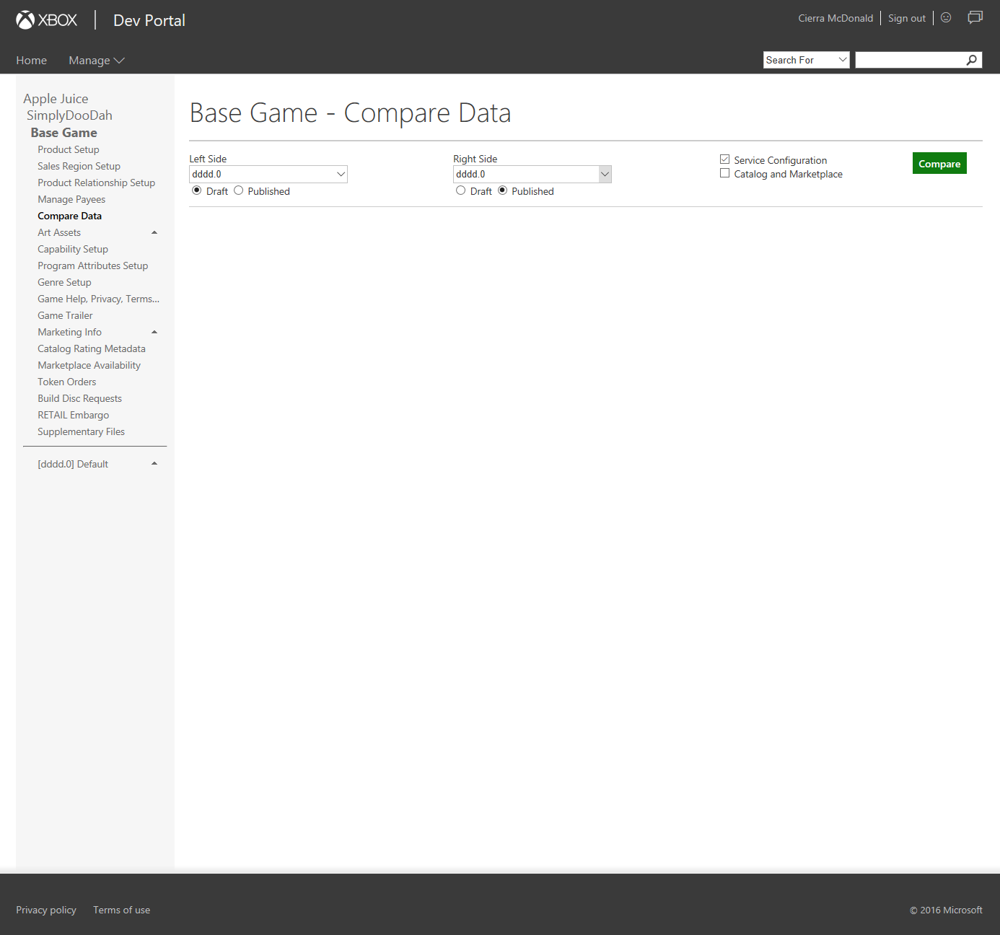
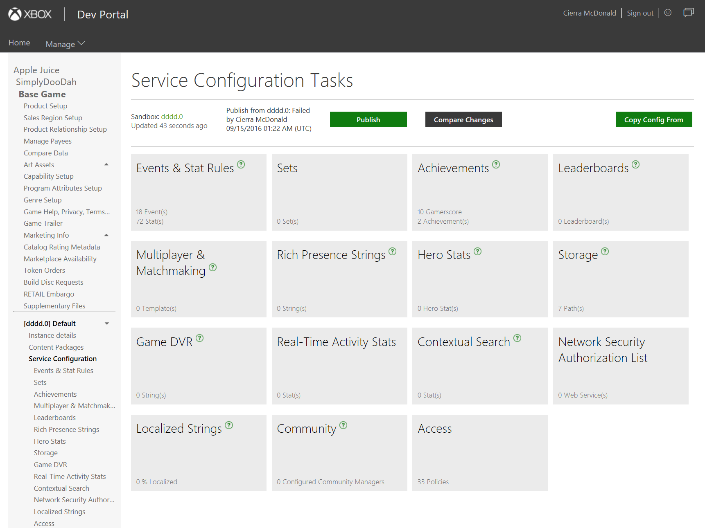
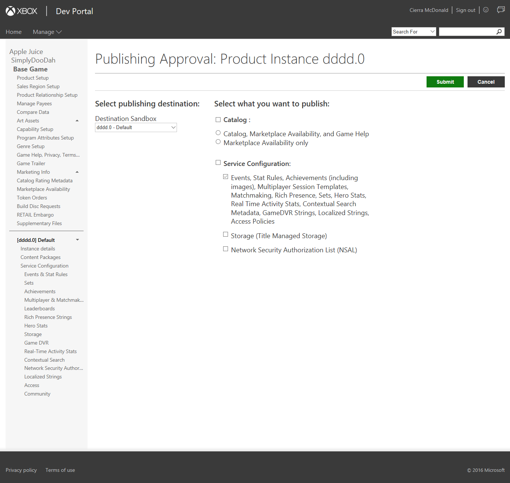

# Configure Achievements 2017 on XDP

In the Achievements 2017 system, the only configuration needs for an achievement are its name, locked & unlocked descriptions, display image, and reward information. (Note: Valid achievement rewards still include: Gamerscore, art rewards, and in-game rewards.)

## Enable Achievements 2017

The Achievements system used by your title is managed at the product level.  

Developers may switch their products between Simplified and Cloud-Powered Achievements systems at any time prior to publishing into RETAIL. Upon switching Achievements systems, in either direction, all of your title’s configured & published achievements (and challenges, if applicable) will be deleted from every sandbox. 

Once a title’s service configuration has been published to RETAIL, its Achievements system is permanently set and cannot be changed. **No exceptions can be made. This is required for both technical & policy reasons.**

1.  From your product page in XDP, navigate to **Product Setup**.

2.  Select **Product Details**.

1.  Switch the **Achievements configuration system** toggle to *Achievements 2017.*

1.  You will receive a warning that all of your title’s achievements will be deleted in all sandboxes. If you are OK with the deletion of your existing achievements in all sandboxes, click **Save**.

## Configure an Achievement

1.  Enable Achievements 2017 for your title.

2.  Navigate to **Service Configuration** and select **Achievements**.

1.  Enter the achievement display details.

    *Note: These strings are used for display in the XDP UI. The final strings that will be shown to users must be configured in the “Localized Strings” service configuration option (step 5).* 

1.  To add Gamerscore, Artwork, or In-App reward onto the achievement, click **New** under the **Rewards** section.

1.  If supplying localized strings for your achievement names & descriptions, navigate to **Localized Strings.**

    *Note: Don’t forget to define your English localized strings. Otherwise, your users in non-USA countries who prefer English text may not get the expected result.* 

1.  To compare your recent changes to the currently published service configuration data, navigate to **Compare Data** and select the desired sandboxes for comparison.

1.  When ready to publish & test in your dev sandbox, return to **Service Configuration** and click the **Publish** button.

1.  Choose the destination sandbox where you want to test (likely the same sandbox where you drafted the achievements).

    Select the *Events, Stat Rules, Achievements…* checkbox under Service Configuration.

    Click **Submit.**

