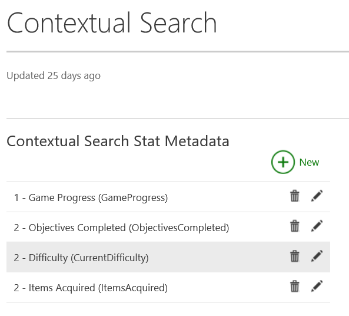
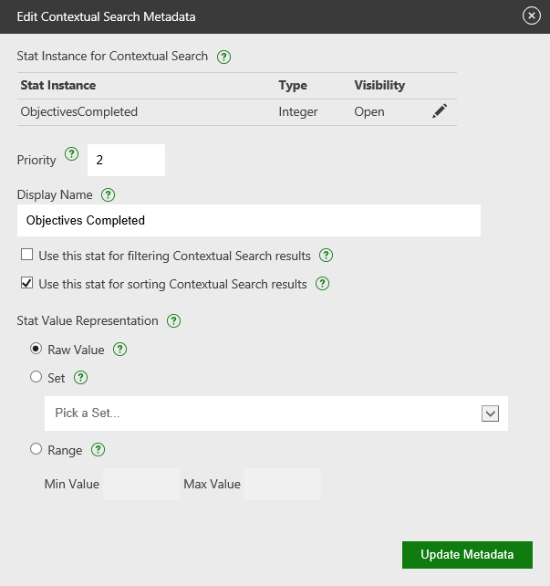
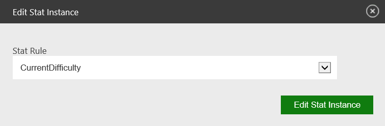

# Configuring Contextual Search

## Configuration Info

### Designing Your Data
When configuring your title for Contextual Search, it's important to think about the things that make your title unique.  If a user is looking for video content, what would be top of mind to search for?  How granular does the data need to be?

Contextual Search supports the ability to both filter and sort content, so your metadata should reflect these search constructs to ensure great coverage.  A good rules of thumb is to think of your game's data in two pivots:
1. Game State - ex.  Level, Character, Weapon, Map, Role, Checkpoint/Story Point, DLC
2. User Skill - ex. K/D Ratio, Prestige, Rank, Speed Run Time

The first pivot is great for filtering content, the second is great for sorting.  Additionally, depending on the type of content being surfaced, varying levels of stat granularity are important.  For broadcasts, assuming there is a limited number of active broadcasts at any given time, lower granularity data will ensure a higher likelihood of a successful search.  For game clips, the number continually increases, so finer granularity data will ensure more accurate results.

It's quite likely that you already have this data created for Xbox Live features like Rich Presence or Hero Stats, so this is a great opportunity to leverage already completed work.

If you are using stats to filter content, be aware that all Contextual Search stats are available to query at any time.  You should design your eventing accordingly to support this.

For example, if you are using stats like SinglePlayerMap and MultiplayerMap to filter content, the player is only going to be in one of them at once.  However, both values will be available to query from the service at any time.  It’s important that as you set one, you clear out the other.  For string based stats, an empty string is great (make sure not to include that in your UI configuration as an option).

### Configuring a Stat for Contextual Search
Configuring your title for Contextual Search is easy once you've set up the Events and Stats that power the tagging.  See other existing XDP documentation on setting this up if you're not already familiar.



The image above is an example of the main page after you click the Contextual Search tile in the main Service configuration portion of XDP.

Even if this is the first time you've visited this page, it's possible that you will see stats already configured for Contextual Search.  This is because all your Hero Stats are automatically set up for Contextual Search. You're not required to keep these Hero stats in your configuration, but they are generally excellent for sorting (and already done for you).

Presently, the maximum number of stat instances you can configure for Contextual Search is 10.

On this page, each of the stats is represented in the following manner:
Priority - Display Name (Stat Instance Name)

Each of these will be explained in more detail in the next section.



The above image is the screen that will appear if you choose to create a new Contextual Search stat or edit and existing one.

To successfully configure a stat for Contextual Search, complete the following steps:
1. Choose your stat instance.

  

  Please note that only stat instances are supported - stat templates are not accepted.  You should also be aware of the visibility you've set for the stat instance (configured in the Stats portion of XDP).  Only stats that are marked as **Open** will appear in third party experiences.

2. Choose your stat Priority. This is a way to delineate the importance of this stat relative to others for search experiences/algorithms.  The acceptable values are 1-10 (1 is the highest).  Leave as 0 or blank for this to be ignored.
3. Add your Display Name.  This is a localizable string that is exposed to the end user.
4. Check whether you will use this stat to Filter or Sort the results.  You can check both in certain instances (if the value of the stat is a number - preferably in a Defined Range).
5. Choose how your stat value is represented.  In the case you have 3 options.
   * Raw Value - The stat is represented as is and has no range requirements.  This is best used for sorting.
   * Set - The values are mapped to individual localizable strings.  This is best used for filtering.
   * Range - The values fall within a min and max range.  This type is great if you want to filter and sort from this data.

#### Explaining Sets
If you aren't familiar with Sets, they are a way to map potential stat values to localizable strings that can be exposed to an end user.  They are very important to the Contextual Search stats you want to filter with.


As an examples, let’s say I have an integer Stat called SinglePlayerMap.  Showing a bunch of numbers to end users doesn’t make any sense.  So instead, I create a Set of mappings like ```{{0, “Blood Gulch”}, {1, “Lockout”}, {2, “Zanzibar”}}```.  The user will see the string, but we use the number as part of the Contextual Search search-query.  You can map integers or strings to localized strings in Sets.


### Updating Your Contextual Search Document
At present, you can easily change the stats on your Contextual Search document as we only support broadcasting at the moment (which is volatile data).  Once we begin to support game clip tagging (September 2015), if you decided to add or remove stats, you will be impacting clips that have already been indexed.  If you add a new stat, only game clips and broadcasts created after the change goes into effect will be tagged and surfaced in queries using the new stat. Old game clips will not be query-able from this stat. If you remove a stat from the Contextual Search document, the old stat attached to the game clip will be useless and will not be returned.
