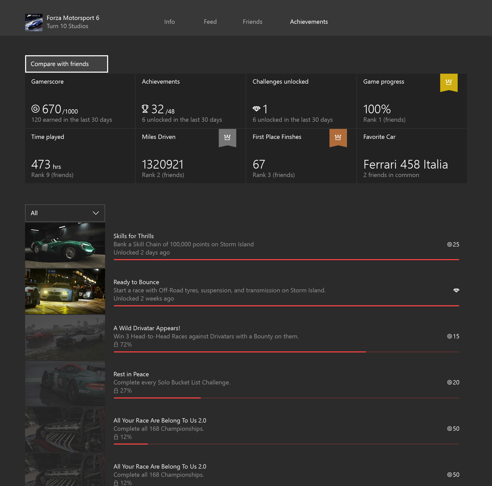
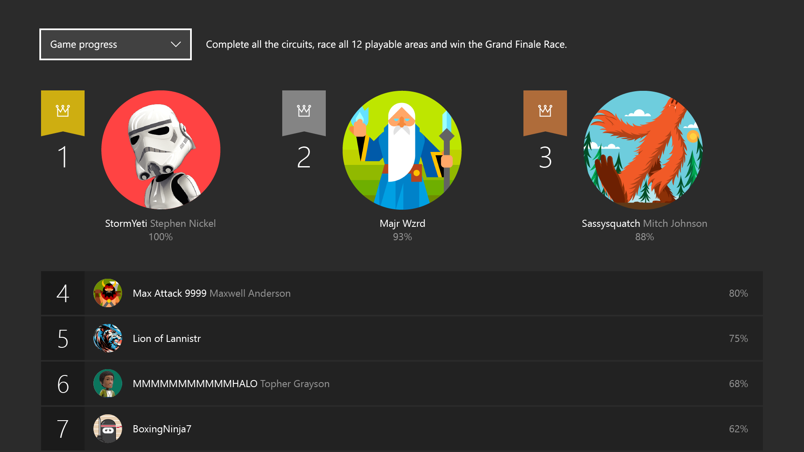

# Designing Xbox Live Experiences

This topic walks you through a sample process of thinking about and adding user statistics,
achievements, and leaderboards to your game by using the Data Platform features of Xbox Live.

## Example
Let's configure a fictional game that shows you how Data Platform can help you light up amazing Xbox Live experiences in the Xbox One dashboard, the Xbox app on Windows 10, and in your game. For this scenario, we'll work with an imaginary racing game called _Races 2015_.

To get the most value out of these experiences, we will follow these recommended planning phases:
1. Design your XBL experiences
2. Design the stats needed to power your scenarios
3. Configure Featured Stats, Achievements, or Leaderboards as needed

## 1. Design your Xbox Live experiences
We want _Race 2015_ to get the most out of Xbox Live in order to keep users engaged both inside and outside of the game. The first questions to ask are:

1. What do we want our GameHub's Achievements tab experience to be like? (Featured Statistics & Social Leaderboards)
2. What goals and motivations do we want to give to the players to do in the game? (Achievements)
3. What scores or stats do we want players to use to rank themselves against other players in game? (Leaderboards)

### GameHubs - Featured Statistics and social Leaderboards
GameHubs are landing experiences where users can learn everything about a game. As a developer and/or publisher, this is the perfect place for you to _showcase_ how great and rich your game is to Xbox users who have not bought the game yet. GameHubs are also designed to show progress and engaging metrics to gamers who already own the title. Under the Achievements tab, users can find Game Progress & Achievements, Hero Stats, and social Leaderboards.

This section's goal is to capture the most engaging metrics for the game and expose them to provide a unique picture of the players's experience with the game and rank them against their friends in a social leaderboard. For instance, the Forza 6 Achievement tab could look something like this:

You'll notice some of the statistics such as Miles Driven and First Place Finishes have gold, silver, or bronze decorations that illustrate where the player ranks against his friends. Interacting with any of these statistics will show a complete leaderboard like this:

 For _Race 2015_, we believe the following is a good set of statistics that represent a player's experience with the title as well as good ranking metrics:
 * Fastest lap
 * Most 1st place wins
 * Miles driven

### Achievements
Achievements are a system-wide mechanism for directing and rewarding users' in-game actions in a consistent manner across all games. Designing this correctly helps guide users to experience the game at its fullest and extends the lifetime of the game.

For _Races 2015_, here is a subset of the achievements we want to configure:
* Finish 1 lap in under 60 seconds
* Finish 10 races in 1st place
* Complete at least 1 race in each the tracks
* Own 5 cars
* Drive for 10,000 miles
* ...

###  Leaderboards
Leaderboards provide a way for gamers to rate themselves against other gamers for specific actions they can achieve in the game. Besides the social leaderboards in the GameHubs, we can configure Global Leaderboards to be used in game. These are some of the Leaderboards we'll want to rank all of our users on:

* Fastest lap time
 * Metadata: track where this happened
 * Metadata: car used
 * Metadata: weather conditions
* Most 1st place wins
* Most cars collected

## Next Steps
Now that you know how to effectively design Stats, Leaderboards and Achievements, you can now begin to start implementing these in your title.  The next few sections will describe the end-to-end process starting with configuration on Dev Center.

See [Player Stats](../leaderboards-and-stats-2017/player-stats.md)
