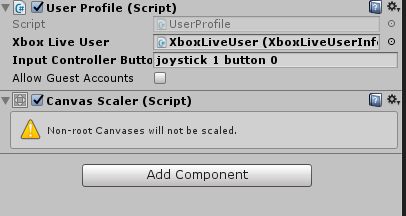

# Add controller support to Xbox Live prefabs

> [!IMPORTANT]
> The Xbox Live Unity plugin does not support achievements or online multiplayer and is only recommended for [Xbox Live Creators Program](../developer-program-overview.md) members.

All of the Xbox Live Unity Plugin Prefabs support specifying controller input in the inspector.

For example, let's say you have a game object called `UserProfile1` which is based on the `UserProfile` prefab. If you would like to tie this game object to Player 1 and have them sign in with the `A` button on their Xbox Controller, simply write `joystick 1 button 0` in the `Input Controller Button` field in the inspector.

  

## All Prefab Controller Input Fields
### UserProfile prefab
- **Input Controller Button:** Adds and signs in an Xbox Live user.

### Social prefab
- **Toggle Filter Controller Button:** Toggles the filter to show either 'All' friends or 'Online' friends.

### Leaderboard prefab
- **First Controller Button:** Takes the player to the first page of leaderboard entries.
- **Last Controller Button:** Takes the player to the last page of leaderboard entries.
- **Next Controller Button:** Takes the player to the next page of leaderboard entries.
- **Prev Controller Button:** Takes the player to the previous page of leaderboard entries.
- **Refresh Controller Button:** Refreshes the leaderboard view.

### Game Save UI prefab
- **Generate New Controller Button:** Generates a new integer save data.
- **Save Data Controller Button:** Saves the current data into the Connected Storage.
- **Load Data Controller Button:** Loads data currently saved in the Connected Storage.
- **Get Info Controller Button:** Retrieves information about saved containers in the Connected Storage.
- **Delete Container Controller Button:** Deletes the saved container from the Connected Storage

## Xbox Controller Button Mappings

For the Xbox Controller Button Mappings in Unity, check out this [Unity Controller Wiki page](http://wiki.unity3d.com/index.php?title=Xbox360Controller).
