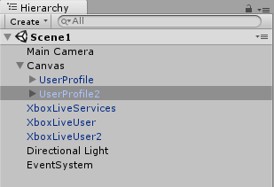
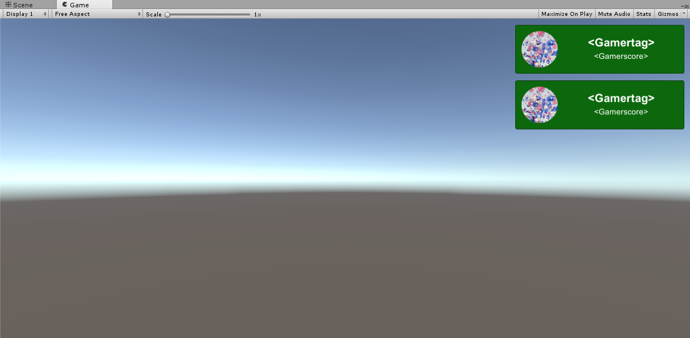
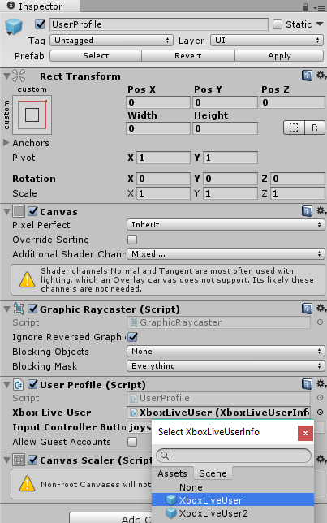
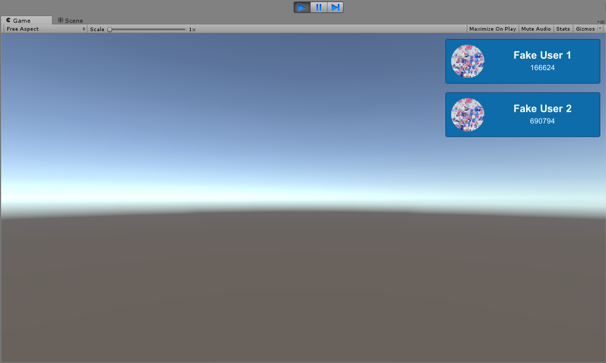

# Add multi-user support to your Unity Game
> [!IMPORTANT]
> The Xbox Live Unity plugin does not support achievements or online multiplayer and is only recommended for [Xbox Live Creators Program](../developer-program-overview.md) members.

Multi-user support is now supported by the Xbox Live Unity Plugin for scenarios that involve multiple local players. Each player can use their own Xbox Live account for stats and sign-in. Your game can also enable guests for users that do not have Xbox Live accounts to play. This feature is only supported on Xbox consoles.

This tutorial will walk you through how to add multi-user support to the different Xbox Live Prefabs.

> [!IMPORTANT]
> Multi-User Scenarios are only supported on Xbox consoles. This functionality does not work on PC.

## Prerequisites
You will need to have followed the [Getting Started](configure-xbox-live-in-unity.md) tutorial to enable and configure Xbox Live.

## Adding and signing in multiple Xbox Live users

1. From the **Assets** > **Xbox Live** > **Prefabs** folder, drag onto your scene as many **XboxLiveUser** prefab instances as there will be players. For this tutorial, there will be two players so two **XboxLiveUser**  instances will be added to the scene. We'll refer to them as **XboxLiveUser** and **XboxLiveUser2** for convenience.

2. To properly add the users and sign them in, add two instances of the **UserProfile** prefab to the scene, one for each **XboxLiveUser**. Make sure you have an instance of the `XboxLiveServices` prefab on the scene. Also, make sure to move the two **UserProfile** objects apart on the scene to tell them apart. Since these prefabs use the Unity Eventsystem, please make sure that you have an instance of the `EventSystem` on the scene.

    

    

3. Assign one instance of the **XboxLiveUser** prefabs you have on the scene to each of the **UserProfile** objects.

    

4. Since Multi-User applications are only supported on Xbox One devices, adding controller support to the **UserProfile** objects is required. On each **UserProfile** object, there is a field called `InputControllerButton` where you can specify the joystick and button numbers each **UserProfile** should listen to.

For this tutorial, we'll use `joystick 1 button 0` for the **UserProfile** that Player 1 is assigned to and `joystick 2 button 0` for Player 2 and the second **UserProfile** game object. This will assign the `A` button for interacting with **UserProfile** for the two controllers.

> [!Note]
> For more details about Xbox Controller Support in the Xbox Live Unity Plugin, please check out: [Add Controller Support to Xbox Live Prefabs](add-controller-support-to-xbox-live-prefabs.md)

5. Run the scene in the editor and hit run on each of the buttons to make sure everything is configured correctly.

    

## Building and Testing the UWP

1. After following the steps outlined at the [Develop Creators Titles with Unity](configure-xbox-live-in-unity.md) tutorial, open the exported UWP solution in Visual Studio.

2. Under the UWP project of your game, right click on the `package.appxmanifest.xml` file and choose **View Code**.

3. Under the `<Properties></Properties>` section, add the following which enables multi-user input for the app:
  `<uap:SupportedUsers>multiple</uap:SupportedUsers>`

4. To test on Xbox, follow the documentation at the [Set up your UWP on Xbox development environment](https://docs.microsoft.com/en-us/windows/uwp/xbox-apps/development-environment-setup) tutorial.

## Using the other Xbox Live Prefabs with multiple Users

In the **Examples** folder of the plugin, there is a **MultiUserExample** scene that shows how the different prefabs can use the **XboxLiveUser** instances to display specific information for each user.
