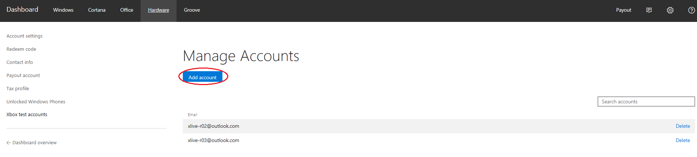
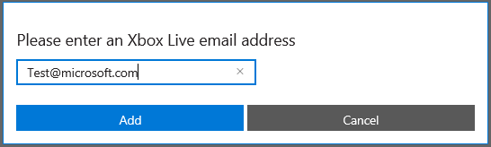
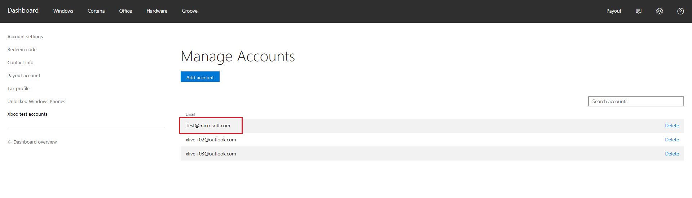

# Authorize Xbox Live Accounts for Testing in your environment

This topic will go through the process of setting up an Xbox Live account with your publishers test environment

## Prerequisites

You will need the following to authorize an Xbox Live test account:

* An [Xbox Live account](https://support.xbox.com/browse/my-account/manage-account/Create%20account)

## Navigate to the Xbox Test Account page
This is located in the Account Settings section of Dev Center

You can arrive at this section in one of two ways

1. From the Dev Center dashboard click the settings gear ⚙️ which will take you to the account view. In the left navigation of the account view click the **Xbox test accounts** link
2. From your Xbox Live Creators configuration page locate the test section and click the link entitled **Authorize Xbox Live accounts for your test environment**

## Authorize an Xbox Live Account for your test environment

* Once within the Xbox test accounts page you should see a list of all currently authorized accounts. To authorize a new account, click the Add account button

* A modal should pop into the screen with one text box where you can enter the desired account’s email address

* Click the add button to validate that the email address exists and has an associated Xbox Live Account. If the checks pass the modal will disappear and you will see the new account in the table indicting it is now successfully authorized for your test environment

## Troubleshooting

The email entered in the modal is run through a few checks including a lookup to ensure there is an Xbox Live account associated with it. If any of these checks fail, the account is not added to the table and therefore not authorized and you may get a "Sorry, there was an issue adding your email address" error.

A good check if you are having issues is to try and sign in with the account on [Xbox.com](http://www.xbox.com/live/). If you can’t sign in then the account is not an Xbox Live account.
