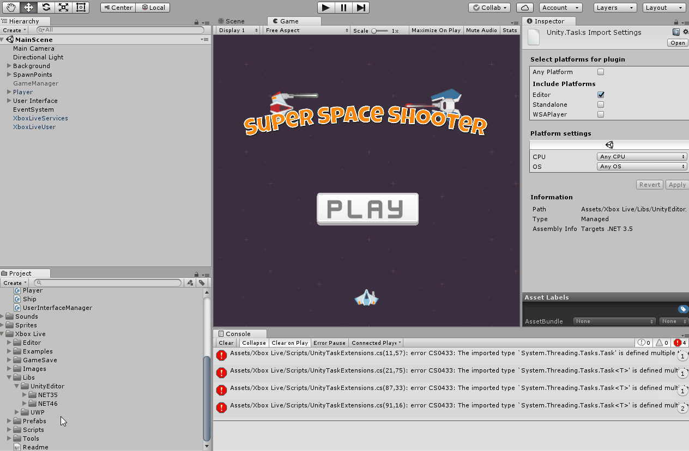
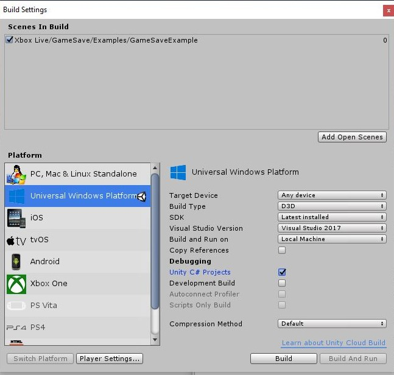

# Configure Xbox Live in Unity

> [!NOTE]
> The Xbox Live Unity plugin is only recommended for [Xbox Live Creators Program](../developer-program-overview.md) members, since currently there is no support for achievements or multiplayer.

With the [Xbox Live Unity Plugin](https://github.com/Microsoft/xbox-live-unity-plugin), adding Xbox Live support to a Unity game is easy, giving you more time to focus on using Xbox Live in ways that best suit your title.

This topic will go through the process of setting up the Xbox Live plugin in Unity.

## Prerequisites

You will need the following before you can use Xbox Live in Unity:

1. An **[Xbox Live account](https://support.xbox.com/browse/my-account/manage-account/Create%20account)**.
1. Enrollment in the **[Dev Center developer program](https://developer.microsoft.com/store/register)**.
2. **[Windows 10 Anniversary Update](https://microsoft.com/windows)** or later
3. **[Unity](https://store.unity.com/)** versions **5.5.4p5** (or newer), **2017.1p5** (or newer), or **2017.2.0f3** (or newer) with **[Microsoft Visual Studio Tools for Unity](https://marketplace.visualstudio.com/items?itemName=SebastienLebreton.VisualStudio2015ToolsforUnity)** and **Windows Store .NET Scripting Backend**.
4. **[Visual Studio 2015](https://www.visualstudio.com/)** or **[Visual Studio 2017 15.3.3](https://www.visualstudio.com/)** (or newer) with the **Universal Windows App Development Tools**.
5. **[Xbox Live Platform Extensions SDK](http://aka.ms/xblextsdk)**.

> [!NOTE]
> If you want to use the IL2CPP scripting backend with Xbox Live, you will need Unity 2017.2.0p2 or newer and the Xbox Live Unity plugin version "1802 Preview Release" or higher.

## Import the Unity plugin

To import the plugin into your new or existing Unity project, follow these steps:

1. Navigate to the Xbox Live Unity Plugin release tab on [https://github.com/Microsoft/xbox-live-unity-plugin/releases](https://github.com/Microsoft/xbox-live-unity-plugin/releases).
2. Download **XboxLive.unitypackage**.
3. In Unity, click **Assets** > **Import Package** > **Custom Package** and navigate to **XboxLive.unitypackage**.

### (Optional) Configure the plugin to work in the Unity Editor (.NET 4.6 or IL2CPP only)

> [!NOTE]
> Support for changing the Scripting Runtime Version in Unity requires the Xbox Live Unity Plugin version "1711 Release" or higher for .NET 4.6 and version "1802 Preview Release" or higher for IL2CPP.

There are three settings that can be configured in Unity to define how your code is compiled:

1. The **scripting backend** is the compiler that is used. Unity supports two different scripting backends for Universal Windows Platform: .NET and IL2CPP.
2. The **Scripting Runtime Version** is the version of the scripting runtime that runs the Unity Editor.
3. The **API Compatibility Level** is the API surface you'll build your game against.

The following table shows the current scripting support matrix for the Xbox Live Unity Plugin:

| Scripting Backend 	| Scripting Runtime Version	| Supported 	| Minimum Unity Version Required |
|-------------------	|-------------------	    |-----------	|------------------------------- |
| IL2CPP            	| .NET 3.5 Equivalent       | No        	| N/A                            |
| Il2CPP            	| .NET 4.6 Equivalent       | Yes       	| 2017.2.0p2                     |
| .NET              	| .NET 3.5 Equivalent       | Yes       	| Same as prerequisites          |
| .NET              	| .NET 4.6 Equivalent       | Yes       	| Same as prerequisites          |

We've added additional scripting runtime support to the Xbox Live Unity Plugin, starting with version "1711 Release". By default, the plugin is configured to run in the Unity editor with the .NET scripting backend and scripting runtime version of .NET 3.5. If your project is using the scripting runtime version of .NET 4.6, you will need to configure the plugin to work properly in the editor:

1. In the Unity project explorer, navigate to **Xbox Live\Libs\UnityEditor\NET46** and select all of the DLLs in the folder.
2. In the Inspector window, check **Editor** under **Include Platforms**.
3. In the Unity project explorer, navigate to **Xbox Live\Libs\UnityEditor\NET35** and select all of the DLLs in the folder.
4. In the Inspector window, uncheck **Editor** under **Include Platforms**.

> [!IMPORTANT]
> These steps will need to be reversed if you change the scripting runtime version in your project back to 3.5.

## Set Visual Studio as the IDE in Unity

Visual Studio is required to build a [Universal Windows Platform (UWP)](https://docs.microsoft.com/windows/uwp/get-started/whats-a-uwp) game. You can set your IDE in Unity to Visual Studio by going into **Edit** > **Preferences** > **External Tools** and setting the **External Script Editor** to Visual Studio.

## Unity plugin file structure

The Unity plugin's file structure is broken into the following parts:

* __Xbox Live__ contains the actual plugin assets that are included in the published **.unitypackage**.
    * __Editor__ contains scripts that provide the basic Unity configuration UI and processes the projects during build.
    * __Examples__ contains a set of simple scene files that show how to use the various prefabs and connect them together.
    * __Images__ is a small set of images that are used by the prefabs.
    * __Libs__ is where the Xbox Live libraries are stored.
    * __Prefabs__ contains various [Unity prefab](https://docs.unity3d.com/Manual/Prefabs.html) objects that implement Xbox Live functionality.
    * __Scripts__ contains all the code files that call the Xbox Live APIs from the prefabs. This is a great place to look for examples about how to properly call the Xbox Live APIs.
    * __Tools\AssociationWizard__ contains the Xbox Live Association Wizard, used to pull down application configuration from the [Windows Dev Center](https://developer.microsoft.com/windows) for use within Unity.

## Enable Xbox Live

For your title to interact with Xbox Live, you'll need to setup the initial Xbox Live configuration. You can do this easily and inside of Unity by using the Xbox Live Association Wizard:

1. In the **Xbox Live** menu, select **Configuration**.
2. In the **Xbox Live** window, select **Run Xbox Live Association Wizard**.
3. In the **Associate Your title with the Windows Store** dialog, click **Next**, and then sign in with your Dev Center account.
4. Select the app that you want to associate with this project, and then click **Select**. If you don't see it there, try clicking **Refresh**. Alternatively, you can create a new app by reserving a name and clicking **Reserve**.
5. You will be prompted to enable Xbox Live if you have not already. Click **Enable** to enable Xbox Live in your title.
6. Click **Finish** to save your configuration.

To call Xbox Live services, your desktop must be in developer mode and set to the same sandbox as your title is in the Xbox Live configuration. You can verify both by looking at the **Xbox Live Configuration** window in Unity:

1. **Developer Mode Configuration** should say **Enabled**. If it says **Disabled**, click **Switch to Developer Mode**.
2. **Title Configuration** > **Sandbox** should have the same ID as **Developer Mode Configuration** > **Developer Mode**.

See [Xbox Live sandboxes](../xbox-live-sandboxes.md) for information about sandboxes.

## Build and test the project

When running your title in the editor, you will see fake data when you try to use Xbox Live functionality. For example, if you [add sign in capabilities](unity-prefabs-and-sign-in.md) to your scene and try to sign in, you will see **Fake User** appear as your profile name, with a placeholder icon. To sign in with a real profile and test out Xbox Live functionality in your title, you'll need to build a UWP solution and run it in Visual Studio.  You can build the UWP project in Unity by following these steps:

1. Open the **Build Settings** window by selecting **File** > **Build Settings**.
2. Add all of the scenes that you want to include in your build under the **Scenes In Build** section.
3. Switch to the **Universal Windows Platform** by selecting **Universal Windows Platform** under **Platform** and clicking **Switch Platform**.
4. Set **SDK** to **10.0.15063.0** or greater.
5. To enable script debugging check **Unity C# Projects**.
6. Click **Build** and specify the location of the project.

Once the build has finished, Unity will have generated a new UWP solution file which you will need to run in Visual Studio:

1. In the folder that you specified, open **&lt;ProjectName&gt;.sln** in Visual Studio.
2. In the toolbar at the top, select **x64** and deploy to the **Local Machine**.

If you enabled **script debugging** when you built the UWP solution from Unity, then your scripts will be located under the **Assembly-CSharp (Universal Windows)** project.

> [!NOTE]
> Before using your Visual Studio build to test your game with real data, follow [this checklist](test-visual-studio-build.md) to help ensure your title will be able to access the Xbox Live service.

> [!IMPORTANT]
> As of May 2018 it is now required that you make an update to the package.appxmanifest.xml file in order to test your UWP title properly in Visual Studio. To do this:
>
> 1. Search the Solution Explorer for the package.appxmanifest.xml file
> 2. Right click the file and choose View Code
> 3. Under the `<Properties><\/Properties>` section, add the following line: `<uap:SupportedUsers>multiple<\/uap:SupportedUsers>.
> 4. Deploy the game to your Xbox by starting a remote debugging build from Visual Studio. You can find instruction to set up your title on an Xbox in the [Set up your UWP on Xbox development environment](../../xbox-apps/development-environment-setup.md) article.
>
> The piece of configuration changed may look like it is enabling multi-player but it is still necessary to run your game in single player scenarios.

## Try out the examples

You're all set to start using Xbox Live in your Unity project! Try opening scenes in the **Xbox Live/Examples** folder to see the plugin in action, and for examples of how to use the functionality yourself. Running the examples in the editor will give you fake data, but if you build the project in Visual Studio and [associate your Xbox Live account with the sandbox](authorize-xbox-live-accounts.md), you can sign in with your gamertag.

Try the **SignInAndProfile** scene for signing into your Microsoft Account, the **Leaderboard** scene for creating a leaderboard, and the **UpdateStat** scene for displaying and updating stats.

## See also

* [Sign in to Xbox Live in Unity](unity-prefabs-and-sign-in.md)
* [Authorize Xbox Live accounts](authorize-xbox-live-accounts.md)
