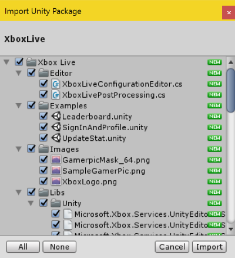
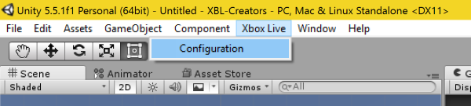
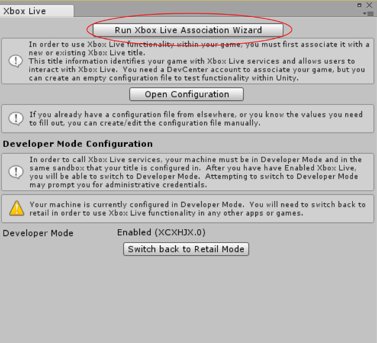
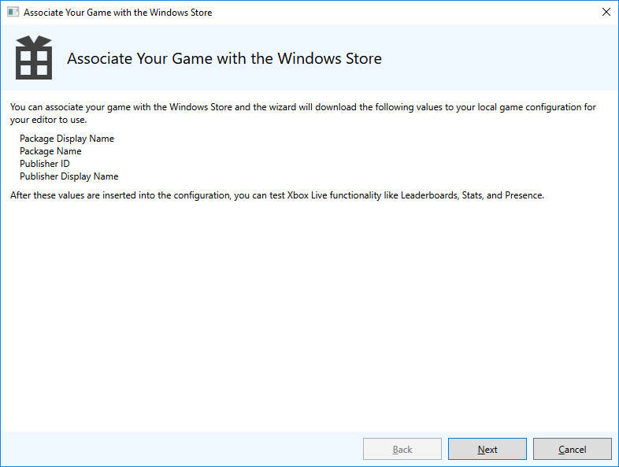
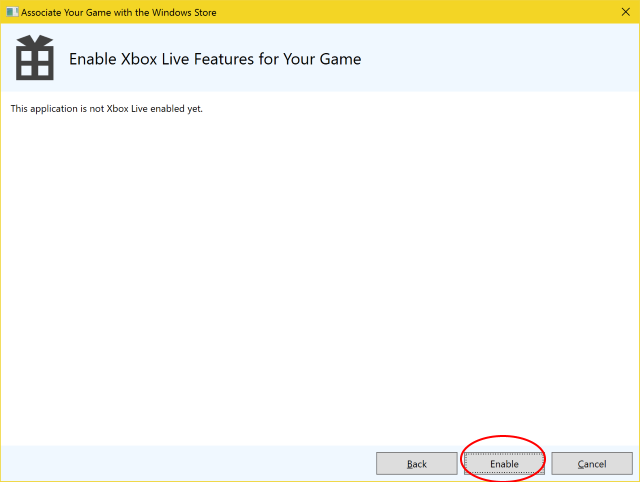
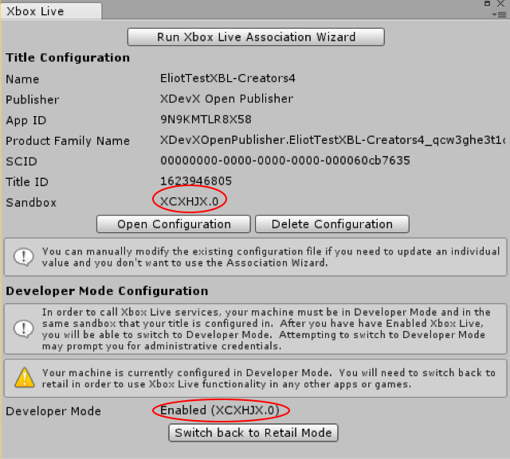
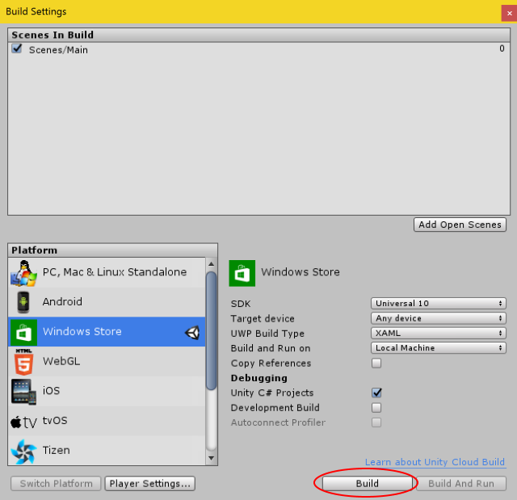
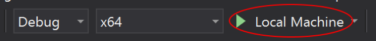

# Configure Xbox Live in Unity

> **Note:**
> The Xbox Live Unity plugin is only recommended for [Xbox Live Creators Program](../developer-program-overview.md) members, since currently there is no support for achievements or multiplayer.

With the Xbox Live Unity plugin, adding Xbox Live support to a Unity game is easy, giving you more time to focus on using Xbox Live in ways that best suit your title.

This topic will go through the process of setting up the Xbox Live plugin in Unity.

## Prerequisites

You will need the following to configure Xbox Live in Unity:

* An [Xbox Live account](https://support.xbox.com/browse/my-account/manage-account/Create%20account)
* [Windows 10 Anniversary Update](https://microsoft.com/windows)  or later
* [Unity 5.5](https://store.unity.com/) or later
  * You need to include the following components when installing.
    * [Microsoft Visual Studio Tools for Unity](https://marketplace.visualstudio.com/items?itemName=SebastienLebreton.VisualStudio2015ToolsforUnity)
    * Windows Store .NET Scripting Backend
* [Visual Studio 2015](https://www.visualstudio.com/) or later
  * Any version of Visual Studio should work for this including Community Edition.
  * Make sure to select everything under **Universal Windows App Development Tools** when installing.  You can modify the installation to include these features for an existing installation as well.
* [Xbox Live Platform Extensions SDK](http://aka.ms/xblextsdk) 

## Import the Unity plugin

To import the plugin into your new or existing Unity project, follow these steps:

1. Navigate to the Xbox Live Unity plugin on [https://github.com/Microsoft/xbox-live-unity-plugin/releases](https://github.com/Microsoft/xbox-live-unity-plugin/releases).
2. Download the XboxLive.unitypackage
3. Double click the XboxLive.unitypackage package, or in Unity click in the menu under Assets | Import Package | Custom Package, to import it into your Unity project.

## Set Visual Studio as Editor in Unity

Set your External Tools in Unity to Visual Studio by going into Unity > Preferences > External Tools and switching to Visual Studio.
This plugin depends on "Microsoft Visual Studio Tools for Unity" so Visual Studio is required to build.

## Unity plugin file structure

The Unity plugin's file structure is broken into the following parts:

* __Xbox Live__ contains the actual plugin assets that are included in the published **.unitypackage**.
    * __Editor__ contains scripts that provide the basic Unity configuration UI and processes the projects during build.
    * __Examples__ contains a set of simple scene files that show how to use the various prefabs and connect them together.
    * __Images__ is a small set of images that are used by the prefabs.
    * __Libs__ is where the Xbox Live libraries will be stored.
    * __Prefabs__ contains various [Unity prefab](https://docs.unity3d.com/Manual/Prefabs.html) objects that implement Xbox Live functionality.
    * __Scripts__ contains all of the code files that actually call the Xbox Live APIs from the prefabs.  This is a great place to look for examples about how to properly call the Xbox Live APIs.
    * __Tools\AssociationWizard__ contains the Xbox Live Association Wizard, used to pull down application configuration from the [Windows Dev Center](https://developer.microsoft.com/windows) for use within Unity.

## Enable Xbox Live

To actually enable Xbox Live in your Unity project, you'll need to follow these steps:

1. In the **Xbox Live** menu, select **Configuration**.

    

2. In the **Xbox Live** window, select **Run Xbox Live Association Wizard**.

    

    > **Note:**
    > Your device must be in developer mode to call Xbox Live services. After you have enabled Xbox Live, you can switch to developer mode by selecting **Switch to Developer Mode**.

3. In the **Associate Your Game with the Windows Store** dialog, click **Next**, and then sign in with your Dev Center account.

    

4. Select the app that you want to associate with this project, and then click **Select**. If you don't see it there, try clicking **Refresh**. Alternatively, you can create a new app by reserving a name and clicking **Reserve**.

5. Click **Enable** to enable Xbox Live in your game.

    

6. Click **Finish** to save your configuration.

7. Back in the **Xbox Live** window in Unity, make sure that under **Developer Mode Configuration** it says **Enabled**. If it says **Disabled**, click **Switch to Developer Mode**.

8. Make sure that the sandbox in which your title resides is the same as the sandbox in which your device currently does. You can see which sandbox your title resides in under **Title Configuration**, next to **Sandbox**; the sandbox that your device is in is under **Developer Mode Configuration**, next to **Developer Mode**, in parentheses. See [Xbox Live sandboxes](../xbox-live-sandboxes.md) for information about sandboxes and how to switch the sandbox on your device. The plugin should switch the sandbox on your device automatically.

    

9. You have now successfully enabled Xbox Live in your Unity project!

## Build and test the project

When running your title in the editor, you will see fake data when you try to use Xbox Live functionality. For example, in the **SignInAndProfile** example scene, if you run it in the editor and try to sign in, you will see **Fake User 123456789** appear as your profile name, with a placeholder icon.

To sign in with a real profile and test out Xbox Live functionality in your title, you'll need to build and then run it in Visual Studio.

1. In Unity, open the **Build Settings** window by selecting **File -> Build Settings** or by pressing **Ctrl+Shift+B**.

2. Make sure that you have the scene that you want to test included in your build under **Scenes In Build**. If it's not listed, open the scene and select **Add Open Scenes**.

3. Switch to the **Windows Store** platform by selecting **Windows Store** under **Platform** and clicking **Switch Platform**.

4. Next to **SDK**, select **Universal 10**.

5. Under **Debugging**, check **Unity C# Projects**.

6. Click **Build**.

    

7. Select a folder in which to put the build in the file explorer.

8. In the folder that you specified, open **&lt;ProjectName&gt;\\&lt;ProjectName&gt;.csproj** in Visual Studio.

9. In the toolbar at the top, select **x64** or **x86**, depending on what your device supports, and deploy to the **Local Machine**.

    

10. If you have added a way to sign in to Xbox Live to your project, sign in using an account with access to the sandbox. You have now connected Xbox Live to your title!

## Try out the examples

You're all set to start using Xbox Live in your Unity project! Try opening scenes in the **Xbox Live/Examples** folder to see the plugin in action, and for examples of how to use the functionality yourself. Running the examples in the editor will give you dummy data, but if you build the project in Visual Studio and associate your Microsoft Account with the sandbox, you can sign in with your gamertag!

Try the **SignInAndProfile** scene for signing into your Microsoft Account, the **Leaderboard** scene for creating a leaderboard, and the **UpdateStat** scene for displaying and updating stats.

## See also

* [Sign in to Xbox Live in Unity](sign-in-to-xbox-live-in-unity.md)
