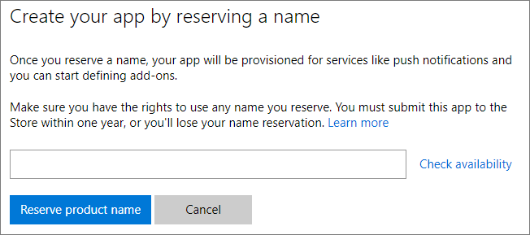
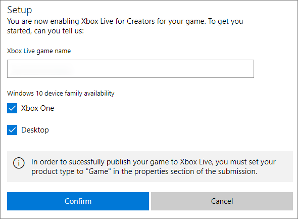

# Create a new Xbox Live Creators Program title and publish to the test environment

## Introduction

Before writing any code, you must setup a new title on your service configuration portal.  You can learn more about service configuration in [Xbox Live Service Configuration](../xbox-live-service-configuration.md)

This article will walk you through this process with the following assumptions

1. You are using the Xbox Live Creators Program.
2. You are developing a Universal Windows Platform (UWP) title.  UWP titles can run on Xbox One, Windows 10 desktop PCs, and mobile
3. You are configuring your title on Windows Dev Center at [http://dev.windows.com/](http://dev.windows.com).  If in doubt, you should use Windows Dev Center.
4. Your development machine is running Windows 10.

Provided that the above are true, the remainder of this article will walk through everything required to get a title configured on Windows Dev Center, a new project created, and Xbox Live sign-in code written and tested.

> **Note**: If you are part of the Xbox Live Creators Program, the above assumptions apply to you and you should follow along with this article

## Dev Center setup

You need an Xbox Live enabled title created on [Windows Dev Center](http://dev.windows.com) as a pre-requisite to any Xbox Live functionality working.

### Create a Microsoft account
If you don't have a Microsoft Account (also known as an MSA), you will need to first create one at [https://go.microsoft.com/fwlink/p/?LinkID=254486](https://go.microsoft.com/fwlink/p/?LinkID=254486).  If you have an Office 365 account, use Outlook.com, or have an Xbox Live account - you probably already have an MSA.

### Register as an App Developer
You will need to register as an App Developer before you are allowed to create a new title on Dev Center.

To register go to [https://developer.microsoft.com/en-us/store/register](https://developer.microsoft.com/en-us/store/register) and follow the sign-up process.

### Create a new UWP title
Next, you need a UWP title defined on Dev Center.  You do that by first going to the Dashboard

 

After clicking on the dashboard, create a new title.  You'll need to reserve a name.

You'll then be taken to the *App Overview* page for your app.  The primary page where you'll be configuring Xbox Live is under the Services -> Xbox Live menu shown below.

## Enable Xbox Live services
When you click the "Xbox Live" link under "Services" first time for an app, you will be taken to the "Enable Xbox Live Creators Program" page.  Click the "Enable" button to bring up the "Enable" dialog.

On the "Enable" dialog, select the platforms of which you would like to enable Xbox Live Services (both Xbox One and Windows 10 PC are selected by default).  Click the "Confirm" button to enable Xbox Live Creators Program for your game.

## Test Xbox Live service configuration in your game
When you make changes to the Xbox Live configuration for your game, you need to publish the changes to a specific environment before they are picked up by the rest of Xbox Live and can be seen by your game.

When you are still working on your game, you publish to your own development sandbox.  The development sandbox allows you to work on changes to your game in an isolated environment.

When your game is released to the public, the Xbox Live configuration will be published to the RETAIL sandbox.

By default, Xbox One Consoles and Windows 10 PCs are in the RETAIL sandbox.

### Authorize devices and users for the development sandbox

Only authorized devices and users can access the Xbox Live configuration for the game in your development sandbox.

By default, all the Xbox One development consoles you have added to your Dev Center account have access to your development sandbox.  To add an Xbox One console, please go to: [https://developer.microsoft.com/en-us/XboxDevices](https://developer.microsoft.com/en-us/XboxDevices)

You can also authorize normal Xbox Live accounts access to your development sandbox.  To authorize Xbox Live accounts access to your development sandbox, please go to:
[https://developer.microsoft.com/en-us/xboxtestaccounts/configurecreators](https://developer.microsoft.com/en-us/xboxtestaccounts/configurecreators)

### Publish Xbox Live Configuration to the test environment

Whenever you enable Xbox Live services and make changes to Xbox Live service configuration, to make the changes effective, you need to publish these changes to your development sandbox.

On the Xbox Live configuration page, click the "Test" button to publish the current Xbox Live configuration to your development sandbox.

## Next steps
Now that you have a new title created, you can now setup an Xbox Live enabled title in your Game Engine, Visual Studio or build environment of choice.

See [Step by step guide to integrate Xbox Live](creators-step-by-step-guide.md)
