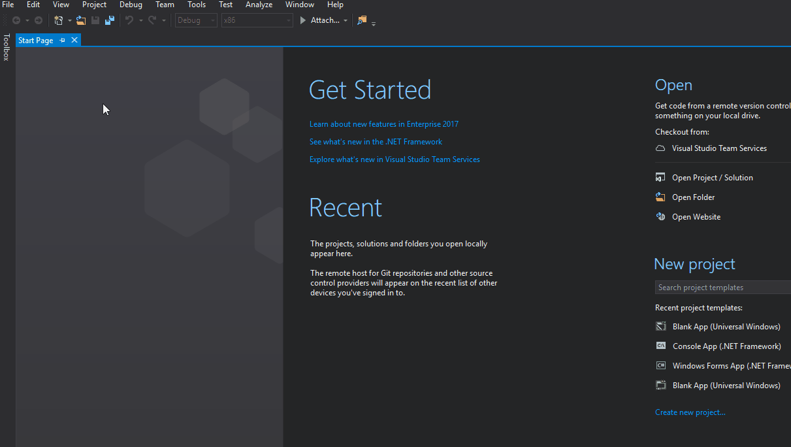
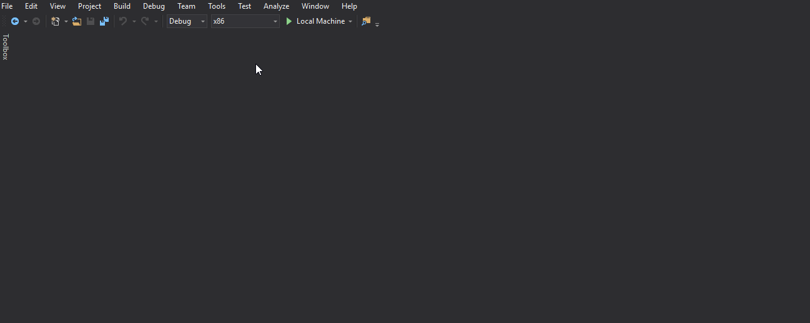
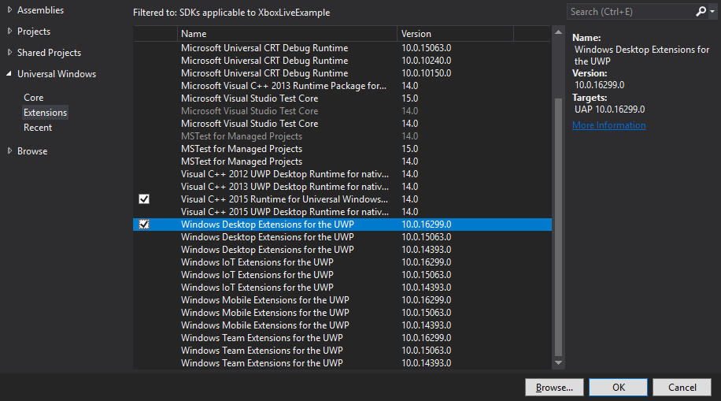
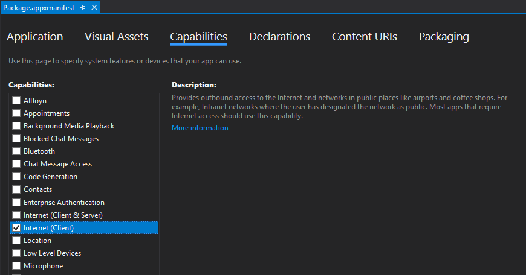

# Get started developing an Xbox Live Creators Program title with Visual Studio

> [!NOTE]
> There is a plugin available for games that are being developed with Unity. See the [Develop a Creators title with Unity](develop-creators-title-with-unity.md) article for more information.

## Requirements

1. Enrollment in the **[Dev Center developer program](https://developer.microsoft.com/store/register)**.
2. **[Windows 10](https://microsoft.com/windows)**.
3. **[Visual Studio 2015](https://www.visualstudio.com/)** (or newer) with the **Universal Windows App Development Tools**.
4. **[Windows 10 SDK](https://developer.microsoft.com/windows/downloads/windows-10-sdk) v10.0.10586.0** or later.

> [!IMPORTANT]
> Visual Studio 2017 is required if using Windows 10 SDK version 10.0.15063.0 (also known as Creators Update) or later.

## Create a new product on Microsoft Dev Center

Every Xbox Live title must have a product created on [Microsoft Dev Center](https://developer.microsoft.com/store) before you will be able to sign-in and make Xbox Live Service calls. See [Creating a new Creators title](create-and-test-a-new-creators-title.md) for more information.

## Configuring your development device

The following preliminary setup steps are required on your device, so that you can successfully login with Xbox Live and call the various Xbox Live Services.

### Set your sandbox

Sandboxes offer a way to keep your [Xbox Live Service Configuration](xbox-live-service-configuration-creators.md) isolated from retail until you are ready to release your title. Some data that you accumulate is specific to a sandbox. For example let's say that your title defines a stat called *Headshots*, and you accumulate some number of Headshots in a user account while testing your title. This value would be specific to your title's development sandbox, and if you switched to playing the retail version of your title, the headshots would not carry over.

See the [Xbox Live Sandboxes](xbox-live-sandboxes-creators.md) article to learn more and see how to set your sandbox.

### Sign-in with an Xbox Live account that has been authorized for testing

To sign-in to your development sandbox, you must provision a regular Microsoft Account (MSA) for access to your sandbox. This provides improved security for your titles in development, as well as some other benefits.

To learn more about test accounts and how to create one, see [Authorize Xbox Live Accounts for Testing in your environment](authorize-xbox-live-accounts.md).

## Visual Studio Project Setup

### 1. Open a UWP project
If you do not already have an existing UWP project, you can create one by doing the following:

1. In Visual Studio, **File** > **New** > **Project**.
2. In the **New Project** dialog box, select the **Visual C#** > **Windows** > **Universal** node in the left pane, and click **Blank App (Universal Windows)** from the right pane.
3. In the lower portion of the dialog, give the project a name and specify the location of the project.
4. Specify the Target Version and Minimum Version of the Windows 10 SDK. See [Choose a UWP version](https://docs.microsoft.com/windows/uwp/updates-and-versions/choose-a-uwp-version) for more information.



> [!NOTE]
> > Xbox Live API (XSAPI) requires a minimum version 10.0.10586.0 or higher.

### 2. Add references to the Xbox Live API (XSAPI) in your project
The Xbox Services API comes in flavors for C++ and WinRT and have their naming structured as **Microsoft.Xbox.Live.SDK.*.UWP**. You can read more about running UWP on Xbox One at [https://docs.microsoft.com/windows/uwp/xbox-apps/getting-started](https://docs.microsoft.com/windows/uwp/xbox-apps/getting-started). The C++ SDK can be used for C++ game engines, where as the  WinRT SDK is for game engines written with C++, C#, or JavaScript. When using WinRT with a C++ engine, you would use C++/CX which uses hats (^). C++ is the recommended API to use for C++ game engines.  

To use the Xbox Live API from your project, you can either add references to the binaries by using NuGet packages or adding the API source. Adding NuGet packages makes compilation quicker while adding the source makes debugging easier. This article will walk through using NuGet packages. If you want to use source, then please see [Compiling the Xbox Live APIs Source In Your UWP Project](../get-started-with-partner/add-xbox-live-apis-source-to-a-uwp-project.md). You can add the Xbox Live SDK NuGet package by:

1. In Visual Studio go to **Tools** > **NuGet Package Manager** > **Manage NuGet Packages for Solution...**.
2. In the NuGet package manager, click on **Browse** and enter **Xbox.Live.SDK** in the search box.
3. Select the version of the Xbox Live SDK that you want to use from the list on the left. In this case, we will use the Microsoft.Xbox.Live.SDK.WinRT.UWP package.
3. On the right side of the window, check the box next to your project and click **Install**.



#### Optionally include XSAPI header in your project

For Microsoft.Xbox.Live.SDK.Cpp.* based projects, you will need to include `xsapi\\services.h` to in your C++ project to bring in the header for the Xbox Live Service API (XSAPI) NuGet package. Before including the XSAPI header, you must define `XBOX_LIVE_CREATORS_SDK`. This limits the API surface area to only those APIs that are usable by developers in the Xbox Live Creators Program. For example:

```c++
#define XBOX_LIVE_CREATORS_SDK
#include "xsapi\services.h"
```
### 3. (Optional) Using Connected Storage
If you want to use the [Connected Storage](../storage-platform/connected-storage/connected-storage-technical-overview.md) service, you will need to access the `Windows.Gaming.XboxLive.Storage` namespace. Depending on the version of the Windows SDK that you are using, you may need to install additional content or manually add references to your project to use it. If you've targeted Windows 10 SDK 10.0.16299 or higher, then you will be able to access the Connected Storage namespace without doing any additional work.

#### Windows 10 SDK version 10.0.15063 or lower
If you want to use Connected Storage, you will need to install the Xbox Live Platforms Extensions SDK before you can add references to your project. You can do this by:

1. Download and extract the [Xbox Live Platform Extensions SDK](http://aka.ms/xblextsdk).
2. Once extracted, run the included MSI file that matches the Windows 10 SDK version that you are using.

After you have installed the Xbox Live Platform Extensions SDK, you will need to add a reference to it in Visual Studio. You can do this by:

1. In the **Solution Explorer**, right click on the **References** node and pick **Add Reference...**
2. On the left side of the **Reference Manager** dialog, select **Universal Windows** > **Extensions**.
3. In the list that appears, search for **Windows Desktop Extensions for UWP** and select the checkbox next to the version that matches your Windows 10 SDK.
4. Click **OK**.



### 4. Associate your Visual Studio project with your UWP app

For your game to be able to sign-in, it must be associated with the product you created on Microsoft Dev Center. You can associate your game in Visual Studio by using the Store Association wizard. In Visual Studio, do the following:

1.  Right click the primary project (the StartUp Project), click **Store** > **Associate App with the Store...**
2.  Sign-in with the **Windows Developer account** used for creating the app if asked and follow the prompts.

> [!TIP]
> See [Packaging apps](https://docs.microsoft.com/windows/uwp/packaging/) for more information on preparing your game for Windows Store.

### 5. Add Internet capabilities to your Visual Studio Project
Your UWP project will need to specify internet capabilities to communicate with Xbox Live. You can set these properties by:

1. Double click on the **package.appxmanifest** file in Visual Studio to open the **Manifest Designer**.
2. Click on the **Capabilities** tab and check **Internet (Client)**.



### 6. Associate your Visual Studio project with your Xbox Live enabled title

To talk to the Xbox Live service, you'll need to add a service configuration file to your project. This can be done easily by:

1. On your StartUp project, right click and select **Add** > **New Item**.
2. Select the **Text File** type and name it **xboxservices.config**.
3. Right click on the file, select **Properties** and ensure that:
    1. **Build Action** is set to **Content**, and  
    2. **Copy to Output Directory** is set to **Copy Always**.
5.  Edit the configuration file with the following template, replacing the **TitleId** and **PrimaryServiceConfigId** with the values applicable to your title. You can get the correct values from the root Xbox Live page on Microsoft Dev Center. The **PrimaryServiceConfigId** appears on Microsoft Dev Center as **SCID**.

```json
    {
       "TitleId" : "your title ID (JSON number in decimal)",
       "PrimaryServiceConfigId" : "your primary service config ID",
       "XboxLiveCreatorsTitle" : true
    }
```

For example:

```json
    {
        "TitleId" : 1563044810,
        "PrimaryServiceConfigId" : "12200100-88da-4d8b-af88-e38f5d2a2bca",
        "XboxLiveCreatorsTitle" : true
    }
```

> [!TIP]
> All values inside xboxservices.config are case sensitive. See [Service Configuration](../xbox-live-service-configuration.md) for more information on obtaining the TitleID and PrimaryServiceConfigId.

## Learn More

The [Xbox Live SDK samples](https://github.com/Microsoft/xbox-live-samples/tree/master/Samples/CreatorsSDK) under showcase the APIs available to developers in the Xbox Live Creators program. To use the samples, you will need to change your sandbox to XDKS.1.
