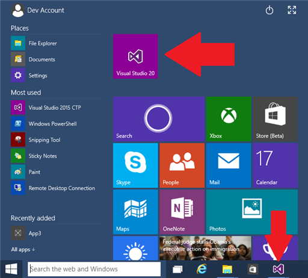
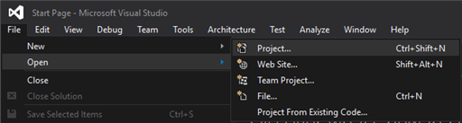
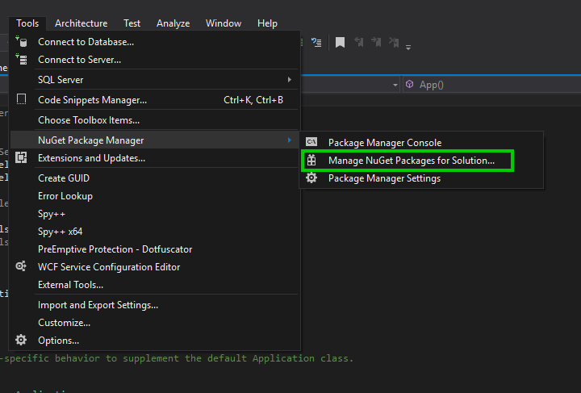
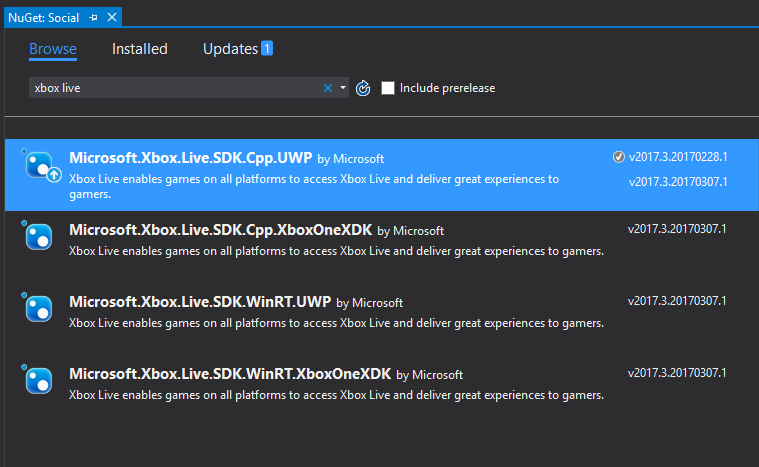

# Get started developing an Xbox Live Creators Program title with Visual Studio

## Setup

### Software Requirements

- Windows operating system
	- Windows 10 (as development and/or test machine)
- Visual Studio
    - Visual Studio 2015 or later.  See [Visual Studio Downloads](https://www.visualstudio.com/en-us/downloads/visual-studio-2015-downloads-vs.aspx)
    - Windows 10 SDK v10.0.14393.0 or later. See [Windows 10 SDK](https://developer.microsoft.com/en-US/windows/downloads/windows-10-sdk)

### Install the Windows 10 SDK

The Windows 10 SDK provides the latest headers, libraries, metadata and tools for building Windows 10 apps. By installing this SDK, the latest Visual Studio 2015 release, and your IDE environment you will be able to access the new Windows 10 APIs. The Windows 10 SDK allows you to build Universal Windows apps as well as desktop apps for Windows 10.

This is typically installed and updated by Visual Studio 2015.  If you already have Visual Studio 2015 installed, go to the menu Tools, Extensions and Updates, and check the Updates tab to install the latest Windows SDK.

Otherwise you can install a standalone version at the [Windows 10 SDK download site](https://developer.microsoft.com/en-US/windows/downloads/windows-10-sdk).

### Create a new title on Windows Dev Center

You need to create a new UWP title on Dev Center before you can sign-in to Xbox Live.  Your service configuration, such as what Achievements are defined, are associated with a title.

See [Creating a new Creators title](create-and-test-a-new-creators-title.md) to learn how to create a new title.

### Configuring your development device

The following preliminary setup steps are required on your device, so that you can successfully login with Xbox Live and call the various Xbox Live Services.

#### Set your sandbox

More detail on Sandboxes is available in the [Xbox Live Sandboxes](../xbox-live-sandboxes.md) article.  Feel free to read that article and come back here after, but a brief summary will be provided below.

Sandboxes offer a way to keep your [Xbox Live Service Configuration](xbox-live-service-configuration-creators.md) isolated from retail until you are ready to release your title.  Some data that you accumulate is specific to a sandbox.  For example let's say that your title defines a stat called *Headshots*, and you accumulate some number of Headshots in a user account while testing your title.  This value would be specific to your title's development sandbox, and if you were playing the retail version of your title, those headshots would not carry over.

See the [Xbox Live Sandboxes](../xbox-live-sandboxes.md) on how to set the sandbox.

#### Sign-in with an Xbox Live account that has been authorized for testing

To sign-in to your development sandbox, you must provision a regular Microsoft Account (MSA) for access to your sandbox.  This provides improved security for your titles in development, as well as some other benefits.

To learn more about test accounts, see [Authorize Xbox Live Accounts for Testing in your environment](authorize-xbox-live-accounts.md)

## SDK Samples

The SDK samples are a good way to see how Xbox Live APIs are used.

The samples found on the [Xbox Live samples Github](https://github.com/Microsoft/xbox-live-samples) under /Samples/CreatorsSDK/ showcase the APIs available to developers in the Xbox Live Creators program.  

To use the samples, you will need to change your sandbox to XDKS.1
See the [Xbox Live Sandboxes](../xbox-live-sandboxes.md) on how to set the sandbox.

## Visual Studio Project Setup

### 1. Create a blank project

You can skip this step if you already have an existing UWP app.

Start Visual Studio 2015 from the Start Menu or the Taskbar.  
If you don't have Visual Studio 2015 installed, you can find it on the [Visual Studio website.](https://www.visualstudio.com/)



After Visual Studio starts, select **File** -> **New** -> **Project** as shown.



When the **New Project** dialog box appears, select the **Visual C#**, **Windows**, **Universal** node in the left pane, and click **Blank App (Universal Windows)** from the right pane.  In the lower portion of the dialog, give the project a name.

### 2. Add references to the Xbox Live API (XSAPI) in your project

To use the Xbox Live Services API from your project, either:

* Add references to Xbox Live Services API binaries to your project in the form of NuGet packages.
<p/>
or
<p/>
* Add references to the Xbox Live Services API source to your project

Referencing source makes debugging easier.
Referencing binaries makes compilation quicker.

This article will assume you're using NuGet packages.  If you want to use source, then please see [Compiling the Xbox Live APIs Source In Your UWP Project](../get-started-with-partner/add-xbox-live-apis-source-to-a-uwp-project.md)

#### Add references to Xbox Live API binaries to your project
To add references to Xbox Live API NuGet packages in your project, in Visual Studio go to "Manage Nuget Packages"



#### Locate Xbox Live
You can enter "Xbox Live" (without quotes) in the search field in NuGet and you will find four variants of the Xbox Live SDK shown below.



The Xbox Services API comes in flavors for both UWP and XDK, and for C++ and WinRT.

Choose between `Microsoft.Xbox.Live.SDK.*.UWP` and `Microsoft.Xbox.Live.SDK.*.XboxOneXDK`.  `XboxOneXDK` is for ID@Xbox and Managed developers who are using the Xbox One XDK.  `UWP` is for UWP games which can run on either PC, the Xbox One, or Windows Phone.  You can read more about running UWP on Xbox One in
 [Getting started with UWP app development on Xbox One.](https://docs.microsoft.com/en-us/windows/uwp/xbox-apps/getting-started)

Choose between `Microsoft.Xbox.Live.SDK.Cpp.*` and `Microsoft.Xbox.Live.SDK.WinRT.*`. `Cpp` is for C++ game engines using the Xbox Live APIs.  `WinRT` is for game engines written with C++, C#, or Javascript using the Xbox Live APIs.

If you are part of the Xbox Live Creators Program, you can use any of these options:
* Microsoft.Xbox.Live.SDK.Cpp.UWP for C++ UWP game engines.
* Microsoft.Xbox.Live.SDK.WinRT.UWP for C# or JavaScript UWP game engines. When using WinRT with a C++ engine, you can use C++/CX which uses hats (^).  Microsoft.Xbox.Live.SDK.Cpp.UWP is the recommended API to use for C++ game engines.
* Unity.  See the [Develop a Creators title with Unity](develop-creators-title-with-unity.md) article for specifics.

### (Optional) Install the Xbox Live Platform Extensions SDK

> [!NOTE]
> Downloading the Xbox Live Platform Extensions SDK is unnecessary for development on a build using the Windows 10 Fall Creators Update SDK or later.

If you want to use Connected Storage, you will need to download the [Xbox Live Platform Extensions SDK zip file](http://aka.ms/xblextsdk).

After you download the zip file, extract the contents to a folder of your choice and install the MSI.
The package contains winmd files and documentation related to Secure Networking and Connected Storage features for the UWP platform.

After you have installed the Xbox Live Platform Extensions SDK, you can use Visual Studio to add a reference to the Extensions SDK and use the following namespaces in your Universal Windows Platform (UWP) game:

- Windows.Gaming.XboxLive.Storage

> [!NOTE]
> If you are in the Xbox Live Creators Program, you do not have access to Secure Sockets.

### 3. Associate your Visual Studio project with your UWP app

For your app to be able to sign-in, it must be linked to the UWP app you created on Dev Center earlier.  We will show you how to make this association.

If the **Store** -> **Associate App with the Store…** option is available in Visual Studio follow these steps:

1.  Open your project in Visual Studio 2015
1.  Right click the primary project (the StartUp Project), click **Store** -> **Associate App with the Store...**
1.  Sign-in with the **Windows Developer account** used for creating the app if asked
1.  On the next page, select the app you just created, confirm the information, and click **Associate**

If the **Store** -> **Associate App with the Store…** option is not available in Visual Studio, you can manually update the app's package manifest to use the app’s Store package identity:

1.  Open your Package.appxmanifest file in a text editor and update the Identity node to the **Application Identity** from **Reserving an app name** section.
1.  Delete (exclusion from project is not enough) the .pfx file from the project

### 4. Associate your Visual Studio project with your Xbox Live enabled title

To do this, you need to add a configuration file for the Xbox Live SDK to read at runtime.

1.  Create a text file and name it **xboxservices.config**. Note the file extension must be .config. All values inside xboxservices.config are case sensitive.
1.  Add the text file to your primary project (the StartUp Project)
1.  Right click on the file, select Properties and ensure that either **Content** is **Yes** or **Build Action** is set to **Content** and set **Copy always** for **Copy to Output Directory**.  This will ensure the file is copied correctly in the AppX folder.
1.  You can leave the Item Type to **Does not participate in build**
1.  Edit the text file with the following template, and replace the TitleId, and PrimaryServiceConfigId with the values you get from Windows Dev Center.  The PrimaryServiceConfigId appears on Windows Dev Center as "SCID".  
1.  XboxLiveCreatorsTitle must be set to true for titles in the Xbox Live Creators Program as it changes the sign-in method to work for titles in the Xbox Live Creators Program.

```
    {
       "TitleId" : your title ID (JSON number in decimal),
       "PrimaryServiceConfigId" : "{your primary service config ID}",
       "XboxLiveCreatorsTitle" : true
    }
```

For example:

```
    {
        "TitleId" : 1563044810,
        "PrimaryServiceConfigId" : "12200100-88da-4d8b-af88-e38f5d2a2bca",
        "XboxLiveCreatorsTitle" : true
    }
```

### 5. Add Internet capabilities to your Visual Studio Project

1. Double click on the **package.appxmanifest** file in Visual Studio 2015 to open the Manifest Designer.
2. Click on the **Capabilities** tab
3. Click on **Internet (Client)**
4. Close the file and save the changes.

### 6. Optionally include XSAPI header in your project

For Microsoft.Xbox.Live.SDK.WinRT.* based projects, no need to include any headers.

For Microsoft.Xbox.Live.SDK.Cpp.* based projects, include "xsapi\\services.h" to in your C++ project bring in the header for the Xbox Live Service API (XSAPI) NuGet package. Before including the XSAPI header, you must define XBOX_LIVE_CREATORS_SDK. This limits the API surface area to only those APIs that are usable by developers in the Xbox Live Creators Program. For example:

```c++
#define XBOX_LIVE_CREATORS_SDK
#include "xsapi\services.h"
```

### 7. Change your sandbox on the target device

See the [Xbox Live Sandboxes](../xbox-live-sandboxes.md) on how to set the sandbox.

### 8. Learn More

The samples found on the [Xbox Live sample Github](https://github.com/Microsoft/xbox-live-samples) under /Samples/CreatorsSDK/ showcase the APIs available to developers in the Xbox Live Creators program.  To use the samples, you will need to change your sandbox to XDKS.1
