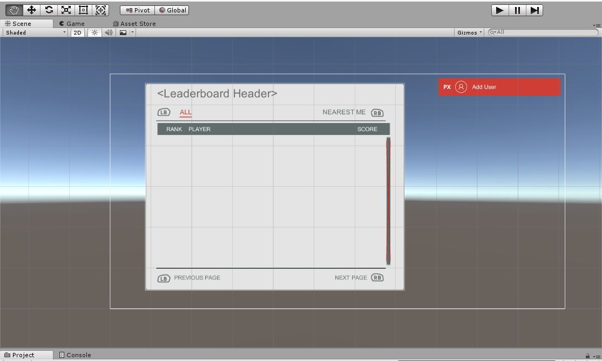
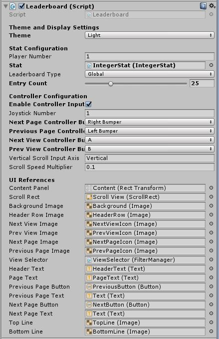
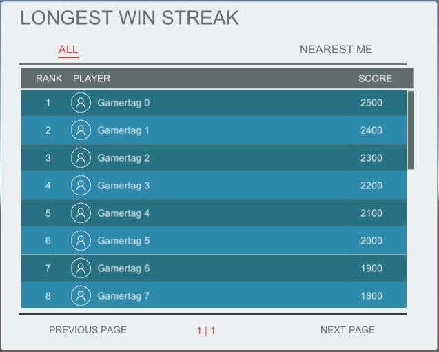
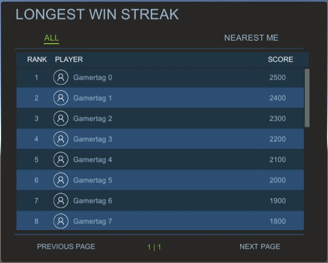
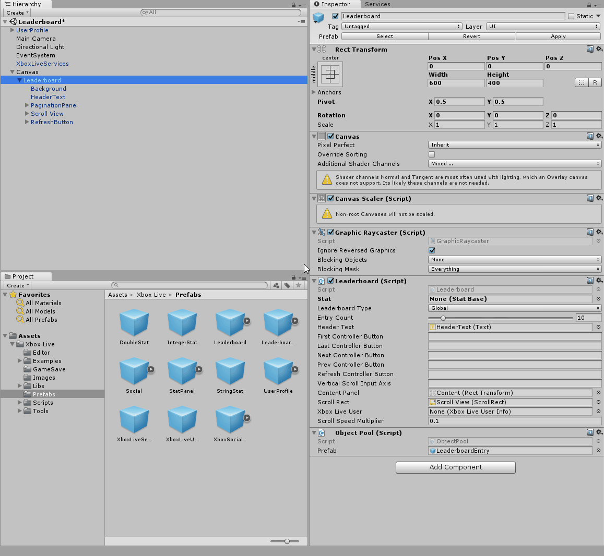
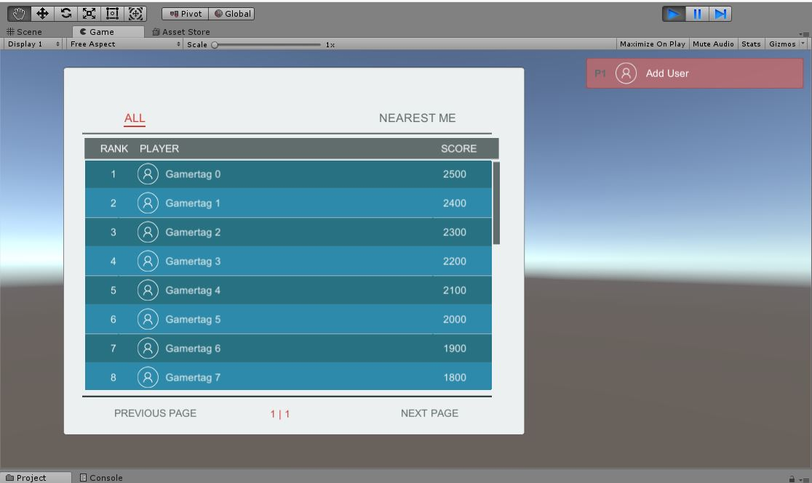

# The Leaderboard example scene in Unity

[The Unity Plugin](https://github.com/Microsoft/xbox-live-unity-plugin) hosts a number of example scenes to showcase the Xbox Live services available to Unity developers. One such scene is the leaderboard example scene. In the screenshot below you will see that the leaderboard example scene simply displays a sign-in panel for the Xbox Live user and a panel to contain the leaderboard. If you hit play at this point without adding to this scene you will find the sign-in panel is populated with fake user data, but the leaderboard loads no information. In order to get this example scene to load an actual leaderboard you'll have to make some additions.

## Prerequisites

Leaderboards in Xbox Live are based on the stats in the Xbox Live stats service. Before you can populate a leaderboard with data you will need to have some stats associated with your test accounts. If you have not already added statistics to your title you can learn how to do so by reading [Add player stats and leaderboards to your Unity project](add-stats-and-leaderboards-in-unity.md). After performing the actions in the stats section of that article come back here to display a stat in the example leaderboard scene.

## The leaderboard inspector

The leaderboard prefab has a number of settings that can be changed in the inspector section for the leaderboard's script component, such as the UI *theme*, the player associated with the leaderboard, xbox controller settings, and other leaderboard settings. You can see the leaderboard settings are split into a few different sections in the inspector below.

### Theme and display settings

This section has one setting called *Theme*. This is a simple drop down which allows you to use a dark or light theme for your leaderboard prefab. This will change the background, font, and image colors of the prefab. The effect is easily seen when playing the scene in the unity player.

 

### Stat configuration

This section allows you to determine what sort of data will be retrieved when the leaderboard is populated with rows.

- **Player Number** - This dictates which player is associated with the leaderboard.
- **Stat** - The stat used to populate the leaderboard data. This is required for the leaderboard prefab to load data.
- **Leaderboard Type** - This drop down menu applies a filter to the leaderboard data loaded. If *Global* is selected the leaderboard will be unfiltered and will show every player with a value for the selected stat. If *Friends* is selected the leaderboard will be filtered to only show players on the leaderboard who are also in your friends list. If *Favorite* is selected the leaderboard will be filtered to only show players on the leaderboard who are also in your favorites list.
- **Entry Count** - A slider with a range of 1 to 100 that dictates how many rows of the leaderboard will be returned at a time. The number set here will determine the number of leaderboard rows shown per page.

### Controller configuration

The leaderboard prefab allows developers to easily configure Xbox controller use. The controller configuration section of the prefab allows you to enable and choose the buttons that control the leaderboard prefab.

- **Enable Controller Input** - A simple radio button toggle. If this is checked then you may use an Xbox controller to interact with the prefab. Required for controller support.
- **Joystick Number** - Designates which controller can interact with this leaderboard prefab.
- **Next Page Controller Button** - Drop down menu which controls which button loads the next page of leaderboard rows.
- **Previous Page Controller Button** - Drop down menu which controls which button loads the previous page of leaderboard rows.
- **Next View Controller Button** - Toggles the view type between **ALL** and **NEAREST ME**.
- **Previous View Controller Button** - Toggles the view type between **ALL** and **NEAREST ME**.
- **Vertical Scroll Input Axis** - string which designates what controller axis is associated with scrolling.
- **Scroll Speed Multiplier** - determines controller scroll speed.

> [!NOTE]
> Changing the buttons used for changing the page or view of the leaderboard will also change the picture associated with the button used for each function of the leaderboard. You do not need to alter the UI References section manually to match the picture to the button.

### UI References

This section controls the images and general makeup of the leaderboard prefab. This section does not need to be changed for successful use of the leaderboard prefab. However you may need to make adjustments to this section to customize the look of the prefab for your own purposes.

## Populating the Unity Player leaderboard (with fake data)

In order to populate the Unity Player leaderboard with data you will need to add a statistic to the leaderboard prefab. Viewing the leaderboard prefab in the inspector will reveal that it can take an object of type `Stat Base` as a public parameter in its script. You can drag any of the `State Base` type prefabs `IntegerStat`, `DoubleStat`, or `StringStat` from the prefabs folder of the Xbox Live Unity plugin and place it in this spot in the leaderboard prefab.

Now play the scene in Unity and you will find that the leaderboard is populated with fake data like below.

## Populating a Visual Studio built project with real data

In order to populate a leaderboard with real data for your title you will need to build your game to run locally on you machine. You will need a local build because the Unity editor does not have access to Xbox Live. In addition to building your project to run locally, you will have to configure the stat in your leaderboard to a stat that is initialized and has values for your title. In order to associate a stat to your leaderboard you will need to modify the ID and Display Name of the stat object in the leaderboard prefab. The ID will need to match that of a stat configured on the [Windows Development Center](https://developer.microsoft.com/dashboard/windows/overview). After you have done this, build your project as described in the [build section of the configure Xbox Live in Unity article](configure-xbox-live-in-unity.md#build-and-test-the-project). Executing this project as an x64 build targeting the Local Machine should allow you to sign-in with a real gamertag and populate the leaderboard with real data.