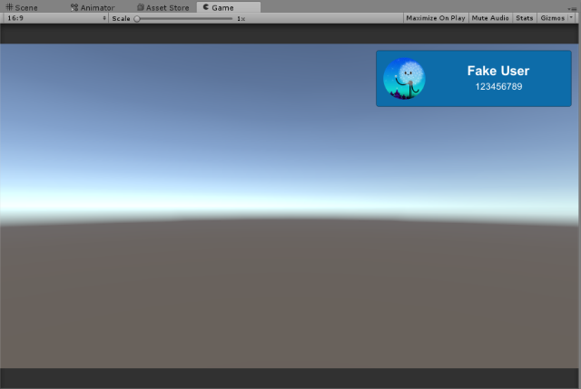

# Sign in to Xbox Live in Unity

> [!IMPORTANT]
> The Xbox Live Unity plugin does not support achievements or online multiplayer and is only recommended for [Xbox Live Creators Program](../developer-program-overview.md) members.

With the Xbox Live Unity plugin, you can easily sign in to Xbox Live in your Unity project. You can use the included prefab, or you can attach the included scripts to your own custom objects. This topic assumes that you have already set up the Xbox Live plugin in your Unity project. For information about how to do that, see [Configure Xbox Live in Unity](configure-xbox-live-in-unity.md).

## Configure and test the prefabs
You can setup your scene to sign into Xbox Live by doing the following:

1. Drag the **UserProfile** prefab onto the scene.
2. Drag the **XboxLiveServices** prefab onto the scene.

When you enter play mode, the button will change to show the user's gamertag, gamerpic, and gamerscore. In the editor, this will be placeholder data. You will need to build the project and run it from Visual Studio in order to sign in with a real Xbox Live account. See [Configure Xbox Live in Unity](configure-xbox-live-in-unity.md) for more information.

### UserProfile Prefab
The **UserProfile** prefab is the most important Xbox Live prefab, and is located in **Xbox Live\Prefabs**. This prefab allows the user to log in to Xbox Live, and after the user is logged in, it will show their gamertag, gamerpic, and gamerscore. Usually you would show this prefab on the initial menu screen, or automatically trigger it when the game launches. In order to use any of the other Xbox Live prefabs, you must include a UserProfile prefab or manually invoke the sign-in API. See the **UserProfile.cs** script and the section below for details on how to do this.

In the Unity Inspector, you can set the following attributes:

* Input Controller Button: Specify the button that will be used to sign in an Xbox Live user.
* Allow Guest Accounts: Enables the support for secondary players to sign in with their Xbox Live profile or play as a guest. This is only relevant in scenarios where multiple users are signing in. See [Add multi-user support to your Unity Game](add-multi-user-support.md) for more information.

### XboxLiveServices Prefab
To use any of the Xbox Live prefabs, you'll need to have an instance of the **XboxLiveServices** prefab in your initial scene. You can toggle whether Xbox Live debug messages are displayed in the console via the` XboxLiveServicesSettings` script, which is included on the prefab.

## Using the scripts

The script that the **UserProfile** prefab uses to sign in to Xbox Live is `Xbox Live\Scripts\UserProfile.cs`. The main method to be aware of here is `SignInAsync`, which calls `XboxLive.Instance.SignInAsync`.

Most Xbox Live functionality in Unity is managed by the `XboxLive` script (`Xbox Live\Scripts\XboxLive.cs`). Any of your scripts that need to make calls to Xbox Live APIs should use the various properties of `XboxLive.Instance`.

`XboxLiveUserInfo.User` provides a reference to the currently authenticated user which can be used when making calls to various services.

Once the user has been signed in, you can get information about them. You can look at `UserProfile.LoadProfileInfo` to see how the script gets the user's ID, gamerpic, and other information.

## See also

* [Configure Xbox Live in Unity](configure-xbox-live-in-unity.md)
