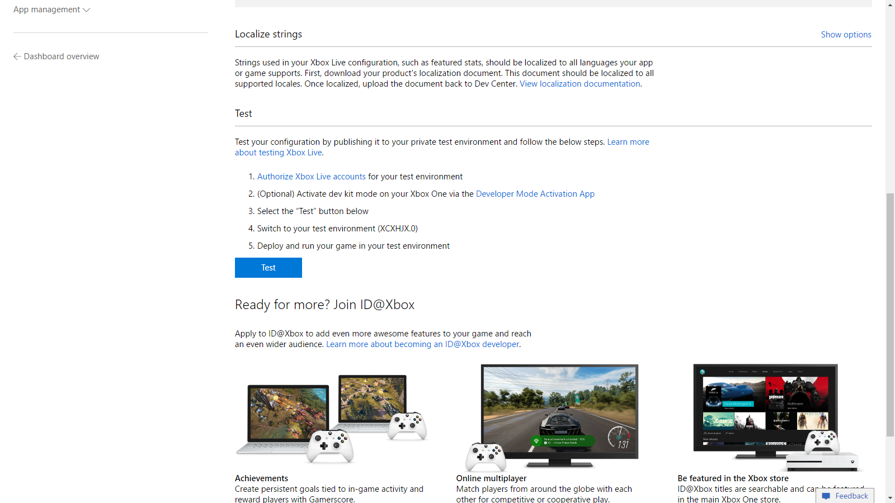

# Test your Unity game build in Visual Studio

To test the Xbox Live functionality of your Unity game with real data, you must build the game as described in the **Build and test the project** section of the [Configure Xbox Live in Unity article](configure-xbox-live-in-unity.md). The following article will give you a checklist of items to help ensure successful testing of your Unity game in Visual Studio.

1. **Double check that you have a properly configured title associated with your Unity game.**
    If you enabled Xbox Live through the Xbox Live Association Wizard, you will want to familiarize yourself with your [Windows development center configuration dashboard](https://developer.microsoft.com/dashboard/windows/overview). This dashboard allows you to configure the Xbox Live settings for your title and must be setup properly in order for your title to communicate with Xbox Live. The article [Create a new Xbox Live Creators Program title and publish to the test environment](create-and-test-a-new-creators-title.md) takes you through the Windows Dev Center setup process. If you have already setup your game through the **Xbox Configuration Wizard** in Unity, you can skip to the section [Test Xbox Live service configuration in your game](create-and-test-a-new-creators-title.md#test-xbox-live-service-configuration-in-your-game). While on Dev Center, make sure to check to see that the information in your Xbox Live configuration for your Unity game matches the Dev Center configuration for your game.

2. **Ensure that your title has an authorized Microsoft Account(with gamertag) that can sign-in to your title.**
    Without an authorized account you will not be able to complete sign-in in while testing your title, nor will you be able to use other Xbox Live features. To make sure you have an authorized Microsoft Account and gamertag read [Authorize Xbox Live Accounts for Testing in your environment](authorize-xbox-live-accounts.md).

3. **Ensure that your title has been published for testing.**
    When you make changes to your title those changes must be published to your sand box before they can be used. Make sure you push the **Test** button to publish your changes to your configuration.

    

    The **Test** button is found on your [Windows Development Center dashboard](https://developer.microsoft.com/dashboard/windows/overview) under your title's Xbox Live service settings. If you made any changes to your configuration such as adding a new authorized test account you will want to push the **Test** button to publish the new configuration settings to the Xbox Live service.

4. **Check to make sure that your PC is in developer mode and you are using the appropriate Xbox Live Sandbox.**
    When your title is published for testing it is published to a specific environment called a sandbox. If your development PC is not set to use that sandbox you will not be able to test Xbox Live features. Learn to check and change your PC's sandbox with the [Xbox Live sandboxes introduction](xbox-live-sandboxes-creators.md).

5. **Make sure that you build your project as an x64 build targeting the local machine to build on your PC**

    