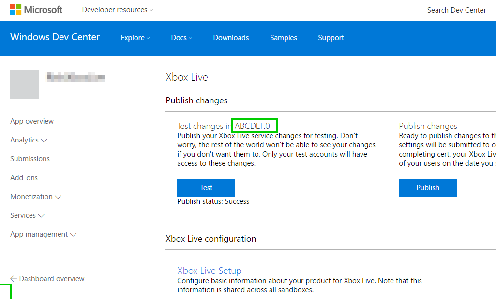
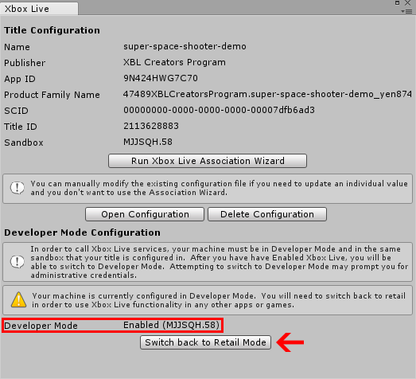
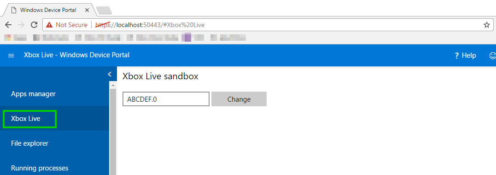
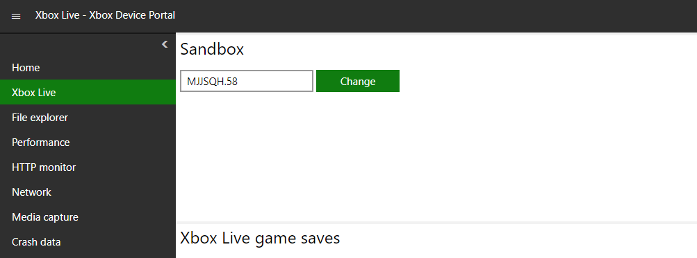

# Xbox Live sandboxes introduction

In the [Xbox Live service configuration](xbox-live-service-configuration-creators.md) article, it was explained that you must configure information about your title in [Windows Dev Center](http://dev.windows.com). This information includes things like the stats, leaderboards, localization, and more. Changes to your Xbox Live service configuration need to be published from Dev Center into your development sandbox before the changes are picked up by the rest of Xbox Live and can be accessed in your title.

A development sandbox allows you to work on changes to your title in an isolated environment. Sandboxes offer several benefits:

1. You can iterate on changes to an update for your title without affecting the version that is live in production.
2. For security reasons, some tools only work in a development sandbox.
3. Other publishers cannot see what you are working on without being granted access to your sandbox.

By default, Xbox One consoles and Windows 10 PCs are in the RETAIL sandbox. You will need to switch your PC and/or Xbox One to the development sandbox to access that version of the Xbox Live service configuration. It's important to remember to change the device back to the RETAIL sandbox if you need to test something in RETAIL or want to take a break to play your favorite Xbox Live game.

## Finding out about your sandbox

A sandbox is created for you when you create a title. You can find your Sandbox ID by opening your product in **Windows Dev Center** and navigating to **Services** > **Xbox Live**. The **Sandbox ID** will be listed at the top of the page.



## Switch your PC's development sandbox
You can switch your PC into the development sandbox by using Unity, Windows Device Portal (WPD) or via command-line.

### Unity

#### Prerequisites
The following needs to be done before you can switch in and out of the development sandbox in Unity:

1. [Configure Xbox Live in Unity](configure-xbox-live-in-unity.md)

#### Switch Sandboxes
The built in Xbox Live Configuration window lets you toggle between your development and RETAIL sandboxes easily. To start, go to **Xbox Live** > **Configuration** in the menu. You can see the current sandbox in the **Developer Mode Configuration** section.

1. If **Developer Mode** says **enabled**, then you are currently in the development sandbox associated with your game. You can click the **Switch back to Retail Mode** button to switch out.
2. If **Developer Mode** says **disabled**, then you are currently in the RETAIL sandbox. You can click the **Switch to Developer Mode** button to switch in.



### Windows Device Portal

#### Prerequisites
The following needs to be done before you switch your sandbox in Windows Device Portal (WPD):

1. [Setup Device Portal on Windows Desktop](https://msdn.microsoft.com/en-us/windows/uwp/debug-test-perf/device-portal-desktop)

#### Switch Sandboxes

1. Open **Windows Dev Portal** by connecting to it in your web browser, as described in the [Setup Device Portal on Windows Desktop](https://msdn.microsoft.com/en-us/windows/uwp/debug-test-perf/device-portal-desktop) article.
2. Click on **Xbox Live**.
3. Enter your development sandbox in the text field and click **change**.



To switch back to RETAIL, you can enter RETAIL here.

### Command-line

#### Prerequisites
The following needs to be done before you can switch in and out of the development sandbox via command-line:

1. Download the Xbox Live Tools Package at [https://aka.ms/xboxliveuwptools](https://aka.ms/xboxliveuwptools) and unzip.

#### Switch Sandboxes
1. Run SwitchSandbox.cmd batch file in **administrator mode**.

Run this in Administrator mode to switch your sandbox. The first argument is the sandbox. For example, if you are trying to switch to the MJJSQH.58 sandbox, you would use this command:

```cmd
SwitchSandbox.cmd MJJSQH.58
```

To switch back to RETAIL, you simply provide that as the second argument.

```cmd
SwitchSandbox.cmd RETAIL
```

## Switch your Xbox One console development sandbox

### Using Xbox Dev Portal

You can use the Xbox Dev Portal to change the sandbox on your console. To do this, go to [Dev Home](https://docs.microsoft.com/windows/uwp/xbox-apps/dev-home) on your console and [enable the Device Portal](https://docs.microsoft.com/windows/uwp/debug-test-perf/device-portal-xbox). Once you have the Xbox Dev Portal open:

2. Click on **Xbox Live**.
3. Enter your development sandbox in the text field and chick **change**.



### Using Xbox One console UI

You can use [Dev Home](https://docs.microsoft.com/windows/uwp/xbox-apps/dev-home) to change the sandbox on your console directly:

1. Click **Change Sandbox**, located under **Quick Actions**.
2. Enter the sandbox ID and then click **Save and restart**.
