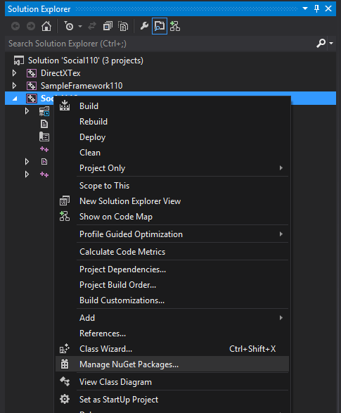

# Add Xbox Live APIs binary package to your UWP project

You can use NuGet to import the latest Xbox Live APIs into your game by following these steps:

### 1. Ensure you have the Windows 10 RTM and Visual Studio 2015 or later installed.

- Visual Studio 2015.  See [https://www.visualstudio.com/en-us/downloads/visual-studio-2015-downloads-vs.aspx](https://www.visualstudio.com/en-us/downloads/visual-studio-2015-downloads-vs.aspx)
- Windows 10 SDK v10.0.14393.0 or later [https://developer.microsoft.com/en-US/windows/downloads/windows-10-sdk](https://developer.microsoft.com/en-US/windows/downloads/windows-10-sdk)

### 2.	Ensure you have the latest NuGet Package Manager installed

1.	Check your current version:
	- On the menu bar, select Tools-> Extensions and Updates.
	- Under the Installed tab,  look for `NuGet Package Manager`

2.	To update your current version:
	- On the menu bar, select Tools-> Extensions and Updates.
	- Under the Updates->Visual Studio Gallery tab, select `Update`


### 3.	Add reference to the project
1.	Right click on your project solution and select `Manage NuGet Packages`

1.	Search for `Xbox Live` and select the appropriate package and click `Install`.
  - The Xbox Services API comes in flavors for both UWP and XDK, and for C++ and WinRT.  
  - Choose between `Microsoft.Xbox.Live.SDK.*.UWP` and `Microsoft.Xbox.Live.SDK.*.XboxOneXDK`.  `XboxOneXDK` is for ID@Xbox and Managed developers who are using the Xbox One XDK.  `UWP` is for UWP games which can run on either PC, the Xbox One, or Windows Phone.  You can read more about running UWP on Xbox One at [https://docs.microsoft.com/en-us/windows/uwp/xbox-apps/getting-started](https://docs.microsoft.com/en-us/windows/uwp/xbox-apps/getting-started)
  - Choose between `Microsoft.Xbox.Live.SDK.Cpp.*` and `Microsoft.Xbox.Live.SDK.WinRT.*`. `Cpp` is for C++ game engines using the Xbox Live APIs.  `WinRT` is games written with C++, C#, or Javascript using the Xbox Live APIs.  When using WinRT with a C++ engine, you would use C++/CX which uses hats (^).  `Cpp` is the recommended API to use for C++ game engines.    
  -  If you are part of the Xbox Live Creators Program, you can use any of these options: 1) Microsoft.Xbox.Live.SDK.Cpp.UWP for C++ UWP game engines, 2) Microsoft.Xbox.Live.SDK.WinRT.UWP for C# or JavaScript UWP game engines. When using WinRT with a C++ engine, you can use C++/CX which uses hats (^).  Microsoft.Xbox.Live.SDK.Cpp.UWP is the recommended API to use for C++ game engines. 3) Unity.  See the [Develop a Creators title with Unity](../get-started-with-creators/develop-creators-title-with-unity.md) article for specifics.

1. After accepting the License TOS, wait until the package has been successfully added.  You should see this log in the Package Manger output window:

```
========== Finished ==========
```

### 4.	Optionally include header
* For `Microsoft.Xbox.Live.SDK.Cpp.*` based projects `#include <xsapi\services.h>` in your project's source.
* For `Microsoft.Xbox.Live.SDK.WinRT.*` based projects, no need to include any headers.   
