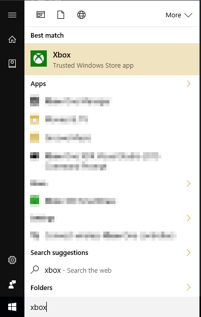

# Create a new title for Xbox Live

## Introduction

Before writing any code, you must setup a new title on your service configuration portal.  You can learn more about service configuration in [Xbox Live Service Configuration](../xbox-live-service-configuration.md)

This article will walk you through this process with the following assumptions

1. You are developing a Universal Windows Platform (UWP) title.  UWP titles run on Xbox One, Windows 10 desktop PCs, and mobile
2. You are configuring your title on Windows Dev Center at [http://dev.windows.com/](http://dev.windows.com).  If in doubt, you should use Windows Dev Center.
3. You are using either Visual Studio with a custom game engine, or Unity.
4. Your development machine is running Windows 10.

Provided that the above are true, the remainder of this article will walk through everything required to get a title configured on Windows Dev Center, a new project created, and Xbox Live sign-in code written and tested.

> [!NOTE]
> If you are part of the Xbox Live Creators Program, the above assumptions apply to you and you should follow along with this article.

## Dev Center Setup

You need an Xbox Live enabled title created on [Windows Dev Center](http://dev.windows.com) as a pre-requisite to any Xbox Live functionality working.

### Create a Microsoft account
If you don't have a Microsoft Account (also known as an MSA), you will need to first create one at [https://go.microsoft.com/fwlink/p/?LinkID=254486](https://go.microsoft.com/fwlink/p/?LinkID=254486).  If you have an Office 365 account, use Outlook.com, or have an Xbox Live account - you probably already have an MSA.

### Register as an App Developer
You will need to register as an App Developer before you are allowed to create a new title on Dev Center.

To register go to https://developer.microsoft.com/en-us/store/register and follow the sign-up process.

### Create a new UWP title
Next, you need a UWP title defined on Dev Center.  You do that by first going to the Dashboard

 

After clicking on the dashboard, create a new title.  You'll need to reserve a name.

You'll then be taken to the *App Overview* page for your app.  The primary page where you'll be configuring Xbox Live is under the Services -> Xbox Live menu shown below.

## Create an Xbox Live Account
You will need an Xbox Live Account to sign-in to Xbox Live.  If you already have one that you use to sign-in on your Xbox One console, or in the Xbox App on Windows 10, then you can use that one.

Otherwise you should open the Xbox App on your PC and sign-in with your Microsoft Account.  It will then be enabled for use with Xbox Live.

You can find the Xbox App by going into the *Start Menu* and typing in "Xbox" as shown below.

## Next Steps
Now that you have a new title created, you can now setup an Xbox Live enabled title in your Game Engine, Visual Studio or build environment of choice.

See [Step by step guide to integrate Xbox Live](partners-step-by-step-guide.md)
