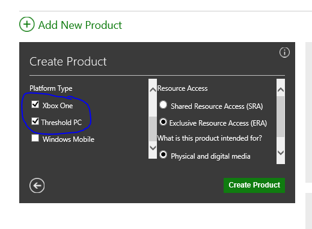
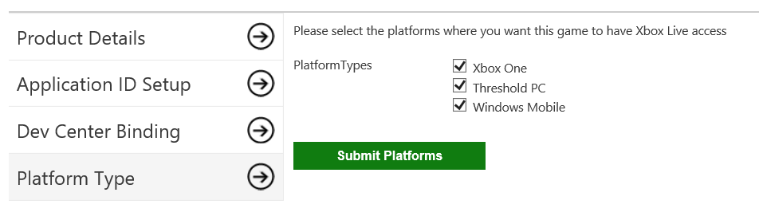
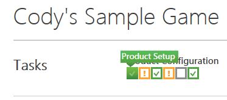
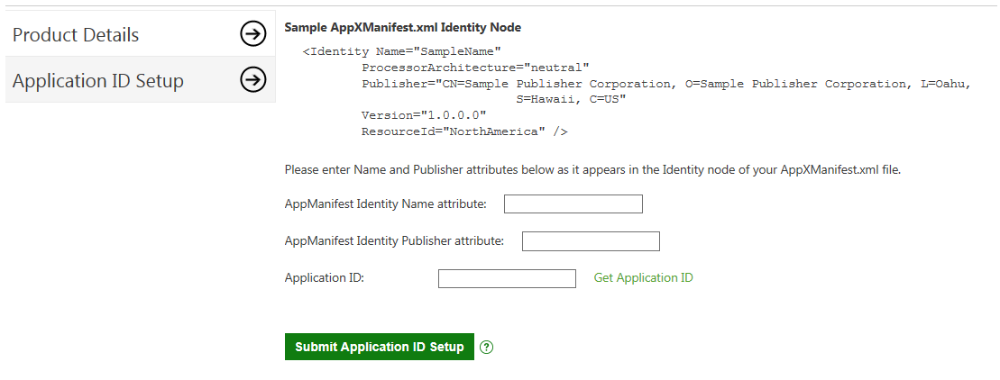
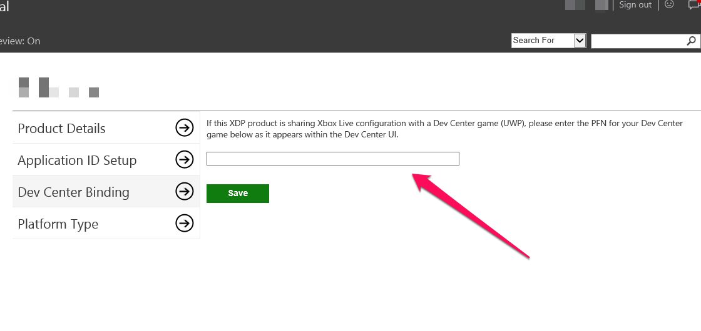

# Get started with cross-play games

## Summary

With the launch of Windows 10, game developers will be able to release single products both on Xbox One (as an XDK game) and Windows 10 (as a UWP game). In some cases, developers will want to enable cross-play for these games, where the Xbox One and Windows 10 versions of their game are unified across Xbox Live services like Multiplayer, Game Save, Achievements, and more. To enable cross-play, these games will share a single Title ID and Xbox Live service configuration across both the XDK and UWP versions of the game.

Ingesting an XDK+UWP today game requires 4 major steps:

1.  Create your UWP product in the Windows Dev Center

2.  Create your XDK game in XDP, selecting the platforms you want to share XBL configuration across

3.  Bind your UWP product information to your XDK product in XDP

4.  Configure and publish Xbox Live through XDP

The purpose of this document is to further detail these 4 steps to make it as easy as possible for Xbox employees to ingest XDK+UWP cross-plat games

## Terminology

### Scenario Terms

1.  Cross-Play: A game that is releasing on more than one platform, but shares a single Xbox title ID and service configuration. The end result is that both versions of the game share the same Xbox Live configuration - achievements, leaderboards, game saves, multiplayer, and more.

2.  Windows Dev Center: The portal where you can reserve app identities for use in UWP development today and setup Xbox Live configuration for UWP.

3.  XDP: The Xbox Developer Portal, which exists today to ingest, configure, and publish Xbox One XDK and SRA games, and will see added use to ingest, configure, and publish XDK+UWP Cross-Play games.

### Identity Terms

1.  Title ID: This is the Xbox Title ID, used to identify each game to Xbox Live. A Title ID maps to a single product, which may span multiple platforms.

2.  Service Configuration ID (SCID): Each Xbox title (identified by a Title ID) has a corresponding Service Configuration ID (aka SCID). This ID allows Xbox Live to uniquely identify the rules / configuration to use when interacting with your title.

3.  Package Family Name (PFN): This is an identity assigned to each product created in the Dev Center. Once you bind your UWP to the identity of this Dev Center product, it will take on this PFN. PFNs are unique product identifiers, which may span multiple platforms. PFNs are 1:1 with Xbox Title IDs.

4.  MSA App ID: Also known as MSA Client ID, this is another app identity assigned by MSA at product creation time in the Dev Center. This identity helps Microsoft services identify your app. MSA App IDs are 1:1 with PFNs (and accordingly with Xbox Title IDs).

## Scenario Overview

### What is Cross-Play?

A showcase Windows 10 experience; cross-play is cross-device gaming between the Xbox One and PC, with games sharing a single Xbox Live configuration across device versions to light up scenarios like cross-device multiplayer, achievements & leaderboards, and game saves.

### What are the pros and cons of Cross-Play?

Cross-Play is likely the right approach for you if you want the XDK and UWP versions of your game to:

-   Engage in cross-device multiplayer (Xbox One vs. PC) in at least one multiplayer game mode

-   Share a single game save that the user can use on both devices

-   Have a single set of achievements & Gamerscore / challenges / leaderboards that they can additively progress against on both devices

Cross-Play is likely not the right approach for you if:

-   You want to prevent the PC and Xbox One players of your game from engaging in multiplayer across devices in any and all multiplayer game modes

-   You want to keep Xbox One and PC game save separate (perhaps for security or trust reasons)

-   You want the Xbox One and PC versions of your game to have separate Gamerscore (aka users who buy both Xbox One and PC can receive 1000 Gamerscore for each platform instead of a shared 1000)

In general, Cross-Play adds the most value to:

-   Free-to-Play / Xbox Play Anywhere games, that emphasize continuity between the Xbox One and PC versions of the game

-   Games featuring cross-device multiplayer between Xbox One and PC

**NOTE**: Cross-Play is available both to new games that are releasing the XDK and UWP versions of their game simultaneously, as well as games that have already shipped an XDK, but are adding a UWP version.

### What are the restrictions of Cross-Play?

Until Xbox One supports UWP games, Cross-Play games require an XDK (for Xbox One console) and UWP (for Windows 10 PC) version of the game.

Any XDK + UWP Cross-Play game comes with some important restrictions:

1.  **XDK titles must be ingested in XDP**. Both from a service configuration and mainline publishing experience, Dev Center is not equipped to support XDK based titles.

2.  **A single service configuration created in XDP can be used both by the XDK and UWP version of a game**. We’ve added new features to XDP to allow a game to share a single service configuration between its XDK and UWP versions. The UWP version will still need to be published in Dev Center for packages / catalog, but all service configuration publishing can be done in XDP.

3.  **Service configuration cannot be split between XDP and Dev Center**. XDP and Dev Center are not aware of one another – publishing in one over-writes any existing publishes from the other. This has the potential to irreparably break service configuration and create terrible user experiences (vanishing achievements, lost game saves, etc.), and as a result we require 100% of service configuration to be done in XDP for XDK+UWP cross-play games.

### Create your UWP product in the Windows Dev Center

Create a UWP product in Windows Dev Center by following the guide: [Adding Xbox Live to a new or existing UWP project](get-started-with-visual-studio-and-uwp.md)

## Setup your XDK product in XDP

Now that your UWP is created, you are ready to setup your XDK product in XDP. If you do not already have an XDK title, you must create one.

### Create your XDP Product

Work with your account manager to create a new product under your publisher in XDP ([https://xdp.xboxlive.com/](https://xdp.xboxlive.com/User/Publisher)).

When creating the product in XDP, make sure that you scroll to the bottom of the left section of the UI to select your platforms. Check every platform that you **intend to someday** release the game on with Xbox Live cross-play integration.

Once you have selected your platforms, specify the type of resource access for your game (most likely a XDK title) and the intended release mechanisms for this product.

### Update your XDP Product Platforms

If you have an existing XDK product in XDP already, it needs to be updated to support the PC platform. To do this, once on the product, navigate to Product Setup &gt; Platform Type.

On this page, select the platforms you want to support (options are Xbox One, Threshold PC, and Windows Mobile). Once you are happy with your selection, select the “Submit Platforms” button.

This change will immediately be made live (no need for a service configuration, catalog, or binary publish for this to take affect). Note that this configuration spans sandboxes – you cannot have different platform types per sandbox for your game.

### Enter your MSA App ID

Once the XDP product is created, go to the Product Setup page for the product to enter the MSA App ID created earlier. Product Setup can be reached by clicking on the left-most “status box” in the Tasks bar for the product in XDP, as shown below.

Once you make it to the Product Setup page, select the “Application ID Setup” section. In this area, you can enter the MSA App ID you retrieved and place it in the “Application ID” field, as shown below.

**You** **do not need to enter Name and Publisher attribution**, **and specifically should not use the “Get Application ID” link on the page**, as you already have an MSA App ID you need to enter in this field and do not want a new one generated for your application.

Once you’ve entered your MSA App ID in the “Application ID” field, click the “Submit Application ID Setup” button. This will save your MSA App ID information with Xbox Live security – whenever you make a request to retrieve an XToken from your UWP, the title claim contained within will now map to this XDP product (as long as the UWP is properly using the AppX Manifest Identity you created in the Windows Dev Center!)

### Enter the Dev Center PFN into XDP

While the above steps are enough to get your UWP game authenticated and using Xbox Live with the Service Configuration you create and publish in XDP, certain Xbox Live features (like multiplayer invites) need to be aware of your UWP game’s PFN in order to work correctly.

To do this, navigate to Product Setup &gt; Dev Center Binding

On this page, enter the PFN for your UWP app (as retrieved in section 4.1.1), then select the “save” button.

This configuration is not immediately made live. It is brought live through future Service Configuration publishes to a sandbox. As such, this information is sandboxed, and needs to be published to each sandbox to be available.

### Flag your App for Xbox Cert in the Dev Center

Today, getting your game recognized as Xbox Live enabled for Xbox Cert requires some manual intervention. Work with your release manager to flag your app is Xbox Live enabled in the Dev Center for SmartCert detection.

### Update your UWP Game in the Xbox App

Normally, the Xbox App uses an auto-generated Title ID for all UWP games to power the Xbox Live experiences within the Xbox App. In order to have your UWP game properly use the XDP-generated Title ID in the Xbox App, a data update needs to be made within the Windows Dev Center, **before you submit your UWP game for release.**

To do this, please contact your DAM and tell them you want to update your Xbox App Title ID for your title name.  Be sure to include the Title ID created in XDP (visible in XDP under Product Setup &gt; Product Details) and the URL for Windows 10 for your UWP (visible in the Dev Center under App Management &gt; App Identity).

## Configure Xbox Live in XDP

### Service Configuration

With our XDP and Dev Center products properly configured and bound, you are free to setup your shared Xbox Live configuration within XDP as you would normally for an XDK title.

**REMINDER** – Bound XDK+UWP games should, under no circumstances, enable, configure, or publish Xbox Live service configuration through the Dev Center. Failure to follow this guidance can permanently harm the Xbox Live configuration for your game.

### Catalog Configuration

For an XDK+UWP game, catalog configuration needs to be setup twice: once in XDP for your XDK, and also in Dev Center for your UWP.

For the XDP configuration, this is exactly the same as a normal XDK product. For the Dev Center configuration, more detailed steps can be found [here](https://dev.windows.com/en-us/publish).

<table>
  <tr>
    <td>
      For UWP-only games, only a limited set of catalog configuration needs to be setup. In particular, Marketing Info should be filled out for UWP-only games, as service configuration consumes the strings entered here for any XDP configure Xbox Live game. Additionally, availabilities should be setup with “not available” to ensure that the game will never appear in the Xbox One catalog if/when the catalog info for the game gets published.
    </td>
  </tr>
</table>

### Binary Configuration

For an XDK+UWP game, binary configuration needs to be setup twice: once in XDP for your XDK, and also in Dev Center for your UWP.

For the XDP configuration, this is exactly the same as a normal XDK product. For the Dev Center configuration, more detailed steps can be found [here](https://dev.windows.com/en-us/publish).

<table>
  <tr>
    <td>
      For UWP-only games, there is no need for binary configuration in XDP. You can skip this step entirely.
    </td>
  </tr>
</table>

## Publish in XDP

Generally speaking, publishing an XDK+UWP game follows the same process as separately publishing an XDK title in XDP and your UWP in Dev Center. As such the below focuses on unique process or considerations to make for cross-play games.

### Dev Sandbox Publishing

### No Dev Sandbox Catalog Equivalent for Microsoft Store

While XDP allows you to publish your catalog & binary to the dev sandbox version of the Xbox One catalog, the Microsoft Store catalog has no sandbox support. As such, testing your UWP in a dev sandbox requires you to sideload that UWP and play it directly. This doesn’t impact Xbox Live testing, but may alter your standard testing processes.

<table>
  <tr>
    <td>
      For a UWP-only game, it is still required to publish the XDK title catalog information to unblock service configuration publish, even though the UWP-only game has not Xbox One catalog presence.
    </td>
  </tr>
</table>

### CERT Sandbox Publishing

### Coordination between XDP publishing and Dev Center publishing

In XDP, moving from CERT to RETAIL are two separate, explicit actions. However, in Dev Center, the submission process automatically moves your game through certification and on to retail. As such, there is an order of operations to respect.

When you’re ready to go to certification, you should follow the following steps in order:

1.  Publish your XDK product in XDP to CERT (including catalog, binary, and service config)

2.  Start your Dev Center submission for your UWP product

    1.  **Be sure to select “Publish this app manually” or “No sooner than \[date\]” in the Publish date field!** If you don’t do this, your UWP game could be released to retail automatically without your intervention

<table>
  <tr>
    <td>
      For a UWP-only game, it is still required to publish your catalog and service config to CERT in XDP before starting your Dev Center submission, even though you don’t have an XDK title binary that you’re publishing.
    </td>
  </tr>
</table>

### RETAIL Sandbox Publishing

### Coordination between XDP publishing and Dev Center publishing

Once certification of your XDK title has completed, and your UWP has left certification and is ready to publish, you are ready to publish your app to RETAIL. Again, it’s important to follow this process in a specific order to ensure that your XDK title and UWP stay aligned.

1.  Once you’re ready, publish your XDK product in XDP to RETAIL (including catalog, binary, and service config)

2.  In the Dev Center, on the certification page of your product, select “Publish Now” if you had previously selected “Publish this app manually”, or wait for the publish to occur if you selected “No sooner than \[date\]”.

Once these steps have completed, you should have your XDK title and UWP game published to the world, with a shared service configuration in RETAIL. Congratulations!

<table>
  <tr>
    <td>
      For a UWP-only game, it is still required to publish your catalog and service config to RETAIL in XDP before publishing completes in the Dev Center, otherwise the released UWP will not be able to access Xbox Live.
    </td>
  </tr>
</table>
