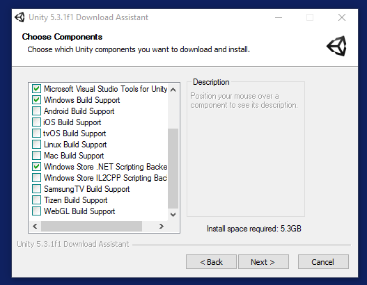
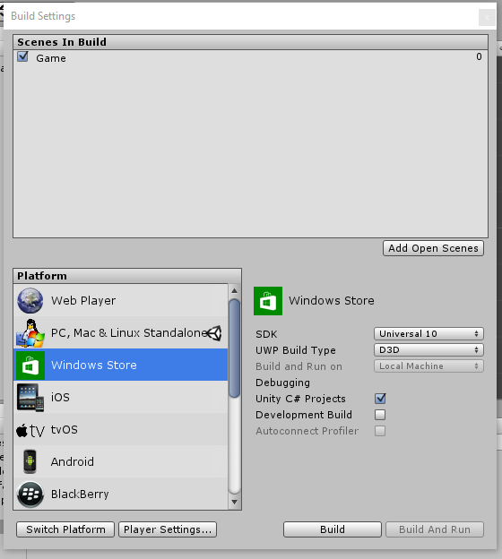

# Add Xbox Live support to Unity for UWP with .NET scripting backend for ID@Xbox and managed partners

**1) Install Unity**

Install Unity 5.3 or higher and during the Unity install process, check the "Windows Store .NET Scripting backend" component.



**2) Open a new or existing Unity project**

It can be a 3D or 2D project. Either type will work with the Xbox Live SDK.

**3) Import the latest version of the Xbox Live WinRT Unity asset package This can be found at https://github.com/Microsoft/xbox-live-api/releases**

**4) Add and attach a new C\# script to a Unity object.**

For example, click on a Unity object such as the "Main Camera", and click "Add Component" \| "New Script" \| C\# Script \| and name it "XboxLiveScript". Any game object will do.

**5) Build the project in Unity.**

1.  Go to File \| Build Settings, click Windows Store and make sure you click “Switch Platform”

2.  Click "Add Open Scenes" to add the current scene to the build

3.  In the SDK combo box, choose "Universal 10"

4.  In the UWP build type combo box, choose "D3D", but "XAML" will also work if you prefer.

5.  Click the "Unity C\# Projects" checkbox to generate the Assembly-Csharp.dll projects

6.  Click "Build" for Unity to generate the UWP Visual Studio project that wraps your Unity game in a UWP application. When you get prompted for a location, create a new folder to avoid confusion since a lot of new files will be created. It’s recommended you call the folder "Build", and then select that folder




**6) Open the generated UWP project in Visual Studio**

Unity will open the output project folder in Explorer.  Ignore the .sln file there.  Instead navigate into your Build folder and open the generated .sln in Visual Studio.  

You'll see 3 projects in this solution.

1.  Assembly-CSharp. This is where your Xbox Live scripts will live

2.  Assembly-Csharp-firstpass. This project can be ignored for our purposes.

3.  UWP app based on the name of your project. This is a traditional UWP app that hosts the Unity engine. This is where you'll be setting up some Xbox Live configuration similar to a traditional UWP app.


**7) Add Xbox Live configuration to the UWP app**

Follow the doc page called [Adding Xbox Live to a new or existing UWP project](get-started-with-visual-studio-and-uwp.md)

**8) Add Xbox Live code to your script**

Copy/paste this example Xbox Live code into script you attached to the game object. This script will appear in the "Assembly-CSharp" project. You can change the code as desired.

```csharp
#if NETFX_CORE

using UnityEngine;
using System;
using Microsoft.Xbox.Services.System;

public class XboxLiveScript : MonoBehaviour
{
    Microsoft.Xbox.Services.System.XboxLiveUser m_user = new Microsoft.Xbox.Services.System.XboxLiveUser();
    Microsoft.Xbox.Services.XboxLiveContext m_xboxLiveContext = null;
    Windows.UI.Core.CoreDispatcher UIDispatcher = null;
    string debugText = "";

    void Start()
    {
        Windows.ApplicationModel.Core.CoreApplicationView mainView = Windows.ApplicationModel.Core.CoreApplication.MainView;
        Windows.UI.Core.CoreWindow cw = mainView.CoreWindow;

        UIDispatcher = cw.Dispatcher;
        SignIn();
    }

    void Update()
    {
    }

    void OnGUI()
    {
        GUI.Label(new UnityEngine.Rect(10, 10, 300, 50), debugText);
    }

    async void SignIn()
    {
        SignInResult result = await m_user.SignInAsync(UIDispatcher);

        if (result.Status == SignInStatus.Success)
        {
            m_xboxLiveContext = new Microsoft.Xbox.Services.XboxLiveContext(m_user);
            debugText += "\n User signed in: " + m_xboxLiveContext.User.Gamertag;
        }
    }
}

#endif
```

**9) Compile and run the UWP app from Visual Studio**

This will launch the app like a normal UWP app and allow Xbox Live calls to operate as they require a UWP app container to function.

**10) Rebuild if you make changes to anything in Unity**
  
If you change anything in Unity, then you must rebuild the UWP project.

Note that Unity will replace your pfx file when you recompile which will cause Xbox Live sign-in to fail, so you must update it inside the Unity project to avoid this issue.

To do this, go to File \| Build Settings, click on "Build Settings" on the Windows Store player and click the PFX button to replace the PFX file with the one you got from above. You can alternatively delete the PFX file each time you rebuild the project from within Unity.

## Troubleshooting common issues

**1)**
If Unity has that an associated script can not be loaded, then ensure that you did step 3 to drag the WinMD to the Unity project assets panel

**2)**
If the app crashes immedately at startup or when trying to run this line of code:

    Microsoft.Xbox.Services.System.XboxLiveUser m_user = new Microsoft.Xbox.Services.System.XboxLiveUser();

Ensure you have added a xboxservices.config text file to the project and in its properties, set the "Build Action" to "Content", and "Copy to Output Directory" set to "Copy Always".

> [!NOTE]
> All values inside xboxservices.config are case sensitive.

Also ensure it contains proper JSON formatting with the TitleId in decimal form, such as:

```json
{
    "TitleId" : 928643728,
    "PrimaryServiceConfigId" : "3ebd0100-ace5-4aa4-ab9c-5b733759fa90"
}
```

**3)**
If the app launches, but fails to signin then check the following:

a) Your machine is set to the your developer sandbox.  Use the SwitchSandbox.cmd script in the \Tools folder of the Xbox Live SDK to do this.

b) You are signing in with an Xbox Live account that has access to the developer sandbox.  Normal retail Xbox Live accounts don't have access.  You can use XDP or Dev Center to create an test accounts.

c) Your package.appxmanfiest in your UWP app is set to the correct Identity.  You can edit this manually, but the easiest way to fix this is to right click on the Project in Visual Studio and choose "Store" \| "Associate App with the Store".

d) The stock .pfx file provided by Unity won't have the correct identity so either delete it from the disk and remove the line in the .csproj that references it, or right click on the Project in Visual Studio and choose "Store" \| "Associate App with the Store" which will place down a proper .pfx file.  Be sure then to go back to Unity, click on "Build Settings" on the Windows Store player and click the PFX button to replace the .pfx file with the one you got from Visual Studio's "Associate App with the Store" action.
