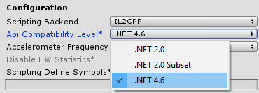
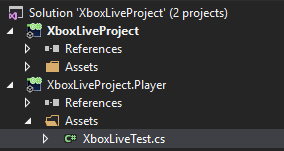
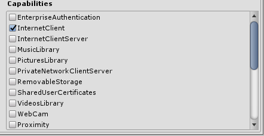

# Add Xbox Live support to Unity for UWP with IL2CPP scripting backend for ID@Xbox and managed partners

## Overview

Windows Runtime Support for IL2CPP in Unity

With the release of Unity 5.6f3 the engine has included a new feature that enables developers to use Windows Runtime (WinRT) components directly in script by including them in the game project directly. Until 5.6 developers have needed a plugin, or dll to support any platform feature (including Xbox Live SDK) from game script in UWP. This new projection layer removes the plugin requirement, and introduces a new and simplified workflow supported only with games that choose the IL2CPP scripting backend.

For more information on how to get started, see the Unity documentation: https://docs.unity3d.com/Manual/IL2CPP-WindowsRuntimeSupport.html

## Steps

**1) Install Unity**

Install Unity 5.6 or higher, and ensure you have the **Windows Store Il2CPP scripting backend** selected during installation

**2) Install Visual Studio Tools for Unity version 3.1 and above for IntelliSense support when using WinMDs**
For Visual Studio 2015, this can be found at https://marketplace.visualstudio.com/items?itemName=SebastienLebreton.VisualStudio2015ToolsforUnity.  For Visual Studio 2017, the component can be added inside the Visual Studio 2017 installer.

**3) Open a new or existing Unity project**

**4) Switch the platform to Universal Windows Platform in the Unity Build Settings menu**

**5) Enable IL2CPP scripting backend in the Unity player settings, and set API compatibility to .NET 4.6**



**6) Import the latest version of the Xbox Live WinRT Unity asset package**
This can be found at https://github.com/Microsoft/xbox-live-api/releases

**7) Add and attach a new C\# script to a Unity object.**

For example, click on a Unity object such as the "Main Camera", and click "Add Component" \| "New Script" \| C\# Script \| and name it "XboxLiveScript". Any game object will do.

**8) Open the script in Visual Studio (with VSTU 3.1+ installed)**

You will notice two projects, open your game script XboxLiveTest.cs in the "Player" project generated by VSTU



This is a special project generated for UWP, and includes references for the winmd files you have placed in your assets.
It will also define the "#if ENABLE_WINMD_SUPPORT" define for you so IntelliSense and syntax highlighting will work properly.

**9) Add the following Xbox Live code to the XboxLiveTest.cs source file**

```csharp

using System.Collections;
using System.Collections.Generic;
using UnityEngine;
using System;
public class XboxLiveTest : MonoBehaviour
{
#if ENABLE_WINMD_SUPPORT
    Microsoft.Xbox.Services.System.XboxLiveUser m_user = new   Microsoft.Xbox.Services.System.XboxLiveUser();

    Microsoft.Xbox.Services.XboxLiveContext m_xboxLiveContext = null;
    Windows.UI.Core.CoreDispatcher UIDispatcher = null;
#endif
    string debugText = "";
    // Use this for initialization
    void Start()
    {
#if ENABLE_WINMD_SUPPORT
        Windows.ApplicationModel.Core.CoreApplicationView mainView = Windows.ApplicationModel.Core.CoreApplication.MainView;
        Windows.UI.Core.CoreWindow cw = mainView.CoreWindow;
        UIDispatcher = cw.Dispatcher;
        SignIn();
#endif
    }
    // Update is called once per frame
    void Update()
    {
    }
    void OnGUI()
    {
        GUI.Label(new UnityEngine.Rect(10, 10, 300, 50), debugText);
    }
#if ENABLE_WINMD_SUPPORT
    async void SignIn()
    {
        Microsoft.Xbox.Services.System.SignInResult result = await m_user.SignInAsync(UIDispatcher);
        if (result.Status == Microsoft.Xbox.Services.System.SignInStatus.Success)
        {
            m_xboxLiveContext = new Microsoft.Xbox.Services.XboxLiveContext(m_user);
            debugText += "\n User signed in: " + m_xboxLiveContext.User.Gamertag;
        }

    }
#endif
}

```

**10)	Make sure you have 'InternetClient' capability selected in the publishing settings found in player settings**



**11) Build the project in Unity.**

1.  Go to File \| Build Settings, click **Universal Windows Platform** and make sure you click **Switch Platform**

2.  Click "Add Open Scenes" to add the current scene to the build

3.  In the SDK combo box, choose "Universal 10"

4.  In the UWP build type combo box, choose "D3D", but "XAML" will also work if you prefer.

5.  Click "Build" for Unity to generate the UWP Visual Studio project that wraps your Unity game in a UWP application. When you get prompted for a location, create a new folder to avoid confusion since a lot of new files will be created. It’s recommended you call the folder "Build", and then select that folder

**12) Add Xbox Live configuration to your project**

Add the xboxservices.config file:


Follow the doc page called [Adding Xbox Live to a new or existing UWP project](get-started-with-visual-studio-and-uwp.md)

> [!NOTE]
> All values inside xboxservices.config are case sensitive.

**13) Compile and run the UWP app from Visual Studio**

This will launch the app like a normal UWP app and allow Xbox Live calls to operate as they require a UWP app container to function.

**14) Rebuild if you make changes to anything in Unity**
  
If you change anything in Unity, then you must rebuild the UWP project.

Note that Unity will replace your pfx file when you recompile which will cause Xbox Live sign-in to fail, so you must update it inside the Unity project to avoid this issue.

To do this, go to File \| Build Settings, click on "Build Settings" on the **Universal Windows Platform** player and click the PFX button to replace the PFX file with the one you got from above. You can alternatively delete the PFX file each time you rebuild the project from within Unity.

## Troubleshooting common issues

**1)**
If Unity has that an associated script can not be loaded, then ensure that you did step 3 to drag the WinMD to the Unity project assets panel

**2)**
If the app crashes immediately at startup or when trying to run this line of code:

    Microsoft.Xbox.Services.System.XboxLiveUser m_user = new Microsoft.Xbox.Services.System.XboxLiveUser();

Ensure you have added a xboxservices.config text file to the project and in its properties, set the "Build Action" to "Content", and "Copy to Output Directory" set to "Copy Always".
Also ensure it contains proper JSON formatting with the TitleId in decimal form, such as:

```json
{
    "TitleId" : 928643728,
    "PrimaryServiceConfigId" : "3ebd0100-ace5-4aa4-ab9c-5b733759fa90"
}
```

**3)**
If the app launches, but fails to signin then check the following:

a) Your machine is set to the your developer sandbox.  Use the SwitchSandbox.cmd script in the \Tools folder of the Xbox Live SDK to do this.

b) You are signing in with an Xbox Live account that has access to the developer sandbox.  Normal retail Xbox Live accounts don't have access.  You can use XDP or Dev Center to create an test accounts.

c) Your package.appxmanfiest in your UWP app is set to the correct Identity.  You can edit this manually, but the easiest way to fix this is to right click on the Project in Visual Studio and choose "Store" \| "Associate App with the Store".

d) The stock .pfx file provided by Unity won't have the correct identity so either delete it from the disk and remove the line in the .csproj that references it, or right click on the Project in Visual Studio and choose "Store" \| "Associate App with the Store" which will place down a proper .pfx file.  Be sure then to go back to Unity, click on "Build Settings" on the **Universal Windows Platform** player and click the PFX button to replace the .pfx file with the one you got from Visual Studio's "Associate App with the Store" action.
