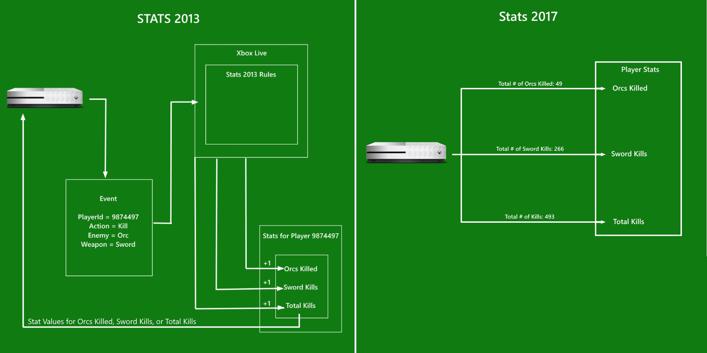

# Player stats

As described in [Data Platform Overview](../data-platform/data-platform.md), stats are key pieces of information you want to track about a player. For example *Head Shots* or *Fastest Lap Time*. Stats are used to generate leaderboards in a number of scenarios that will allow players to compare their effort and skills with their friends and every other player in a title's community. Configured stats show up in a title's [Game Hub](../data-platform/designing-xbox-live-experiences.md) leaderboard where a player will see how they rank against their friends who have also played the title. The stats that show up in a title's Game Hub are called **Feature Stats**, aka **Hero Stats**. In addition to showing up in the Game Hub, as of the Xbox One 1806 update Featured Stats may also periodically appear in pinned content blocks that users may add to their Home view. This allows quick access to social leaderboards for directly from the Home view. It’s important to remember that Featured Stats are one of several possible items displayed in pinned Content Blocks, so users may not always see them if Microsoft’s content services determine another content item could be more compelling.

## Stats 2013 and 2017

Currently there are two implementations for stats for Xbox Live, Stats 2013 and Stats 2017. Both are available to ID@Xbox and managed partner developers. Xbox Live Creators Program developers may only use Stats 2017 and so can ignore Stats 2013.

Xbox Live Creators Program developers can skip ahead to the [Stats 2017 document](stats2017.md).

These two implementations operate on fundamentally different principles. When using Stats 2013 you send **events** to the Xbox Live Service containing certain information about an action a user performed. The information in these **events** is used to update stats accordingly. In Stats 2013 the service will keep track of and update all of your stats values, making it the source of truth for statistic values for a player or group of players. To contrast, in Stats 2017 you will send up the actual stat value itself for the server to use. In Stats 2017 the server does little to no validation on the value sent to it and so it is up to your title to keep track of the correct stat values and be the source of truth for statistic values. We recommend that you track and store your stats in the cloud with the [Xbox Live Storage Platform](../storage-platform/storage-platform.md) if you decide to implement Stats 2017. You can think of Stats 2017 as a reporting service. You send the correct stat for your game to the server, you stat will then sit on the server and wait to be displayed on request or updated.

## A brief history

With the launch of Xbox One, Xbox Live introduced a new event-driven stats model, Player Stats 2013. This offered a multitude of benefits – a single event from a game can update data for multiple Xbox Live features, such as leaderboards and achievements; Xbox Live configuration lives on the server instead of in the client; and much more. In the years following the Xbox One launch, we listened closely to game developer feedback, and developers consistently requested a more streamlined stats service that would allow them to bypass the complexity that comes with an event driven system, as well as allow them to use any stats tracking methods they were already practicing. Based on Developer feedback a new simplified version of stats was created that would put control of stats logic back into the hands of the developer. That system is Stats 2017, a service that simply takes the value passed to it by the title giving developers control of the logic of how a stat value is determined.

## How Stats are handled in 2013 and 2017

Let's take a look at configuring and updating stats for 2013 and 2017. Let us say we're going to make stats from some generic rpg and want to keep track of monsters killed.

In Stats 2013 your title would send an *event* that contains information about an action performed by a player. In this event the action will be slaying an orc while the player had a sword equipped. Some of the information contained in this event might be that a slay action was taken, the thing slayed was an orc, the combat type was melee, and the weapon used was a sword. Stats 2013 will run this information through a number of rules configured by you, the developer, on the [Xbox Developer Portal (XDP)](https://xdp.xboxlive.com/User/Contact/MyAccess?selectedMenu=devaccounts) or the [Windows Dev Center](https://developer.microsoft.com/en-us/windows), and update stats, also configured by you, based on the event. In Stats 2013 the service will keep track of what the value for your slaying statistics should be. The slay orc with sword event could update multiple statistics such as, number of kills, number of orcs slain, and number of sword kills.

In Stats 2017, you will send up the actual values for your statistics. For the slay orc with sword example, your title will keep track of the number of overall kills, sword kills, and orcs slain individually, and send the service the updated number for each statistic. The service has minimal validation checks to make sure that you're sending a number that makes sense, so it is absolutely up to your title to send up the correct statistic. While you may use the Stats 2017 service to recall the values of stats at the beginning of a game session, you should not use the Stats 2017 service to confirm the value of a stat while the session is ongoing.

Below you can see an illustration of how the two flavors of Stats operate.

## A few more notes

For ID@Xbox and managed partner developers there are a few more differences you should be aware of when deciding between Stats 2013 and Stats 2017 for your title.

Stats 2013 allows for more leaderboard views.
Stats 2013 allows you to more easily drill down on the meta data of your statistics. In our orc slay example the overall statistic was keeping track of the number of kills. Stats 2013 allows you to drill down on your statistics to what was killed and with what weapon as well as any other kill defining information you may configure.

Stats 2013 has a native minutes played stat.
Stats 2013 allows you access to a player's play time in game without configuring the statistic. Any playtime statistic would have to be tracked by your title in Stats 2017.

Stats 2013 has a near real time update frequency.
The Stats 2013 event system updates your stats almost instantaneously. In Stats 2017 there is a five minute wait time before updated stats are flushed to the service. The developer can flush statistics manually, but will still be throttled to a minimum of 30 seconds between flushes.

Stats 2013 can support other Xbox Live Services.
With Stats 2013 you can use stats to unlock achievements and make matchmaking decisions. Stats 2017 is only used to produce leaderboards.

## Further reading

For a more in-depth explanation of Stats 2013 you can read the  [partner only documentation on Stats 2013](https://developer.microsoft.com/en-us/games/xbox/docs/xboxlive/xbox-live-partners/event-driven-data-platform/user-stats).
For a more in-depth explanation of Stats 2017 read the [Stats 2017 Documentation](stats2017.md).