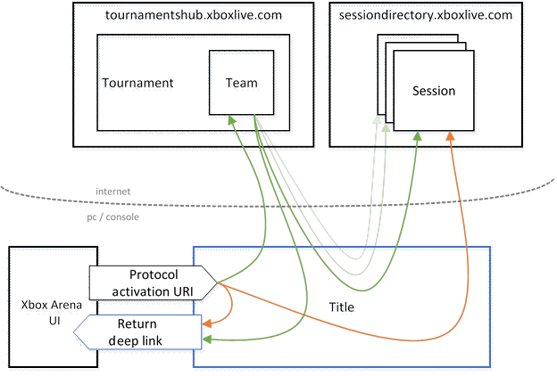
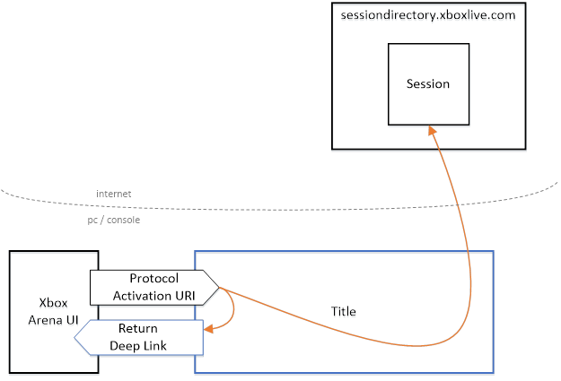
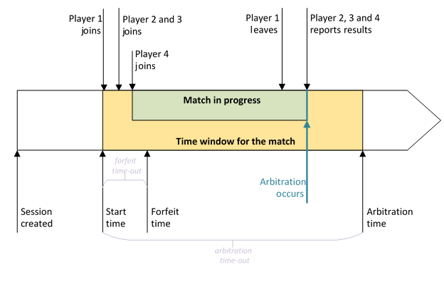
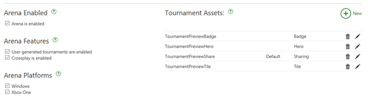

# Arena title integration guide

## Introduction

The Arena platform for Xbox allows Tournament Organizers (TOs) to create and operate tournaments for titles that support Arena. Arena supports both an Xbox Live TO that enables publisher and user-run tournaments, as well as third-party TOs who integrate with Arena. The style of tournament, such as single elimination or Swiss, is determined by the TO.

This topic walks you, as a title developer, through how to implement support for Arena in your title. After a game is Arena enabled, it will work with any supported tournament format selected by the TO. The TO orchestrates matches for your title according to the structure of the tournament. The Arena-enabled title then places the right users into each match within the game and reports match results back to the TO.

## Overview

Xbox Arena uses concepts familiar to Xbox multiplayer game development. If you’re not familiar with the Xbox multiplayer system, we recommend that you review that documentation before continuing. The process is similar to that of a user accepting an invitation into a multiplayer game. When it’s time for a user to play a match in an Arena tournament, a toast pops up to inform the user. Accepting the toast causes your title to receive a standard Arena protocol activation event. If your title isn’t already running, it is launched at this time.

The tournament match itself is coordinated by using a Multiplayer Session Directory (MPSD) session. In the case of Arena, the session is created by the Arena platform instead of by your title. This is done by using a session template and additional game configuration which have been created by you as the title publisher. The tournament match participants will already have been joined to the session. As the title publisher, you must configure the session template used for Arena to support arbitration for results reporting. The full requirements for the session are included later in this document. Your title is also free to create any additional sessions it needs.

Your title uses the session to set up the match and report results. Responding to protocol activation and interacting with the MPSD session is the minimum level of integration required by Arena titles. Browsing and registering for tournaments is supported via the Xbox Arena UI. Optionally, titles can get additional information about the tournament from the Tournaments Hub service, enabling a richer in-title experience. For example, by using the Tournaments Hub, your title can display context such as the team names, and discover new match sessions for a user. This data flow is depicted by the green arrows in the following diagram, and is described in detail in the [Experience requirements and best practices](#experience-requirements-and-best-practices) section. The faded arrows indicate that the reference from the team to the session changes over time, as the user moves from match to match within the tournament.




The Arena protocol activation URI contains information about the tournament, the session for the match, and a deep link that your title can invoke when the match is over. The deep link returns the user to the Xbox Arena UI. These URI components are described in more detail in the [Protocol activation](#protocol-activation) section of [Basic requirements for Arena integration](#basic-requirements-for-arena-integration).

## Basic requirements for Arena integration

This section provides technical guidance and details for integrating your title with the minimum requirements for supporting Arena. This style of integration leverages the data flow depicted by the orange arrows in the following overview diagram.



Your title is protocol-activated from the Xbox Arena UI. This could originate from a toast notification, the details page for the tournament, or any other entry point for the match. The steps that occur when a user participates in a match are:

1.	Your title is protocol-activated by the Xbox Arena UI.
2.	Your title uses the activation parameters to play a single match.
3.	When the match is over, your title reports the results to the MPSD game session.
4.	Your title gives the user the option to return to the Arena UI.

The following sections go through each of these steps in detail.

### 1.	Protocol activation

The Arena UI kicks things off by protocol-activating your title when a match is ready for the user. There are two cases: your title may be launched at this time, or it may already be running. Both cases are similar to what happens when a title is activated in response to a user accepting an invitation to a multiplayer game.

#### If your title is launched at the time of protocol activation

The **Activated** event fires for the first time when your title is launched. If that initial activation is an Arena protocol activation, your title was launched by a user attempting to play in a tournament. Have your title skip as quickly as possible to the match, bypassing menu and sign-in screens. The Xbox User ID (XUID) of the participating user is provided in the activation URI and should already be signed in.

#### If your title is already running

The **Activated** event can also fire with an Arena protocol activation while your title is already running. The **Activation** event is triggered only by an explicit user action (either acting on a toast that indicates the match, or jumping into the match from the Xbox Arena UI). If your title has been waiting on a menu screen, have it jump immediately to the tournament match. If your title receives the protocol activation during gameplay, have it give the user the option to leave the game and enter the tournament match in the most expedient way it can. Give the user a chance to save their game if necessary.

Protocol activations are delivered to your title via the `CoreApplicationView.Activated` event. If the `IActivatedEventArgs.Kind` property of the event arguments is set to `Protocol`, the activation is a protocol activation, and the arguments can be cast to the `ProtocolActivatedEventArgs` class, where the protocol-activation URI is available via the `Uri` property.

Have your title check the XUID on the protocol activation URI. If it doesn’t match the current player, your title will also need to switch user contexts.

#### The protocol-activation URI

The template for the URI is:

```URI
ms-xbl-multiplayer://tournament?action=joinGame&joinerXuid={memberId}&organizer={organizerId}&tournamentId={tournamentId}&teamId={teamId}&scid={scid}&templateName={templateName}&name={name}&returnUri={returnUri}&returnPfn={returnPfn}
```

For ERA titles on the console, the activation scheme is slightly different:

```
ms-xbl-{titleIdHex}://
```

This is the same as for invitations. For this purpose, the title ID must be eight hexadecimal characters, so it will include leading zeroes if necessary.

First make sure that the `Uri.Host` (the name immediately following the “://” separator) is “tournament”. That’s how Arena’s protocol activations are distinguished from activations of other features, such as game invitations.

The query-string arguments will be URL encoded and are case insensitive. Your title shouldn’t depend on the order of the parameters, and it should ignore unrecognized parameters.


Paramater(s) | Description
--- | ---
**action** | The only supported action is “joinGame”. If the **action** is missing or another value is specified for it, ignore the activation.
**joinerXuid** | The **joinerXuid** is the XUID of the signed-in user who is attempting to play in a tournament match. Your title must allow switching to this user’s context. If the **joinerXuid** is not signed in, your title must prompt the user to do so by bringing up the account picker. XUIDs are always expressed in decimal.
**organizerId, tournamentId** | The **organizerId** and **tournamentId**, when combined, form the unique identifier for the tournament that the match is associated with. Use this identifier to retrieve more detailed information about the tournament from the Tournaments Hub, if you choose to display it in your title.
**teamId** | The **teamId** is a unique identifier for the team, in the context of the tournament that the user (specified by the **joinerXuid** parameter) is a member of. Like the **organizerId** and **tournamentId** parameters, you can use the **teamId** to optionally retrieve information about the team from the Tournaments Hub.
**scid, templateName, name** | Together, these identify the session. These are the same three parameters in the MPSD URI path to the session:</br> </br>`https://sessiondirectory.xboxlive.com/serviceconfigs/{scid}/sessiontemplates/{templateName}/sessions{name}`.</br></br>In XSAPI, they’re the three parameters to the `multiplayer_session_reference `constructor.
**returnUri, returnPfn** | The **returnUri** is a protocol-activation URI to return the user to the Xbox Arena UI. The **returnPfn** parameter may or may not be present. If it is, it’s the Product Family Name (PFN) for the app that’s intended to handle the **returnUri**. For sample code that shows how to use these values, see [Returning to the Xbox Arena UI](#returning-to-the-xbox-arena-ui).

### 2.	Playing the match

When the MPSD session is created by the Tournament Organizer, the user is set as an inactive member of that session. Your title must immediately set the player to active by using `multiplayer_session::join()`. This indicates to Xbox Live and the other users in the match that the user is in your title and ready to play.

The start time for the match is in the session at `/servers/arbitration/constants/system/startTime` as a date-time value in the standard UTC format (for example, “2009-06-15T13:45:30.0900000Z”). (Start time is also available in XSAPI as `multiplayer_session_arbitration_server::arbitration_start_time()`, starting in the 1703 XDK). The TO can create the session as far in advance of the start time as it wants (including concurrently with the start time). Match notifications are sent to the match participants at the start time, so titles never get activated before the start time. The start time is also the earliest time at which MPSD will allow results to be reported for the match.

Your title looks at each member’s `/member/{index}/constants/system/team` property (`multiplayer_session_member::team_id()`) to figure out which team each user is on.

Your title also uses the session to determine the match settings, such as map and mode. These title-specific settings can be set in the session template or as part of the tournament definition as custom constants. (For more information, see [Configuring a title for Arena](#configuring-a-title-for-arena).) Here’s an example:

```json
{
    "constants": {
        "custom": {
            "enableCheats": false,
            "bestOf": 3,
            "map": "winter-fall",
            "mode": "capture-the-throne"
        }
    }
}
```

You can retrieve these settings from the session as a JavaScript Object Notation (JSON) object by using the `multiplayer_session_constants::session_custom_constants_json()` API.

In general, your title should treat the Arena session the same way it would treat its own MPSD session. For example, it can create handles and subscribe for RTA notifications. But there are a few differences. For example, your title can’t change the roster of the game session or use the Quality of Service (QoS) features of the session, and it must participate in arbitration. The complete details of the session are provided later in this document.

### 3.	Reporting results

The results of the match are reported back to Arena and the TO through the session by using a feature called arbitration. Arbitration is a framework for using a session to securely play a match and report a result.

The session provided to your title in the protocol-activation step will be an arbitrated session, which means that it has a fixed timeline that the arbitration framework enforces. This diagram shows the arbitration timeline.



At least one player must be active in the session before the forfeit time, which is the start time (`multiplayer_session_arbitration_server::arbitration_start_time()`) plus the forfeit time-out. The forfeit time-out is in the session as a number of milliseconds at `/constants/system/arbitration/forfeitTimeout` (`multiplayer_session_constants::forfeit_timeout()`). If no one has joined the session as active before the forfeit time, the match is canceled.

The arbitration time-out is in milliseconds at `/constants/system/arbitration/arbitrationTimeout` (`multiplayer_session_constants::arbitration_timeout()`) . Arbitration time is the start time plus the value of the arbitration time-out, and represents the time by which the players must have completed the match and reported results. This value is set in the session template or game mode by the publisher. Set it to allow as much time as your title needs for the match to be completed.

Your title can report results at any time between the start time and the arbitration time. Arbitration occurs at any time between the forfeit time and the arbitration time, after every active member of the session has submitted results. For example, if just one member is active in the session at the forfeit time, they can (and should) post a result, and arbitration will occur. No matter how many results are available at arbitration time, arbitration will occur if it hasn’t already. If no results are submitted when arbitration time is reached, all participants in the match are given a loss.

It’s also possible for a game server to force arbitration at any time by simply writing an arbitrated result.

If a user is in a session that has already been arbitrated (either because the arbitration time-out expired, a game server arbitrates the session, or the user joins late), your title ends the match and displays the arbitrated result to the user.

Arbitration results always include the outcome for every team. When an individual player writes a result to the session, it includes not just their team’s outcome, but the full set of results for every team.

The results in JSON look like this.

```json
"results": {
    "red": {
        "outcome": "rank",
        "ranking": 1
    },
    "blue": {
        "outcome": "rank",
        "ranking": 2
    }
}
```

In this example, the team IDs are “red” and “blue”. The red team came in first and the blue team second. Other possible values for **outcome** are:

* “win”
* “loss”
* “draw”
* “noshow”

If **outcome** is anything other than “rank,” the ranking is omitted for that team.

Individual users write the match results to `/members/{index}/properties/system/arbitration` (`multiplayer_session::set_current_user_member_arbitration_results()`). The following example illustrates how a title might construct and submit a set of results, assuming that your title isn’t team based (that is, all players are on teams of one).

```c++
void Sample::SubmitResultsForArbitration()
{
    std::unordered_map<string_t, tournament_team_result> results;

    for (auto& member : arbitratedSession->members())
    {
        tournament_team_result teamResult;
        teamResult.set_state(tournament_game_result_state::rank);
        teamResult.set_ranking(memberRank);

        results.insert(std::pair<string_t, tournament_team_result>(
            member->team_id(),
            teamResult));
    }

    arbitratedSession->set_current_user_member_arbitration_results(results);
    xboxLiveContext->multiplayer_service().write_session(
arbitratedSession,
multiplayer_session_write_mode::update_existing)
    .then([](xbox_live_result<std::shared_ptr<multiplayer_session>> sessionResult)
    {
        if (sessionResult.err())
        {
            // Handle error.
        }
        else
        {
            // Update local session cache.
        }
    });
}
```

After arbitration occurs, MPSD places the final results in `/servers/arbitration/properties/system` (`multiplayer_session::arbitration_server()`), along with a few other properties as shown here.

```json
{
    "resultState": "completed”,
    "resultSource": "arbitration",
    "resultConfidenceLevel": 75,

    "results": { ... }
}
```

Possibilities for **resultState** include:

* “completed”: All active players reported a result.
* “partialresults”: Some but not all active players reported a result before the arbitration time-out.
* “noresults”: None of the active players reported a result before the arbitration time-out.
* “canceled”: No active players arrived before the forfeit time-out.

In the case of “noresults” and “canceled”, the results are omitted.

The **resultSource** is “arbitration” when MPSD performs the arbitration based on the results reported by individual players. A game server can write to /servers/arbitration/properties/system itself, bypassing arbitration. In that case, it indicates a **resultSource** of “server”. It’s also possible for a game server to rewrite (that is, fix or adjust) the results, in which case it sets **resultSource** to “adjusted”.

The **resultConfidenceLevel** is an integer between 0 and 100 that indicates the level of consensus in the result. 100 means all players agree. 0 means there was no consensus, and a result was chosen essentially at random from those submitted. When a game server sets the arbitration results, it sets the **resultConfidenceLevel**-typically to 100, unless for some reason even the game server itself isn’t sure (for example, if it’s reporting the results of its own per-player voting procedure). Set the **resultConfidenceLevel** also when results are adjusted to reflect the confidence in the adjusted results.

When the **resultSource** is “arbitration” (and the **resultState** is “completed” or “partialresults”), the results provided are an exact copy of at least one of the player-reported results.

### 4.	Returning to the Xbox Arena UI

When the match is over (or potentially in response to a player’s request to abandon the match in progress), present an option for the player to return to the Xbox Arena UI from where they joined the match. This can be done from a post-match results screen or any other end-of-game UI.

To return to the Arena UI, invoke the **returnUri** that was passed in from the protocol-activation URI by using the `Windows::System::Launcher` class. Be sure to include the user context.

The launch API is exposed slightly differently to ERA games than to Universal Windows Platform (UWP) games. The ERA version of the API doesn’t allow the PFN to be supplied, so the PFN can be ignored even if present on the activation URI.

Here’s example code for an ERA to return the user to the Arena UI.

```c++
void Sample::LaunchReturnUi(Uri ^returnUri, Windows::Xbox::System::User ^currentUser)
{
    auto options = ref new LauncherOptions();
    options->Context = currentUser;

    Launcher::LaunchUriAsync(returnUri, options);
}
```

UWP games can set the **TargetApplicationPackageFamilyName** property on **LauncherOptions** to the return PFN, if one was provided on the protocol activation URI. That ensures that the specific app is launched and that the user is taken to the Store if the app isn’t already installed.

Here’s example code for a UWP app to return the user to the Arena UI.

```c++
void Sample::LaunchReturnUi(Uri ^returnUri, String ^returnPfn, User ^currentUser)
{
    auto options = ref new LauncherOptions();

    if (returnPfn != nullptr)
    {
        options->TargetApplicationPackageFamilyName = returnPfn;
    }

    Launcher::LaunchUriForUserAsync(currentUser, returnUri, options);
}
```

After invoking the Arena UI, your title continues running, possibly at that same screen, waiting for another protocol activation event. That way, if the player has another match to play, your title is ready to go. This expedites the user experience as the player goes from match to match, switching between your title and Xbox Arena UI.

### Handling errors and edge cases

The flow in the preceding section describes the golden path through playing a match. There are many places where you may see unexpected behavior, or issues might arise. This section covers a number of potential errors or edge cases, and provides recommendations for handling them in your title.

#### Game session not found

If your title is launched with a session ref for a match, and the client then fails to get an error when requesting that session from MPSD, present an error to the user indicating that they are unable to join the match.

#### User attempts to join a match that has been played

If a user attempts to join a match after results have been reported, block that client from starting a new match and present the user with an error. You can check whether results have been reported by iterating through the members of the session to see if any have a `/members/{index}/arbitrationStatus` (`multiplayer_session_member::tournament_arbitration_status`) set to “complete”.

#### Game clients unable to establish a p2p connection

If your title uses person-to-person (p2p) connections between clients for multiplayer and doesn’t have support for relays, there may be instances where users who are matched together are unable to form a p2p connection.

If the client is able to retrieve the session for the match but can’t connect to other clients, report a “draw” result for each team under `/members/{index}/properties/system/arbitration/results` (`multiplayer_session::set_current_user_member_arbitration_results()`). This indicates to Xbox Live that the match has not taken place. It also prevents exploits where users can advance through a tournament by forcing a p2p connection failure.

#### Game client disconnects mid-match

One of the most common error scenarios is when clients disconnect while a match is being played. Depending on the state of the match and your implementation, there are a few options for handling this case:

* If the tournament match is one vs. one, or if all members of a team disconnect from the other clients and/or your game service, we recommend that you report a “loss” for the team that is no longer connected. This prevents the case in which users can force a disconnect from a match they are losing to prevent the result from being reported.
* If the match is between teams with multiple members, and a subset of the clients for a team disconnect mid-match, you can choose to end the match at that point or allow it to continue with the remaining users. If you choose to continue the match, you may also optionally allow users who disconnected to rejoin the match.

#### Full team(s) not present

If your title supports matches with teams of two or more, you may encounter cases where some members of a team fail to launch your title for their match. In this case, you can choose to allow the members of the team to play without their team member, and optionally allow that team member to join the match in progress.

Alternatively, you can automatically enforce a result. If you do that, wait until the forfeitTimeout time to give all participants an opportunity to join the match before you enforce the result. This allows you to adjust the window with changes to the game mode for the tournament instead of having to update your title.

#### Length of match exceeds arbitrationTimeout

Set the value for **arbitrationTimeout** to be greater than the maximum length of time a match can possibly take. That being said, your title may feature modes in which the possible match lengths are extremely long, or in which there is no maximum. In these cases, you consider either:

* Limiting tournament play to only modes with fixed, maximum lengths of time.
* Informing the user of the time limit, and reporting a result before the **arbitrationTimeout** based on an in-match tiebreaker.

Because **arbitrationTimeout** expiration will trigger an automatic result for the match, don't wait the full **arbitrationTimeout** period before reporting a result from the title.  Instead, build in a time buffer (for example, **arbitrationTimeout** - 1000ms), or use a separate value to control the maximum match length.

#### Other cases

For any other failure cases, the general guidance is to inform the user of the error and return the user to the Xbox Arena UI.

## Experience requirements and best practices

Because Arena only ever presents your title with individual matches, new formats can be introduced over time without requiring updates to your title. Therefore the baseline user experience for an Arena integrated title must be simple and flexible enough to work with multiple competition formats.

Optionally, you can use data from the Tournament Hub in your title to make tournaments a more integrated part of the in-game experience.  This functionality can be found under 'xbox::services::tournaments'.  Using these APIs you have the ability to:
* Surface tournament details in your title UI (tournament name, team name, etc.)
* Provide discovery for tournaments in your title
* Keep users in your title between Arena matches

## Configuring a title for Arena

To enable a title for Arena, some additional steps are required when you configure it in the Xbox Developer Portal (XDP) or Universal Dev Center (UDC).

### Enabling Arena for your title

To enable Arena, go to the service configuration page for your title in XDP and select ‘Arena’.



Here, you’ll have several options:

* **Arena Enabled** – Select this check box to enable Arena for this sandbox.
* **Arena Features** – This section includes check boxes to enable user-generated tournaments in the sandbox, and to enable cross play, which allows users on multiple platforms to participate in the same tournaments.
* **Arena Platforms** – Lets you select the platforms on which tournaments can be played for your title.
* **Tournament Assets** – (Formerly in the ‘Multiplayer and Matchmaking’ section.) These are the tournament images for your title.

You must publish the service configuration for your changes to take effect. Self-service Arena configuration is currently not supported through UDC. If you’re using UDC for service configuration, work with your Development Account Manager to onboard with Arena.

### Setting up game modes

Game modes are an Xbox Live feature that enables the publisher to preconfigure settings for a tournament match. These game modes are used upon tournament creation to set the rules enforced by Xbox Live and your title for the tournament. As the title publisher, you need at least one game mode to enable user-generated tournaments for your title. Elements of the game mode include:

#### Supports UGT?

Game modes can be enabled for use with user-generated tournaments (UGTs). If your title is configured to support UGT, you can mark game modes so that they can be selected by Xbox Live users when creating tournaments for your title.

#### Team size

This is the number of users that can participate in the tournament as a team. For a single-user title or tournament, the game mode has a team size of one. Arena currently doesn’t support variable team sizes for tournaments.

#### forfeitTimeout

This is the number of milliseconds, after the match start time, before the match is canceled if no players show up for it (that is, if no players set themselves to active in the session). Set this to an amount of time that’s at least long enough for a player to launch your title and get into the tournament match from the time they see the toast notification.

#### arbitrationTimeout

This is the number of milliseconds, after the match start time, after which no more results will be accepted. Set it to the forfeit time-out plus an amount of time longer than the longest match could possibly take. That way, even if the players start playing right before the forfeit time, they still have enough time to finish the match. If no results are reported by the time of the **arbitrationTimeout**, the participants of the match all receive a loss. Xbox Arena also waits up until the **arbitrationTimeout** for all active members to report results before beginning arbitration.

This time-out acts as a backstop in case something goes wrong and a result doesn’t get reported for a player. Rather than stalling the entire tournament, this time-out puts an upper bound on the amount of time that the tournament will wait. For that reason, it shouldn’t be set too high, because it determines the maximum length of each tournament round.

#### Name

This is the user-facing name for game mode. This value is localizable.

#### Description

This is the user-facing description for game mode. This value is localizable.

#### Custom

The **custom** section for the game mode is a property bag where developers can insert any title-specific configuration settings for the tournament match. Values defined as part of the custom section are written to the match MPSD session under `/properties/custom/`.

Currently, game mode setup is not supported through XDP or UDC. To create game modes for your title, contact your Developer Account Manager.

### Requirements for the session template

As the title developer, you must provide the session template for the TO for use when creating sessions for matches. There are some expectations about the contents of the template.

```json
{
    "version": 1,
    "inviteProtocol": "tournamentGame",
    "memberInitialization": null,

    "capabilities": {
        "gameplay": true,
        "arbitration": true,

        "large": false,
        "broadcast": false,
        "blockBadMsaReputation": false
    },

    "maxMembersCount": {maxMembersCount},
}
```

Other properties not shown here can be set however you want.

Arena sessions are always version 1. Setting the **inviteProtocol** to “tournamentGame” enables the match-ready notifications to be sent to tournament participants. **memberInitialization** is set to null to disable QoS. The gameplay capability must be set because the session represents a match, and the arbitration capability is required for results reporting. The **large**, **broadcast**, and **blockBadMsaReputation** capabilities must be disabled because they would interfere with the operation of the session.

Your title can specify its own settings in the custom section of the template, for settings that have a fixed value for all tournaments that use the template. Here’s an example.

```json
        "custom": {
            "enableCheats": false,
            "bestOf": 3
        }
```

Finally, the **maxMembersCount** system setting is required. Set it to the total number of players that can play in a tournament match. The number of players can be further constrained by game mode settings, so make sure that the value set in the session represents the highest total number of players supported for your title. For example, if the maximum number of players your game supports for a match is 5 vs. 5, set **maxMembersCount** to 10. This MPSD template can be used to support matches of any number of players up to the **maxMembersCount**.
