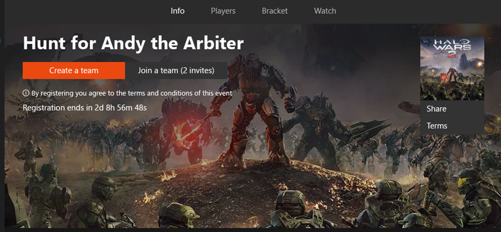
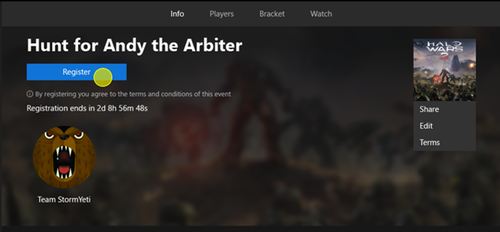

# Join a tournament by using the Arena UI

The Arena APIs can provide your title with data about registration, check-in, and team info, but they *don’t* provide the functionality to *execute* the related tasks. Your title is expected to use the Arena UI or a third-party Tournament Organizer (TO), or to build their own tournament-management support.

## Xbox Arena UI: Team formation

The Arena UI provides a method for gamers to form or a join a team. There is no requirement for the title.

###### UI Example: Create a team

#### When forming a team, a gamer can:

* Send invitations to join to one or more friends or club members.
* Find team members by posting an LFG ad.
* Register or unregister a team.
* Remove a member of a team.

## Xbox Arena UI: Registration

The Arena UI provides a method for gamers to register a team. There is no requirement for the title.

###### UI Example: Register a team

#### When registering for a tournament, a user can:

* Unregister for a tournament *before* registration has closed.
* Unregister a team at check-in or when the tournament is in progress.
* Unregister an entire team. *Note that an individual user leaving a team unregisters the whole team.*
* Register as a captain.
* Understand the tournament requirements and rules of engagement prior to registering.
* Receive a notification that registration was successful.
* See the tournament status change to 'registered' in real time.
* Preview the bracket at the time a tournament starts.
* See players who have already registered for the tournament.
* Be blocked from registering if they do not meet the tournament qualifications.
* Be blocked from registering if a player has been banned.

> [!div class="nextstepaction"]
> [Match engagement](arena-ux-match-engagement.md)
