# Match engagement

After a gamer has registered and checked in for a tournament, they’re set up to play. A participant can be at one of four stages. Each stage contains a unique set of criteria guiding users through the in-game tournament experience. The four stages are:

1.	Ready (Arena UI or in-game)
2.	Playing (in-game)
3.	Results (Arena UI or in-game)
4.	End (Arena UI or in-game)

> [!NOTE]  
> Playing is the only stage of the four that is not supported in the Arena UI. At a minimum, your title must redirect participants to the Arena UI at the end of each match (when the Playing stage is over), so they can view results.

###### Diagram: The four stages of participant progression, after check-in.

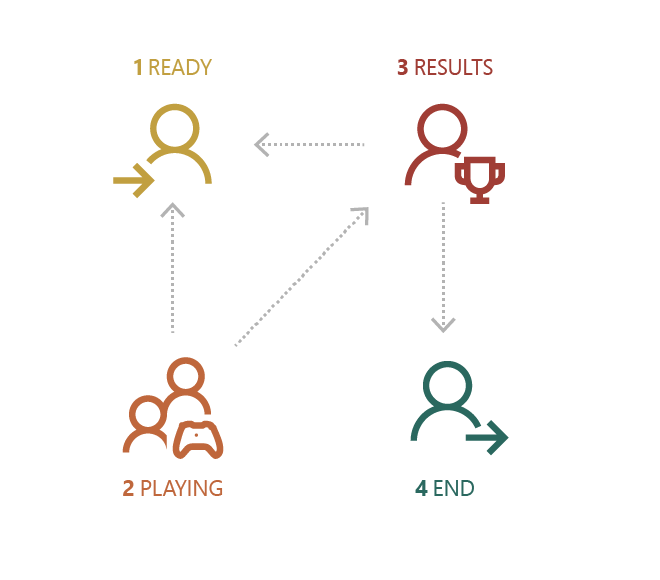

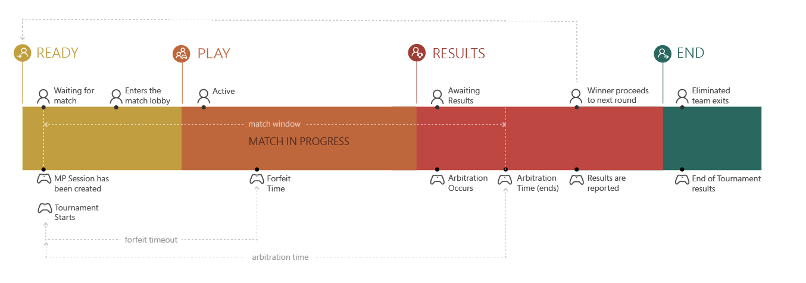

## 1. Ready (“Waiting for match”)

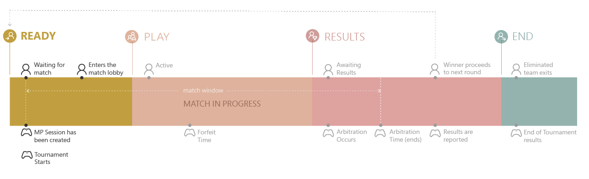

### User impact

At this stage, the gamer expects to play in a match, but the opponent isn’t yet known. This stage is triggered when a tournament has started and the participant is waiting for their match session to begin. This waiting period could be because:

* The check-in period is still open.
* The next round hasn’t started.
* The participant has a bye in the current round.

### When a bye is needed

A bye can happen in any round of a tournament, even though we spread out seeding to try to avoid it.

Any time a single-elimination or double-elimination tournament involves a number of players or teams that is not a power of 2 (that is, 4, 8, 16, 32, 64, 128, or 256), byes must be awarded. A bye simply means that a team does not have to participate in the first round of the tournament, and instead gets a free pass to the second round.

### Discovery

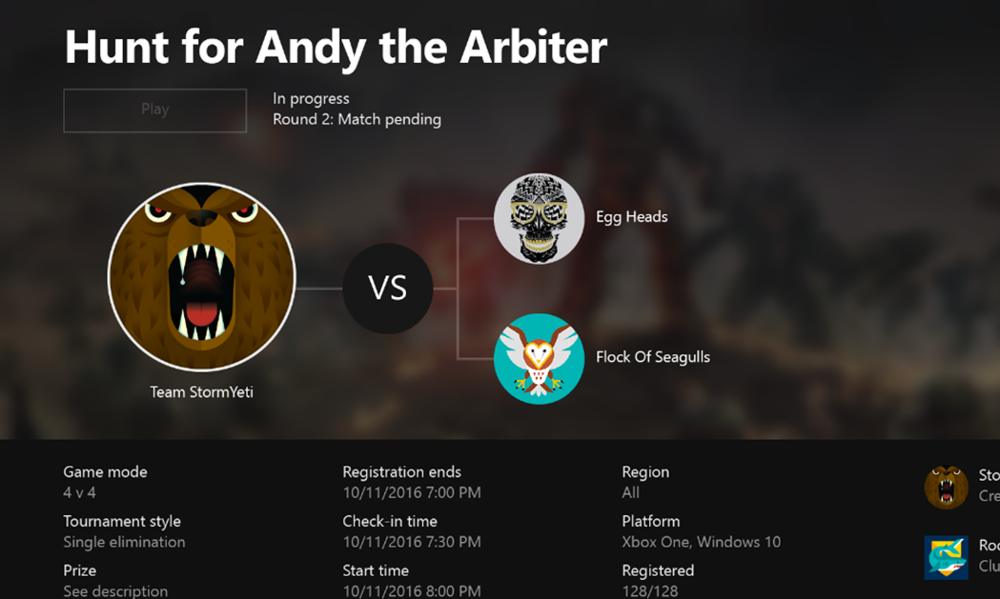

In the Ready stage, participants learn about their status in these places:

* Arena UI: Tournament Detail page
* In game: Tournament list, Promotion, Match Lobby

> [!TIP]  
> **UX recommendations**  
> Indicate that the player is waiting for their next match in the event. Examples: “Match pending” or “You have received a bye” notification.  
>
> If this stage is supported, provide a method to return to the Tournament Detail page.  
>
> Give context of the event: Tournament name, State, Style, description, Start time/end time, etc.

###### UI Example: In-game Multiplayer Lobby

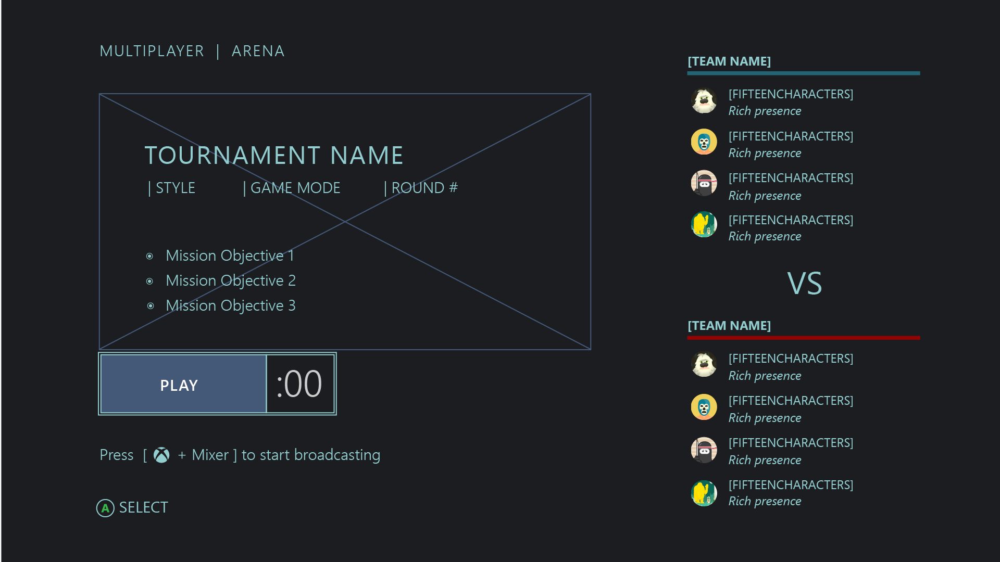

Always present the Tournament State and Reason in a consistent position, wherever a tournament match is promoted or match details are presented.

This is critical guidance for gamers when they must decide:

* To leave the game to learn more.
* What next steps are needed to progress while in a tournament.

### Under the hood
If this stage is supported by the title, proceed to the Playing stage when the match is ready.

 
## 2. Playing

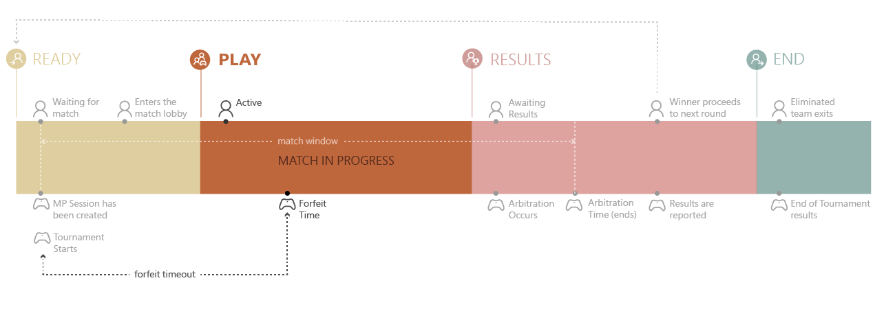

### User impact

The player’s next match-up is known and the multiplayer session has been created. During this stage, the title moves the players through the normal game flow (match-setup screens, game lobby, and so on). This is the stage that users reach when the match is ready.

### Discovery

There are two ways to alert a tournament participant and enable them to join a Tournament Match from outside a game:

* **Xbox toast notification** – When the notification appears,
the participant can hold the   (Nexus button) to launch the game and enter a match.

  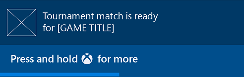

* Arena Tournament Detail Page – The participant can select **Play**
to launch the game and enter a match
 
> [!TIP]  
> **UX recommendation:** Confirm match entry.  
> Show UI that informs and/or confirms that the participant is about to enter directly into a match lobby.

###### UI Example: match entry confirmation dialog box

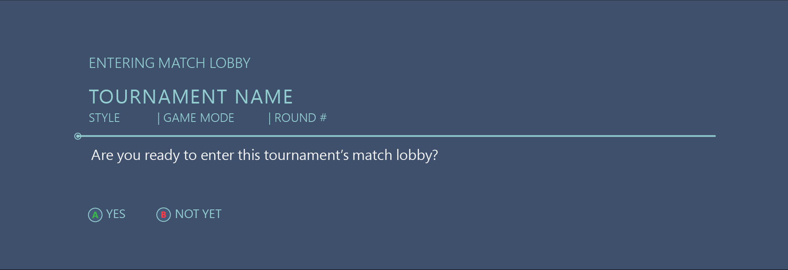

Display this UI after the participant chooses to enter a tournament from a location outside the game. Do this after a game has launched and before entering the match lobby.

> [!TIP]  
> **UX recommendation:** Give an option to cancel.

Participants may decide there are other tasks they need to complete to prepare for the tournament. It’s important to give them the flexibility to change their mind. Your title can offer additional options:

* Stay in the game. (The participant is taken to the main menu.)
* Return to the Arena UI.
* If the participant chooses to leave the game, we recommend that your title inform the participant of the time remaining before the Forfeit time-out limit has been reached.

###### UI Example: match entry confirmation – leave game warning

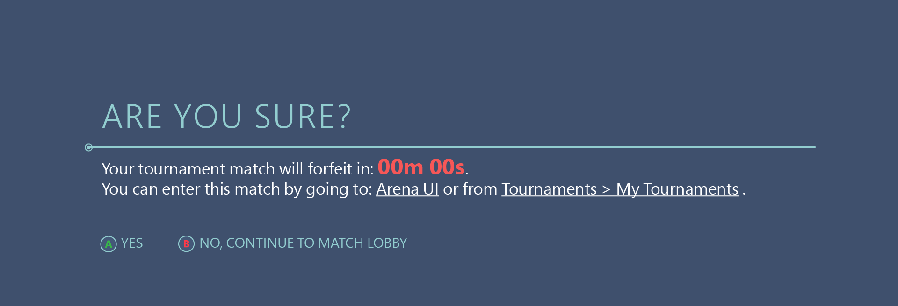

### Playing a match

The start time for the match is defined in the session template. It is set as a date-time in the standard UTC format—for example, `2009-06-15T13:45:30.0900000Z`. The tournament organizer can create the session as far in advance of the start time as it wants to, including concurrently with the start time. Match notifications are sent to the match participants at the start time, so titles never get activated before the start time. In general, treat the Arena session the same way that you would treat your title’s own multiplayer session. However, there are a few differences:

* Your title can’t change the roster of the game session.
* There isn’t the usual vetting process for players with problematic connection speeds.
* Your title must participate in arbitration.

### Match lobby details

A tournament match lobby should include details that make it clear that it’s a tournament, and that it’s different from a standard multiplayer match. Examples of such details are timing, team dependency, and consecutive rounds and stages. When the match is over, either proceed to stage 3 (Awaiting Results) or return the player to the Arena UI.

###### UI Example: Match Lobby details

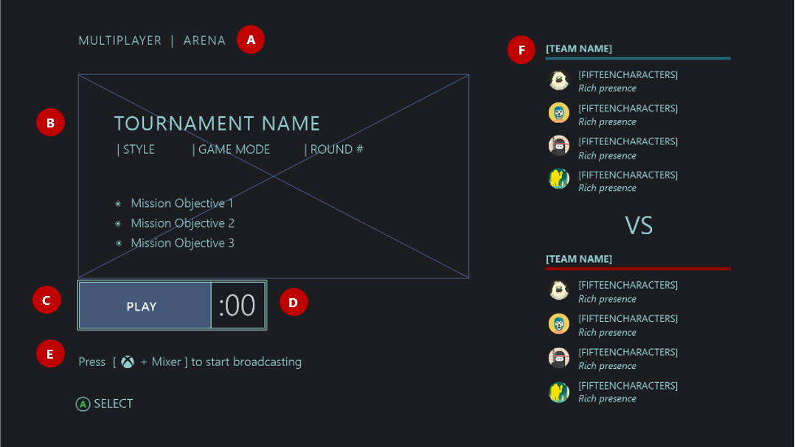

**A** - Reinforce that this is a ”Tournament” or ”Arena” match.  
**B** - Tournament Detail  
   1. Tournament name (128 characters maximum)  
   2. Style, Game Mode  
   3. Round or Stage number  

**C** - Ready Up/Play button – Participants may have entered a tournament, but require extra time before beginning the match session. For example, a match may require set-up, such as character selection. This affordance can inform the other team members when they are ready.  
**D** - Countdown timer
  * The timer is based on the **forfeit time-out limit** (set by the game).
  * This warns both teams that if the minimum team requirements are not met by this time, the game is forfeited and the active team wins.  

**E** -	Broadcast reminder  
**F** -	Team Name + participants

 
### Under the hood

#### Protocol activation

The Arena UI kicks things off by sending participants directly into a title when a user is ready to play a match—for example, when accepting the “match ready” toast sent by the Arena. Protocol activation can occur at two times: as the title is launched, or when it’s already running. In both cases,  activation is similar to what happens when a title is activated in response to a user accepting an invitation to the game.

* **If the title is being launched** -- The **Activated** event fires for the first time when the title is launched. If that initial activation is an Arena protocol activation, it means that the title was launched by a user attempting to play in a tournament. The title should skip as quickly as possible to the match, bypassing the main menu and sign-in screens. The Xbox User ID (XUID) of the participating user is provided in the activation URI and should already be signed-in.

* **If the title was already running** -- The **Activation** event can also fire with an Arena protocol activation while the title is already running. If the title is idle when it receives the protocol activation, it should jump immediately to the tournament match. It’s safe to do that because the activation event is triggered only by an explicit user action (either acting on a toast that leads to the match, or jumping into the match from the Arena UI). If the title receives the protocol activation during gameplay, it should give the user the option to leave the game (saving it first, if necessary) and enter the tournament match in the most expedient way possible.

* **If a participant bypasses the Xbox toast notification** -- We recommend that an Arena-enabled title always query Arena on startup to see whether the user is in an active match. If so, the title should present the “confirm match entry” UI, to tell the user they have a match and ask whether they want to enter it.  

  This ensures that participants make the transition into a tournament match correctly, in case they miss the match toast and simply launch the game (expecting to get into their match). Or, in case the game crashes and the participant just relaunches the title to get back into their match.

> [!NOTE]  
> The title should check the XUID on the protocol activation URI. If it doesn’t match the current player of the title, the title must also switch user contexts.

#### Forfeit time-out

At least one player must be active in the session before the forfeit time, which is the start time plus the forfeit time-out (See Playing Diagram). If no one has joined the session as active before the forfeit time, the match is canceled and both teams are given a loss via Arena arbitration.
 
## 3. Results

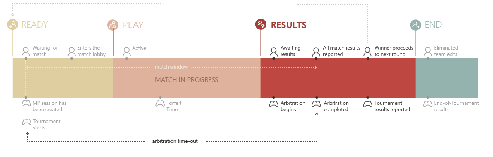

This is the stage when a player has completed the match and the results have been reported to be arbitrated. At this point, it’s not yet been determined whether the team is still in the tournament. In the meantime, the “end game” screen experience should continue reporting the results of the session (just like in any multiplayer match).

The tournament results—No contest (no game), Win, Loss, Draw, Rank, or No Show—will follow.

It’s possible for this stage to be skipped if the result is available immediately.

### Reporting results

The results of the match are reported back to Arena and the tournament organizer through the session by using a feature called *arbitration*. Arbitration is a framework for using a match session to securely play a match and report a result.

When a match session begins, it is considered an arbitrated session. It has a fixed timeline, which the arbitration framework enforces.
 
### Arbitration time-out

The arbitration time-out is the maximum amount of time, after the match start time, that participants have to play and report results. This value is set in the session template for tournament organizer-run events and in the Arena Multiplayer Game Mode for UGT and franchise-run events, so it can be as much time as your title needs.

The title can report results at any time between the start time and the arbitration time. Arbitration occurs at any time between the forfeit time and the arbitration time, after every active member of the session has submitted results. For example, if just one member is active in the session at the forfeit time, they can (and should) post a result, and arbitration will occur. No matter how many results are available at arbitration time, arbitration will occur if it hasn’t already.

If a user happens to be in a session that has already been arbitrated (because the arbitration time-out expired, a game server arbitrates the session, or the user joins late), your title should end the match and display the arbitrated result to the user.

Arbitration results always include the outcome for every team. When an individual player’s score is reported, it includes not just their team’s outcome, but the full set of results for every team.
Arbitration begins automatically as soon as the first client reports results to Xbox Live. It ends as soon as all clients report results. There may be instances where participants play longer than the arbitration time specified in the session template. This incurs a risk that a match is forced to end before participants are ready.

> [!TIP]  
> **UX recommendation:** Provide a fixed match-session time frame.
>
> Predefined time limits on match sessions will reduce the risk of problems occurring from arbitration time-out.

There are two options for preventing a match from ending before participants are done playing:

* Set a generous time frame for arbitration time-out.
* If a fixed time frame conflicts with your title’s gameplay style, try the following solution:
   1.	Determine that results have not been reported, and that the arbitration time-out is about to expire (for example, five minutes are left).
   2.	Display UI that alerts the participants their game is about to end in X minutes. This option can be implemented for all tournaments, and if the arbitration time-out is generous, most participants will never see it.

### Returning to the Arena UI by using a dedicated a button-press

If your title doesn’t surface tournament results or stage progression in-game, we recommend that the participant have a way to return to UI that does offer this information. This could be the Arena UI or a third-party tournament organizer app. Ideally, this affordance would appear after the match is over, or potentially in response to a player’s request to abandon the match in progress. This could be done from an end-of-game report screen.

> [!TIP]  
> **UX recommendation**  
> Dedicate a controller button as a quick way for gamers to return to the Arena Hub in the Xbox Dashboard.  
>
> 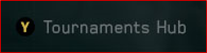

### Redirect participants at the end of a match

When participants complete the match, it’s important that your title give clear direction on next steps. This includes a method to review tournament round or stage results (if not presented in-game).

> [!TIP]  
> **UX recommendation:** Use a pop-up overlay.
>
> This UI appears when tournament results are in, and the end-game experience is complete.

### Recommended UI data:

* Tournament name
* Next bracket
* Next round or stage details
* Team standing
* Arbitrated results
* Deep link to Tournament Details
* Option to stay in game

### Under the hood

After invoking the Arena UI, your title should continue running, possibly at that same screen, waiting for another protocol-activation event. Then, if the player has another match to play, the title will be ready to go. It can expedite the user experience as the player goes from match to match, switching between the title and Arena UI.

###### UI Example: Tournament arbitrated results—Winning team

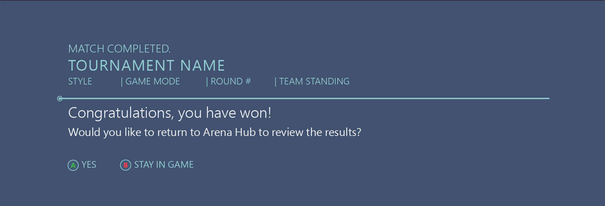

###### UI Example: End-of-tournament results—Match ended 

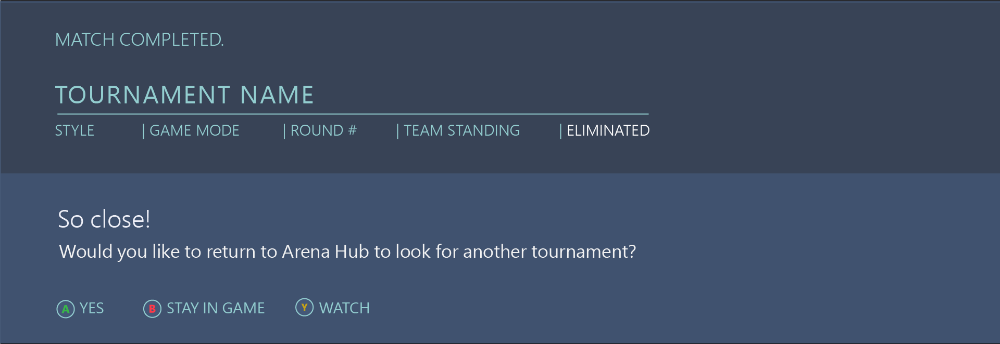

## 4. End

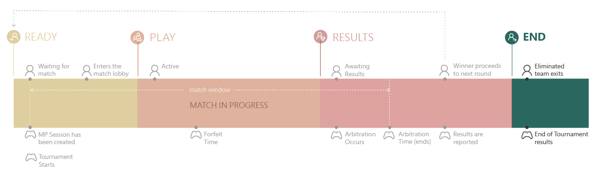

The end stage of a tournament flow occurs when the tournament itself has ended and the final results are reported.

Participants are informed either that the tournament is over or that the player has been eliminated.

### Discovery

The Arena UI displays results and celebrates the final winners:

* Tournament details page
* Results shared by participants in their player or club activity feed
* Tournament results posted to a player’s profile

Your title can surface tournament results in-game:

* After the end-of-game experience for the final round the participant completed.
* Listed under **My Tournaments**, in a Tournament Browse feature.

###### UI Example: End of Tournament Results—Tournament Ended

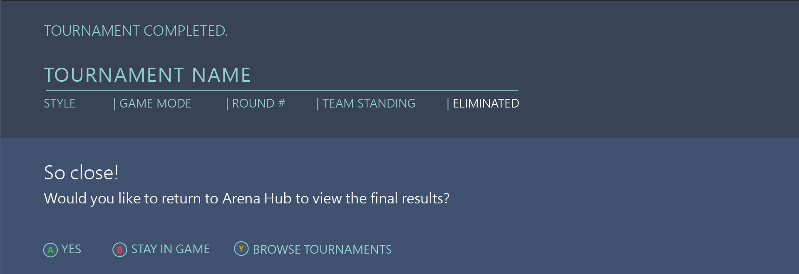

* If this stage is supported, provide an option to return to the Arena UI or tournament organizer app.
* Display the name of the event.
* Display the team name, if the team has more than one member.
* Display the team’s standing in the event, if available. If no standing is available (or optionally, in addition to the standing), your title should indicate that the player’s participation in the event has come to an end.
* Your title suggests next steps (for example, “Watch live streams,” “Find another tournament,”, “Stay in the game”).
* Your title provides a reason why the team’s engagement has ended:
  * Rejected—The team failed to meet the qualifications for entering the tournament.
  * Eliminated—The team has lost the tournament match.
  * Evicted—The team has been removed from an active tournament.
  * Completed—The team completed the tournament’s final round.
