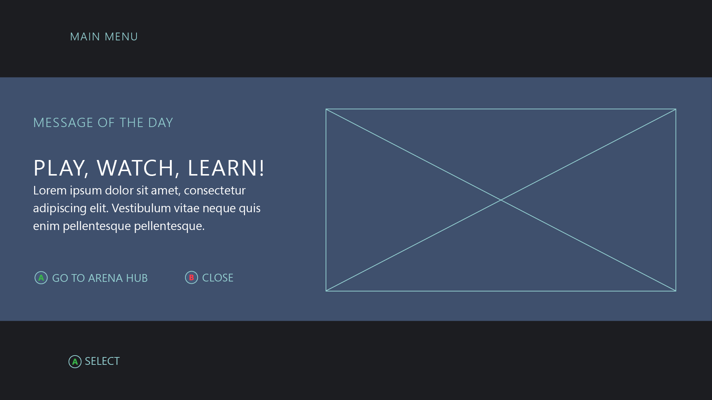
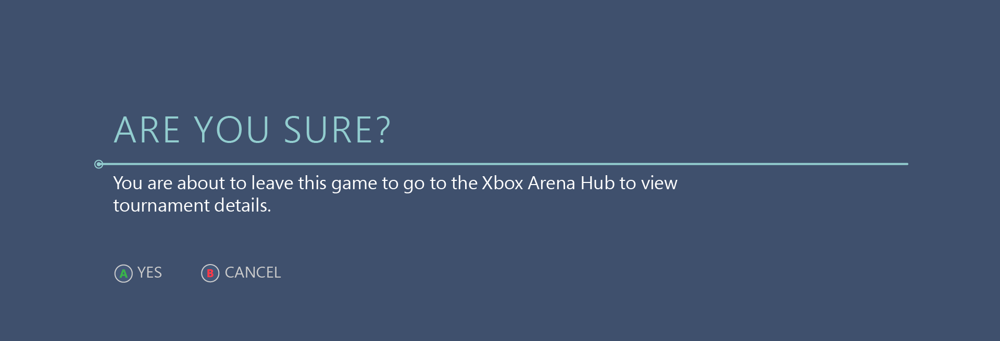
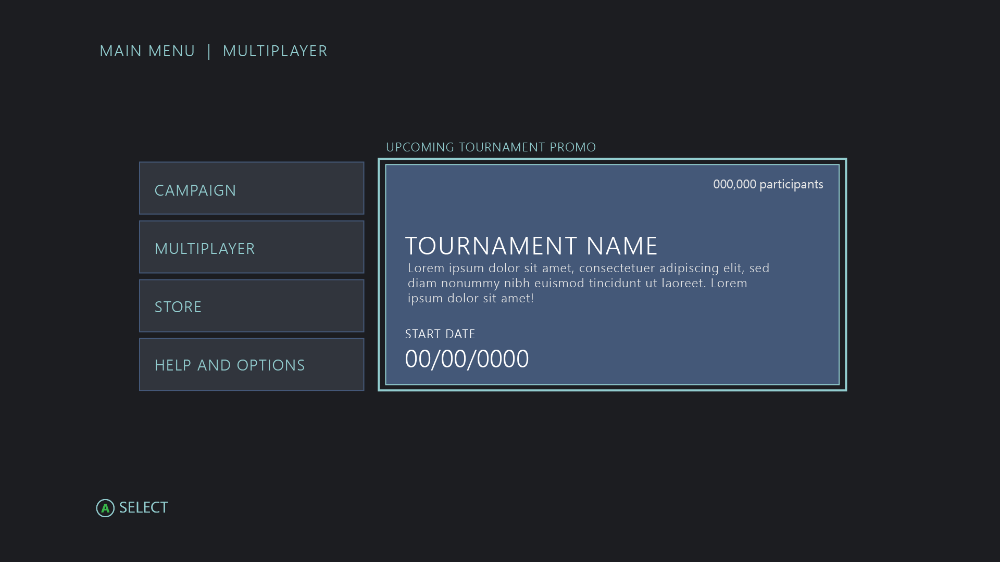
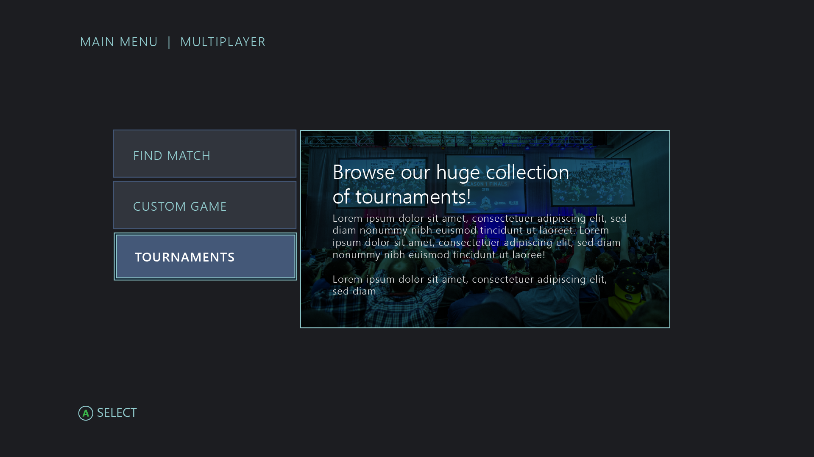
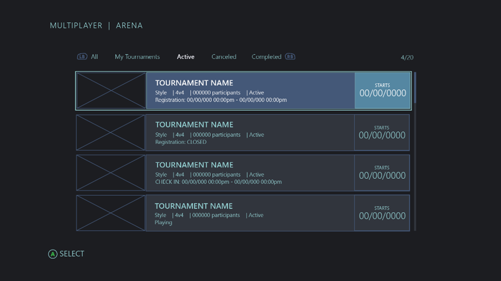

# Discovering Xbox tournaments

Gamers have multiple options in the Xbox Dashboard, or the Xbox app on a PC, to learn more about participating in or watching a tournament. There are also opportunities to increase tournament discovery from within your title.  

A gamer can find Arena-enabled tournaments by:

* Opening a recently played game's Tournaments Hub from Xbox Home.
* Visiting a player profile for tournaments played, now playing, or registered for.
* Responding to a team Looking for Group (LFG) post in a club they belong to.
* Watching a tournament stream in the Mixer app, website, or the Watch pivot in the Game Hub/Arena.
* Visiting a Game Hub in the Xbox Dashboard.

## Promoting tournaments in-game

People watch tournaments because they're interested in the title. Xbox games have a unique opportunity to catch gamers at that crucial moment when they are looking for new ways to extend their gameplay experience.

> [!TIP]
> **UX recommendation:** Promote tournaments at decision-making moments.
>
> Raise awareness for tournaments at times when gamers need to decide whether to keep playing or exit (for example, at game launch, main menu, multiplayer menu, or end of match).

### 1.	Use a dynamic announcement feature (example: Message of the Day)

Titles that have built an announcement feature into their game UI typically use a content-management system that allows for instant updates. This is useful for pushing new content to gamers without relying on a content update or downloadable content release. For example, Halo uses a “Message of the Day” feature to surface community announcements and tips. Tournament promotion is perfect fit for this scenario.

**User impact**

* Gamers are introduced to a new competitive gaming opportunity before initiating a game session.
* Exposure is intermittent (at launch, combined with other announcements).
* To learn more, gamers will be directed to leave the game and go to the Arena Hub.
* The feature does not require a content update to populate.
* Relevancy and timing of promotion remains flexible.

###### UI Example: 'Message of the Day'

#### A. Main Heading ex: Play, Watch, Learn  

Informs gamers about all tournaments or a specific one.

#### B. Go to Arena Hub  

Deep-link to Game Hub/Tournaments - Recommended when promoting all tournaments related to your game.  
–Or–  
Deep-link to Game Hub/Tournament/Details - Recommended when announcing a specific tournament.

#### C. Game-exit confirmation

Screen elements A and B lead the user out the game to the Xbox Dashboard. Set that expectation in your title’s UI before the gamer makes a decision.

###### UI Example: Exit game confirmation

### 2.	Promote tournaments on the Main Menu

In this example, the announcement is an interactive ad for an upcoming event. It gives enough information to entice the gamer to learn more. On **Select**, the gamer is led to a tournaments detail page in the Arena Hub, where they can manage their registration.

###### UI Example: A tournament ad displayed alongside the main menu

> [!TIP]
> **UX recommendation**  
> The announcement should Include just enough detail to help gamers decide if they want to learn more. For example, ***description***, ***popularity***, and ***timing***.

## Browsing tournaments in-game

The Arena APIs provide enough data for your title to create a browsing experience inside the game. If you intend to build a browsing feature, add a **Tournaments** entry point in the Multiplayer section.

> [!TIP]
> **UX recommendations**  
> Present Tournaments as a Multiplayer game mode.  
> Because Xbox Arena is a new feature, be sure to keep it visible at the Tier 1 or Tier 2 level.

###### UI Example: Tournaments listed as an additional mode in the Multiplayer section

### Provide a comprehensive list of tournaments

Empower gamers to quickly check the status of tournaments they’re currently registered in, and to browse tournaments between gameplay sessions.

#### User impact

* Minimizes the gamer’s need to leave the game to check tournament status in the Dashboard.
* Serves as a great back-up solution if gamers miss Xbox Arena toast notifications.
* Does involve additional cost for the game developer to manage.
* Leads gamers to the Arena UI for joining, registration, checking in, seeding and team formation.

> [!NOTE]  
> The Arena APIs do not provide a query for user-generated tournaments (club generated).

> [!TIP]
> **UX recommendation**  
> Create a UI that can scale, and provide methods for gamers to manage a large list of tournaments.

### Filters

Filter tournaments by **All**, **Active** (which covers everything until the tournament ends), **Canceled**, and **Completed** states, and tournaments a gamer has or will be participating in (for example, My Tournaments).

###### UI Example:

> [!NOTE]  
> Adding custom filters, outside of what the API supports is possible, *but not recommended*.

Your title can filter by other properties after it makes the request, but it can’t specify them on the query parameter. This makes filtering by other properties unreliable for this type of UI. The Arena APIs retrieve a title-specified number of results at a time—for example, the title may specify a **maxItems** value of 10 tournaments. This helps your title manage performance and minimizes the risk of overwhelming the user with a large list. However, any custom filters provided by your game would apply only to the 10 items requested at that time. This could result in an inconsistent number of filtered results after each API call. For example, the first set of 10 tournaments returned might contain 2 that are related to a custom filter, like ‘Playing.’ But the next 10 may show 9 such items, and so on. The only reliable way for your title to fully populate each custom filter is to request every active tournament and then filter them all, which we don’t recommend.

#### Filter recommendations:

##### ALL

View all **Active**, **Canceled**, and **Completed** tournaments, sorted by most recent.

Results:

* Tournament state
* Tournament start date
* Tournament status—for example, Registration open
* Deep link to Tournament Detail Page in the dashboard

##### MY TOURNAMENTS

View tournaments that a participant is currently registered in.

Results:

* Tournaments that the currently signed-in user is participating in
* Tournament status
* A method to enter a tournament match (for ‘match ready’ status)
* Deep link to Tournament Detail Page in the Dashboard

##### ACTIVE

View all tournaments that have been created: upcoming, open for registration, check-in, and playing.

Results:

* Tournaments that are open to register for, that the current user has not already joined
* Time remaining until registration closes

##### COMPLETED/CANCELED

View recent results. Tournaments that just ended can age out over time, instead of simply disappearing after they are complete.

Results:

* Deep link to Tournament Detail Page in the Dashboard
* Tournament Status
* End date/time

##### CANCELED

View tournaments that have been canceled.

Results:

* Deep link to Tournament Detail Page in the Dashboard
* Date/time of cancellation

> [!div class="nextstepaction"]
> [Join a tournament by using the Arena UI](arena-ux-join-tournament.md)
