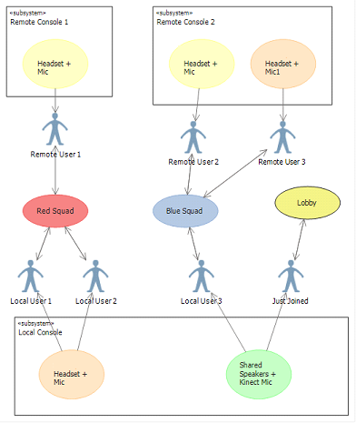
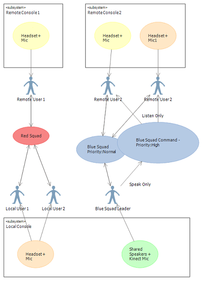

# Game Chat overview

 Game chat is a technology that you can use to enable voice communications between users of a single title on remote consoles. It does not include wider independent communication among console users.

 > [!Note]
 > New titles should use [Game Chat 2](game-chat-2-overview.md) instead of Game Chat. The original Game Chat was deprecated at the end of 2017. Titles consuming the original Game Chat can use the [Game Chat 2 Migration Guide](game-chat-2-migration.md) to map Game Chat concepts and calling patterns to Game Chat 2.

 Xbox One has a specialized, hardware-accelerated voice chat codec that is used for encode and decode, and is exposed through the `Microsoft.Xbox.GameChat` Namespace. This codec supports several quality settings for title networking bandwidth flexibility, and its use is required for all voice chat communications transmitted by the console. No other codecs are supported.

> **Note:** A lower-level namespace called `Windows.Xbox.Chat` calls the codec.

  * [Game Chat Channels](#ID4EFB)
  * [Game Chat Classes](#ID4EKC)
  * [Default USB Endpoint](#ID4E3D)
  * [Volume and Pitch](#ID4EDE)
  * [Making Users Inaudible During Game Chat](#ID4EWE)
  * [Compiling the GameChat DLL](#ID4E5H)

## Game Chat Channels

 The chat system relates local input from users rather than devices. The OS associates input devices with player IDs. One of the key features is support for multiple channels. A game might have a lobby, a user might join a team, and there might be a command structure within the team. Users can be active in multiple channels at the same time as the game permits. For example, a game might have the following channels:

  * Red team squad 1 channel &ndash; open communication among all red team players on squad 1.
  * Red team squad 2 channel &ndash; open communication among all red team players on squad 2.

**Figure 1.**&nbsp;&nbsp;**Standard chat channel.**

  *  Red team command channel &ndash; listen-only channel for all red team non-command players. This channel can duck all other "red team" channels. Speak-only channel for red team commanders that is enabled with push-to-talk.

**Figure 2.**&nbsp;&nbsp;**Command chat channel.**

  * Blue team channels as above.

> **Note:** *Ducking* is a chat term meaning the reduction in level of one audio signal in the presence of another signal. For example, in radio, a music track's volume is lowered (ducked) while a presenter makes an announcement.

 In standard chat between users, the channels are bidirectional so that the users can both listen and talk on their associated channels. With the command channel, the communication can either be bidirectional (as the standard channel) or can be set to unidirectional, where a user can either speak or listen on the channel, but not both. Typically, for example, a commander might want to speak, with the subordinates only listening. The command channel is treated as having a higher priority than other channels, and will cause other channels' voices to be ducked.

 Game titles can duck non-chat audio while a remote user is speaking. Also properties can be set on each channel, such as volume, listen-only attributes for some users, and speak-only attributes for other users.

## Game Chat Classes

 The namespace for game chat is `Microsoft.Xbox.GameChat`. This section describes the class hierarchy of the namespace. Refer to the `Microsoft.Xbox.GameChat` namespace documentation for a full description of each class, interface and enumeration.

  * [ChatManager](#ID4EYC)
  * [ChatManagerSettings](#ID4EDD)
  * [ChatUser](#ID4EQD)

### ChatManager

The `ChatManager` class is the top-level game chat class.

### ChatManagerSettings

 The `ChatManagerSettings` class class represents the settings for the `ChatManager` class.

### ChatUser

The `ChatUser` class represents a user on a channel, with a set of properties specific to the interaction of that user with other users on the same channel.

## Default USB Endpoint

 The default USB capture endpoint is single channel mono. This enables echo-cancellation to be applied to the audio stream, which is a useful feature for chat applications.

## Volume and Pitch

Volume controls in the chat system are the same as those used for XAudio2, on which the Chat API is based. Pitch control is not supported by the chat system.

 For details on XAudio2 volume settings, refer to `SetVolume`.

 XAudio2 automatically adjusts volume levels based on the user's speaker settings to maintain a consistent volume level across configurations. If the user's settings don't match their physical configuration the volume will either be too loud or too soft compared to a system with accurate settings. For example, a system configured for 5.1 surround sound speakers that only has two speakers connected will sound too soft. XAudio2 is unable to detect whether the user speaker settings correctly match their physical setup.

## Making Users Inaudible During Game Chat

Xbox One supports two mechanisms to render users inaudible during game chat:
  * Muting
  * Blocking

### Muting

Muting is frequently unidirectional. That is, Player A mutes Player B, but Player B can still hear Player A. Examples of muting:
  * A title has "proximity" chat. In this case, a player can hear other players who are located nearby, but players who are too far away are muted.
  * A title offers users a player the ability to mute any/all other players.

Muting is primarily implemented at the discretion of the title. However, a player can also mute other players at the Xbox system level, using the gamercard or system UI.

### Blocking

> **Note:** Titles do not block players. Blocking is carried out at the Xbox system level only.

A game player can influence the audibility of chat directly by the use of blocking. The player can block other players directly through the gamercard, or can set the voice communication and text restriction to "Block" or "Friends only". Typically blocking is bidirectional. That is, if Player A blocks Player B, not only does Player A not hear Player B, but Player B does not hear Player A. Examples of blocking include:
  * Player has a child account and blocks all other players from access to that account.
  * Player sets the account configuration to chat only with friends, and blocks non-friends.
  * Player A blocks Player B by flagging Player B for inappropriate behavior through reputation/feedback in the People app or through system UI.

A player can also block other players by physically removing the headset and/or disabling the Kinect sensor.

### What Titles Should Do to Provide for Muting/Blocking

A title provides muting through an in-game option implemented using the GameChat DLL, illustrated in the InGameChat sample. The library meets all requirements for muting/blocking and no specific action is required from the title to abide by system policies. The title must only ensure that it exposes gamercard UI that allows players to mute/block other players during chat sessions.

 To implement muting, the title calls `ChatManager.MuteUserFromAllChannels`. If it must mute for all users, it calls `MuteAllUsersFromAllChannels`. The title can restore audibility for muted players using calls to `ChatManager.UnmuteUserFromAllChannels` or `UnmuteAllUsersFromAllChannels`, as required. Titles are discouraged from using the `Chat` namespace directly. Most of the functionality of this library is exposed through `GameChat`.

When a player clears a chat channel and creates a new chat session, the session does not retain information about the previous players who were muted. The title must track this behavior and call `ChatManager` to keep the muting experience consistent for players during gameplay.

Many titles restrict voice traffic in blocking/muting situations to optimize network operation by sending less data over the network. For example, Player A blocks/mutes Player B, restricting voice traffic, but the title does not stop the transmission of voice data from Player B to Player A. This behavior is totally up to the title to implement. `GameChat` handles the case where it blocks voice data from Player B if passed into `ChatManager`.

### Debugging When Players Cannot Hear Each Other

`ChatManager` includes debug traces that the title can enable, using the `ChatManagerSettings.DiagnosticsTraceLevel` property, and the `ChatManager.OnDebugMessage` event. The traces offer much content that can help in narrowing down issues. This content comes from adding/changing audio devices, adding local and remote users, getting voice data from each remote user, and the like.

## Compiling the GameChat DLL

 The source for building the Microsoft.Xbox.GameChat.dll is available on Xbox Developer Portal. Developers can compile this source to create a customized version of `GameChat`. A typical customization is to create a custom network channel for transmitting the audio data.
