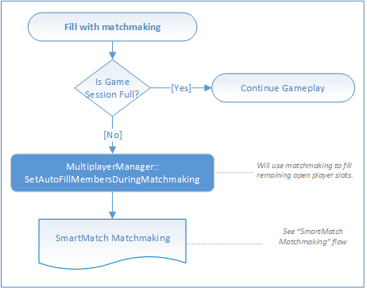

# Flowchart - Fill open slots in a multiplayer game

The following flowcharts show the flow of filling open slots in a multiplayer game, with friends and/or with matchmaking.

## Fill open slots with friends

## Fill open slots with matchmaking

