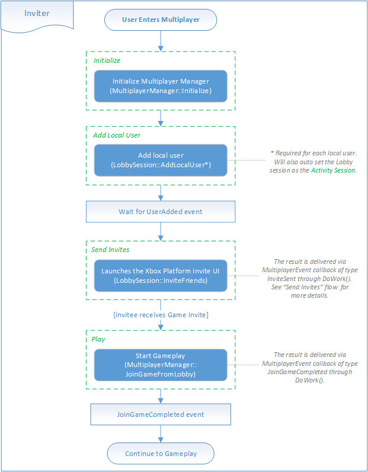
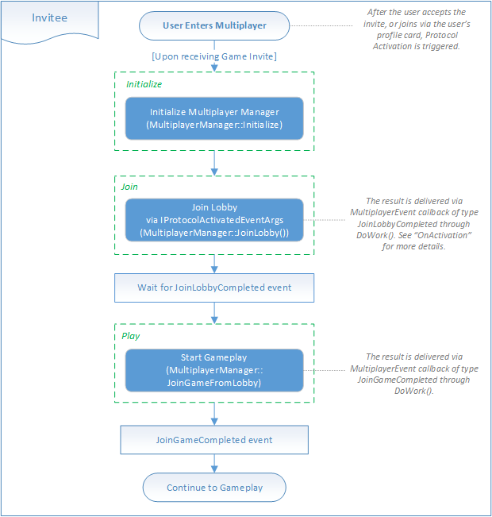

# Flowchart - Play a multiplayer/co-op game with friends

The following flowcharts show how to start a new multiplayer game by adding and inviting friends to the game.

You can see multiplayer manager code examples of this process in [Play a multiplayer game with friends](../play-multiplayer-with-friends.md).

## Add and invite friends

The following flowchart applies to the client that is starting the multiplayer game:

## Accept an invite to a game

The following flowchart applies to the client that receives and accepts an invite to a game:

