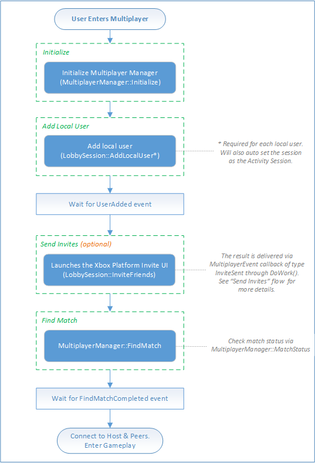

# Flowchart - Play a multiplayer game by using SmartMatch matchmaking

The following flowcharts show how to start a new multiplayer game by adding and inviting friends to the game, and then using SmartMatch matchmaking to fill any open slots with other Xbox Live members.

You can see multiplayer manager code examples of this process in [Play a multiplayer game by using SmartMatch](../play-multiplayer-with-matchmaking.md).

## SmartMatch matchmaking

