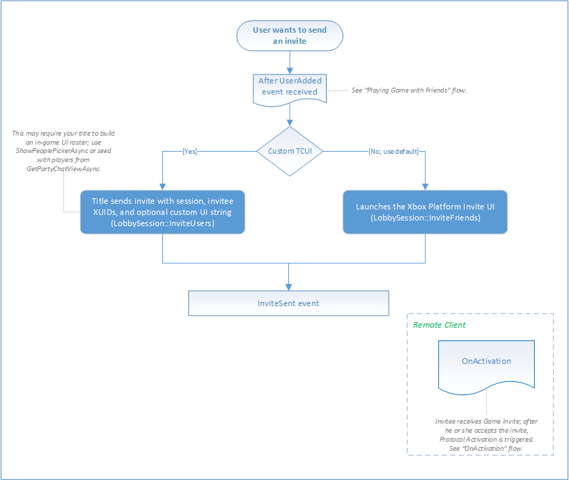

# Flowchart - Send an invitation to another player

The following flowcharts show the flow of inviting another player to join your game.

## Send invites

In the flowchart below, TCUI stands for Title Callable User Interface, which represents commonly used UI elements, such as a friend picker for invites. A system provided TCUI is available on both Xbox One and Windows 10, or your title can implement a custom TCUI for viewing online friends and inviting them.

