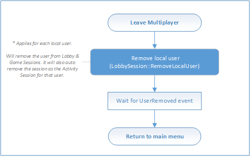

# Flowchart - Shut down after a multiplayer game is complete

The following flowcharts show the flow of shutting down a multiplayer session after it is no longer needed.

## Shut down a multiplayer session

