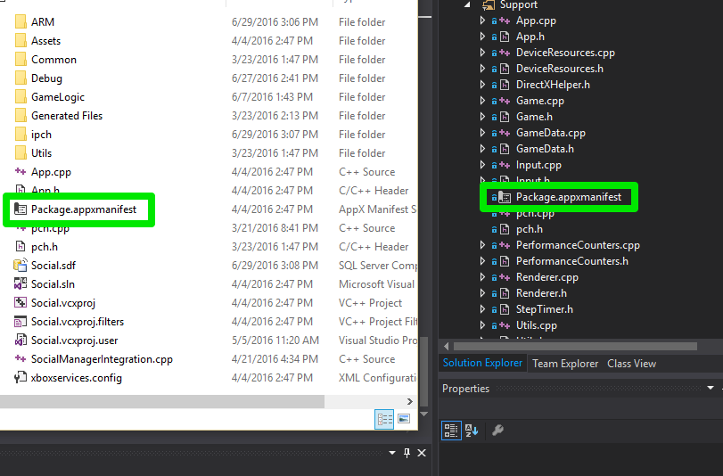
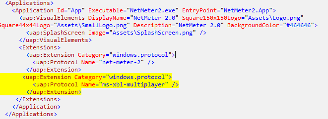

# Configure your AppXManifest for Multiplayer

You need to make some updates to the .appxmanifest file in your Visual Studio project if the following conditions are true:
- You are developing a UWP
- You want to implement the ability for players to invite other users to your title

If you don't do this step, then your title will not get  protocol activated when a recipient player accepts an invitation to play.

## Open your Package.appxmanifest

Your Package.appxmanifest file is typically located in the same directory as your Visual Studio project's solution file.  Or you can find it in the solution explorer.



## Add new entry

You will need to add the following to the ```<Extensions>``` element under ```<Applications>``` in your Package.appxmanifest file

```
<Extensions>
  <uap:Extension Category="windows.protocol">
    <uap:Protocol Name="ms-xbl-multiplayer" />
  </uap:Extension>
</Extensions>
```

Eg:



Save and rebuild your title.  To learn how to use the Multiplayer Manager to implement the ability to invite players to your title, please see [Play Multiplayer With Friends](../multiplayer-manager/play-multiplayer-with-friends.md)
