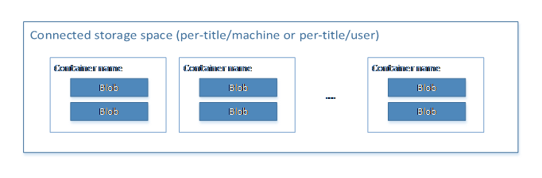
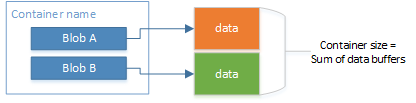
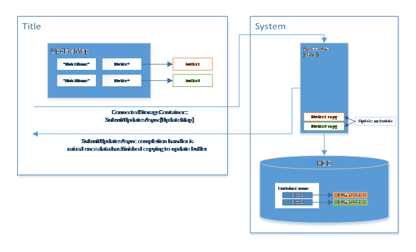
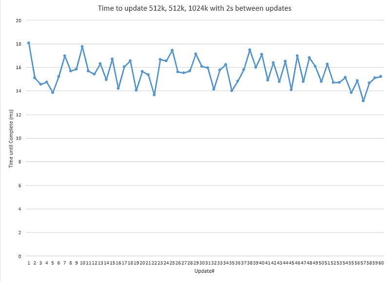
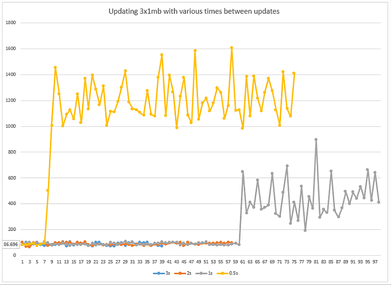

# Connected Storage

> [!NOTE]
> This document was originally written for Managed Partner Xbox One developers.  Some of the Xbox One specific content like Local and Title storage can be ignored for UWP on Windows.  The conceptual content and API in this document are still relevant.  Please contact your Microsoft representative (if applicable) with any questions.

The storage and save models on Xbox One are much different from those on Xbox 360; Xbox One has a more flexible application model that supports fast application switching, multiple simultaneous applications, and quick suspend and resume of apps. Data stored by using the Connected Storage API automatically roams for users across multiple Xbox One consoles, and is also available for use offline.

This topic covers:

-   Using the Connected Storage API to store saved games and app data on Xbox One.
-   Best practices for the design of app save systems, so that they integrate well with the user experience benefits provided by the Xbox One application model.
-   How the connected storage system maximizes the speed with which your app can save data
-   How the system handles data synchronization and data conflicts from multiple consoles without requiring app UI.
-   The Connected Storage resiliency model, which is designed so that the app always has a self-consistent view of data stored in individual containers even in the case of interrupted network connectivity or power loss.

> [!NOTE]
> The term *app*, as used here, refers to any application running on the console, including games.

## Overview

The Xbox One application model allows users to use multiple apps at once, which means your app can't ask a user to wait for data to be saved before turning off the console or moving on to another app. Xbox One users will also enjoy having their data roam automatically across consoles so that every Xbox One console feels like their own console. The Xbox One platform provides the Connected Storage API to help your app satisfy these requirements.

The connected storage system allows apps to store data as one or more *blobs* in *containers*. When an app saves data, it is quickly copied from the exclusive partition into the shared partition so that the tasks of storing the data on disk and uploading it to Xbox Live Title Storage can be handled outside the lifetime of your app.

When your app requests a specific user's data from the connected storage system, the system automatically checks with the cloud for updated data and notifies users if they need to wait for data to download. The system also asks users to choose between conflicting data in some cases, such as when a user has played off-line on more than one console, or when another console is uploading saved data for that user.

Your app also has a dedicated, but limited, amount of cloud storage space for every user, so users will not have to make hard choices about permanently deleting data from one app to make space for another app's saves. There is, however, a limited amount of storage space on the Xbox One hard drive for caching saves locally, so the system provides a user experience for freeing up local cache space. Users are in control of what is cached locally; they never lose access to data they care about when they're playing offline. The connected storage system also allows a small amount of user-independent data to be stored locally for the app. This per-machine data does not roam and is not uploaded to the cloud.

The Xbox One connected storage system takes care of system power management so that pending writes to the hard disk and uploads to the cloud are handled automatically—there is no need for titles to display UI to say "save in progress, please do not turn off your console."

### The Xbox One app model and app navigation

Xbox One allows users to switch quickly between multiple applications. Well-written applications let users pick up where they left off during their last activity with relevant context loading quickly, even if the app was shut down since the last time the user accessed it.

Xbox One consoles can run only one app in the exclusive partition at a time. Presenting a fast-switching user experience requires the currently running exclusive app to shut down quickly when the user wants to run another one. When a user tries to switch to another app, the system sends the active app a suspend notification. During this time, the app should save the relevant state and return from its Suspend function. The system enforces a maximum time limit of 1 second for this operation. If the app has not returned within 1 second, the system forcibly terminates the application. Apps cannot stop users from navigating away, as with the navigation model on modern smartphones and tablets.

There are also other cases in which an exclusive app is suspended, such as the system's entering an idle or low power state when the user presses the power button on the console. Once the app is suspended, it may be resumed without being unloaded by the system. This enables quick-resume functionality. The important thing to know is that suspended apps may also be terminated or resumed. The app must always save state in case it is terminated.

To work well with the Xbox One application model, apps should be prepared to serialize state into a memory buffer quickly so that relevant state can be saved within the 1 second suspend time-frame.

Note that there is a difference between saved data about user gameplay, and data about the state of the app, such as location within menus. In addition to saving gameplay when the app is suspended, you should consider persisting menu state if the user is in the middle of configuring a setting or customizing a character outside the main game engine.

Users can leave a game suspended for a very long time. Consider offering a different experience when the game is resumed following a long suspension. Dropping a user back into a firefight from their campaign might be a jarring and unexpected experience if the user hasn't played for two weeks, whereas a one-hour break would be more common and warrant a quick return to gameplay.

For more information about the Xbox One app model, see the following resources:

-   [Modern Application Switching for the Living Room](https://developer.xboxlive.com/en-us/platform/documentlibrary/events/Documents/Xfest%202012/Xfest%202012%20-%20Modern%20Application%20Switching%20for%20the%20Living%20Room.pptx), a presentation at Xfest 2012
-   [The Shell Experience](https://developer.xboxlive.com/_layouts/xna/download.ashx?file=PROD-D_Experience.pptx&folder=platform/xfest2013), a presentation at Xfest 2013
-   [Process Lifetime Management for Xbox One](https://developer.xboxlive.com/en-us/platform/development/education/Documents/PLM%20for%20Xbox%20One.aspx), a white paper on GDN

> [!NOTE]
> Some presentations at [Xfest 2012](https://developer.xboxlive.com/en-us/platform/documentlibrary/events/Pages/Xfest2012.aspx) and [Xfest 2013](https://developer.xboxlive.com/en-us/platform/documentlibrary/events/Pages/Xfest2013.aspx) contain information that is out of date due to the announcement that Xbox One supports off-line play.


### Storage options on Xbox One

Xbox One provides several storage options, each with its own benefits and constraints. Apps may need to use a combination of options depending on the apps' requirements.


Connected storage
-----------------

Connected storage is designed to help apps save Xbox One gameplay data and other relevant app states-data that should roam between consoles. The Connected Storage API, specific to Xbox One, assists with saving and uploading that data. The API works in combination with the Xbox One application model.

The Connected Storage API provides the following features:

-   Apps can quickly save up to 16 MB of data at a time into a memory buffer in the system partition, which is then cached locally on the HDD by the system and uploaded to the cloud.
- For managed partners and ID@Xbox developers:
  - 256 MB per user/app of cloud storage.
- For Xbox Live Creators Program developers:
  - 64 MB per user/app of cloud storage.
-   Robust response to power failures—apps don't have to deal with partial data being saved.
-   Data is automatically uploaded to the cloud, even when the app isn't running.
-   Data is available across Xbox One consoles that are connected to Xbox Live.
-   Xbox Live handles cross-device syncing and conflict management without requiring involvement by the app.

For more information about the Connected Storage API, see the appropriate section in xblesdk.chm (which documents the Xbox Live Extension SDK APIs) in the Xbox Live SDK.


Xbox Live Title Storage
-----------------------

The Title Storage service offers a cross-platform REST API for data storage with the following capabilities:

-   Provides data sharing across users, apps, and various platforms
-   Supports binary, JSON and configuration files
-   For managed partners and ID@Xbox developers:
    - 256 MB per user/app of cloud storage
    - 256 MB of per title global storage
- For Xbox Live Creators Program developers:
  -   64 MB per user/app of cloud storage
  -   256 MB of per title global storage

Requirements for using the service:

-   Xbox One console must be online in order to access the service
-   All service interactions must be completed while the app is running; data transfer is not completed automatically in the background.

For more information, see *Xbox Live Title Storage*, in the XDK documentation.


Local temporary storage
-----------------------

On the console, an app has access to local temporary storage with the following characteristics:

-   2 GB of dedicated hard drive storage, accessible by the path T:\\.
-   Contents of this storage may be evicted when the app is not running.

For more information about local storage, see Local Storage, in the XDK documentation.


Configuring your app for connected storage
------------------------------------------

When you use the Connected Storage API, all read and write operations are associated with an Xbox Live Primary Service Configuration ID (SCID), defined in your app's manifest file, AppXManifest.xml:

```xml
      <Extensions>
        <mx:Extension Category="xbox.live">
        <mx:XboxLive TitleId="<your title ID>" PrimaryServiceConfigId="<your SCID>"
        RequireXboxLive="<boolean indicating Live requirement>" />
        </mx:Extension>
      </Extensions>
```

For more information about acquiring the title ID and SCID for your app, see *Setting Up Sandboxes for Xbox Live Development*, in the XDK documentation.


## Connected storage: system concepts

This section describes the components of the connected storage system, their relationships, and their proper uses.

### Connected storage space

At a high level, all data in the connected storage system is associated with either a user or a machine (for example, an individual Xbox One console). All data saved by an app for a particular user or machine is stored in a connected storage space.

Each user of your app gets a connected storage space with a limit of 256 MB total storage. It's important to note that this storage is dedicated to your app alone—it is not shared with other apps.

Your app also has 64 MB of space in a local connected storage space for the machine. This storage space is independent of users and can be accessed even if no users are signed in.

To acquire a connected storage space, the app calls the *ConnectedStorageSpace.GetForUserAsync Method* or the *ConnectedStorageSpace.GetForMachineAsync Method*. This a potentially long-running operation, especially if the user has saved data on one device and is resuming gameplay for the first time on another device. For details about this process, and the possible error conditions that can occur while the app is waiting to acquire a connected storage space, see *Synchronizing a connected storage space*, later in this paper.

After the app acquires a **ConnectedStorageSpace** object, calls to all methods under the *Windows.Storage Namespace* which use that object, or other objects derived from it, do not depend on a response from web services to complete. However, because access to the Xbox One HDD is not exclusive to the active app, strict upper bounds on the performance of these methods cannot be guaranteed.


### Connected storage: containers and blobs

The *connected storage container*, or *container* for short, is the basic unit of storage. Each connected storage space can contain numerous containers, as shown in the following diagram.

**Figure 1.  Connected storage space (per-title/machine or per-title/user)**


Data is stored in containers as one or more buffers called *blobs*. The following diagram illustrates the internal system representation of containers on disk. For each container, there is a container file that contains references to the data file for each blob in the container.

**Figure 2.  Diagram of a container**



To store data in a container, call the *ConnectedStorageContainer.SubmitUpdatesAsync Method*, providing a map of names and blobs (Buffer objects). All changes described in a **SubmitUpdatesAsync** call are applied atomically, that is, either all the blobs are updated as requested, or the entire operation is terminated and the container remains in its state prior to the call.

Individual save operations that use **SubmitUpdatesAsync** are limited to 16 MB of data at a time.


### SubmitUpdatesAsync behavior

When **SubmitUpdatesAsync** is called, the buffers provided to the call are quickly copied from the app partition into a dedicated memory space in the system partition. Once the memory has successfully been copied into the system partition, the completion handler provided in the **SubmitUpdatesAsync** call is invoked within the app, indicating to the app that it is safe to free the memory it allocated locally for the data.

The system then saves the blobs to the console's hard drive and completes the operation with a final container update that commits the entire operation on that container.

There is a 16 MB cap on the memory in the shared partition for receiving **SubmitUpdatesAsync** data. If a call to **SubmitUpdatesAsync** cannot be immediately serviced by the system because there is not enough memory free in the dedicated 16 MB buffer, the call is queued for servicing. The system continuously transfers data from the 16 MB buffer to the hard drive, and queued updates are serviced in the order they were requested as space becomes available in the 16 MB buffer.

**Figure 3.  SubmitUpdatesAsync behavior**


Uploading to the cloud happens in a similar way: Individual blobs are uploaded to the service, and the update operation is committed by a final update to a container file that references all the other uploaded blobs. In an upload to the cloud, this consolidation into a single and final update ensures that all data referenced in a **SubmitUpdatesAsync** call is either committed in its entirety or the container is left unchanged. In this way, even if a system goes offline or loses power during an upload operation, a user could go to another Xbox One console, download data from the cloud, and continue play with a consistent view of all containers.

> [!IMPORTANT]
> Data dependencies across containers are not safe.  The results of individual *SubmitUpdatesAsync* calls are guaranteed to be applied entirely, or not at all.

**SubmitUpdatesAsync** calls must not assume that a future **SubmitUpdatesAsync** call will be completed successfully in order to leave the container in a valid state. In other words, apps cannot rely on more than one **SubmitUpdatesAsync** call to save all required data into a container. Each **SubmitUpdatesAsync** call must leave the contents of the specified container in a valid state for the app to read later.

To illustrate this issue, consider a scenario where a container tracks the amount of gold and food held by a character named Bob. The title can store two blobs, named *food* and *gold*. Bob starts with 100 gold and no food in his inventory.

**Figure 4.  Example scenario: Bob starts with 100 gold.**


Now Bob spends 50 gold. The title prepares a **SubmitUpdatesAsync** call, which updates the value of the gold blob to 50.

The system captures both the updated blob and information about the container update to the updates buffer. Then the system copies the value of the new blob to the hard drive.

**Figure 5.  The system captures the updated information and copies the values to the hard drive.**


Finally, the system updates the container file on the HDD to reference the new blob. Eventually, the system removes the unreferenced blob in a garbage collection operation.

**Figure 6.  The system updates the container file on the HDD and removes the unreferenced blob.**


Note that the more blobs you use per **SubmitUpdatesAsync** call, the more time is required to complete the necessary atomic operations of the file system operations to store the data robustly. The granularity of data storage in the preceding example is far too small, but it is intended to clearly illustrate the behavior of the atomic update of multiple blobs in one container.


### Updating multiple blobs — the wrong way

Consider a scenario in which Bob wants to buy some food. For simplicity, we'll say that 1 unit of gold buys 1 unit of food, and Bob wants to buy 25 units of food. The app could issue one **SubmitUpdatesAsync** call to add 25 units of food and then another one to subtract 25 units of gold from the Bob\_Inventory container. But even if the completed handlers for both **SubmitUpdatesAsync** calls have been called, there is a potential for incorrect results due to events like power loss, which might stop the data from being written to the hard drive, or an incomplete sync to the cloud. The following diagrams explain the steps taken by the system, and the result of a power loss at any one of the steps.

Assume that the data from both **SubmitUpdatesAsync** calls is already in the system's update buffer, and the title's completion handlers for both calls have been invoked.

First the system writes the data for the new value of the food blob to disk.

**Figure 7.  The system writes the value of the food blob to disk.**


Next, the system updates the container to reference the newly written value. As the following diagram illustrates, if power were lost after this step and before the next one, Bob would end up with a good deal, gaining 25 food without having the corresponding gold deducted from his inventory.

**Figure 8.  The system updates the container to reference the newly written value.**


Next, the system writes the data for the new value of the gold blob to disk. The value for gold referenced by the Bob\_Inventory container still hasn't been updated, and Bob has 25 more gold than he should—but we're one step closer to the desired result.

**Figure 9.  The system writes the data for the new value of the gold blob to disk.**


Finally, the system updates the container file to reference the newly written blob for gold—the intended result.

**Figure 10.  The system updates the container file to reference the newly written gold blob.**


### Updating multiple blobs — the right way

The proper way to ensure the amount of gold and food in Bob's inventory is atomically updated, with no possibility of incorrect intermediate state due to power loss, is to update both blobs in a single **SubmitUpdatesAsync** call. The system will then take the following steps.

First the system writes the data for the new value of the food blob to disk.

**Figure 11.  The system writes the data for the new value of the food blob.**


Then the system writes the data for the new value of the gold blob to disk.

**Figure 12.  The system writes the data for the new value of the gold blob.**


Finally, the system updates the container file to reference both of the new blobs.

**Figure 13.  The system updates the container file to reference both new blobs.**


While this example is very simple, it illustrates the importance of making all modifications to the data in a container which must be atomically applied by issuing a single **SubmitUpdatesAsync** call with all the desired updates. By doing so for the case of purchasing food with gold, the app avoids a potential race condition that could incorrectly update only one of the values and leave the character with too much gold.

### Performance characteristics and considerations

The 16 MB update buffer in the shared partition allows a limited number of update operations to be performed very quickly. The speed at which the system can persist the data to disk depends on both the amount of data in the buffer and the number of blobs. Because each blob is written to disk with resiliency, the larger the number of blobs in the buffer, the more time it takes to persist them to disk.

Figure 13 shows an example for the processing time for a **SubmitUpdatesAsync** operation every 2 seconds with two 512k blob updates and one 1024k blob update, when there is no other hard drive activity on the system. The system can operate at a steady state, processing each update within 14–18ms.

**Figure 14.  Processing time for a SubmitUpdatesAsync operation every 2 seconds with two 512k blob updates and one 1024k blob update, and no other hard drive activity.**


Figure 14 shows the processing time for three 1024k blobs at various time intervals.

The system can process these updates at intervals of 3 seconds at 87ms steady state. Increasing the frequency to once every 2 seconds, the system can still process updates within 87ms steady state.

Reducing the interval to 1 second between updates alters the steady state behavior. The system can process 60 updates at 87ms per update, but every update beyond that takes significantly longer, reaching a steady state processing time of 500 milliseconds second per update, with significant fluctuation. This is because the 16 MB memory buffer is being filled faster than it can flush the data to disk; updates are forced to wait for previous updates to be written.

The effect increases dramatically when updating the interval to one update every 0.5 second. The system can process only 7 updates at this interval, again at 87ms per update, before reaching a steady state in which each update takes more than 1 second to be processed, with very high variations.

**Figure 15.  Processing time of three 1024k blobs at various time intervals.**


These are illustrative examples only. Your app generally shouldn't be saving data this often, yet it also won't generally be operating in an environment free of disk I/O.

It's important to understand the characteristics of the system based on these examples—to measure the app under various operating conditions, ensuring that your save operations can complete in less than 1 second during your app's suspend handler.


## Synchronizing a connected storage space

-   Connectivity check
-   Lock acquisition
-   Container listing, comparison, and merger logic
-   Container download

When your app requests access to a connected storage space, the system performs a synchronizing process to keep the user's saved data in a consistent state across Xbox One consoles and to make his or her data available for offline play. Because synchronizing can take varying amounts of time and might require the user to make decisions, the system might display UI to the user at various stages of the process.

The user can navigate away from your app by pressing the Xbox button at any time, even if synchronization UI is active. The system hides the UI, and the synchronization continues as far as it can without user interaction. When the user navigates back to the app, the UI is displayed again unless the synchronization has completed. The system never makes an assumption about a user selection when the UI is hidden.

Because the system displays no synchronization UI when the user is at the Home screen, and your app's rendering is still visible in the Big App Tile, it's important that the app render contextually appropriate visuals while a **GetForUserAsync** call is completing. The continued rendering indicates to the user that the app is still interactive and is waiting for data to load.

The following diagram outlines the high-level sequence the system follows when an app requests a connected storage space. If the entire sequence takes more than a few seconds, the system-drawn synchronization UI is displayed.

**Figure 16.  Sequence followed by the system when an app requests connected storage space.**


The system goes through the following stages when it services a **GetForUserAsync** request:

-   Connectivity check
-   Lock acquisition
-   Container listing, comparison, and merger logic
-   Container download

### Connectivity check

To start servicing a **GetForUserAsync** request, the system checks for connectivity. If the console is offline, the entire synchronization process is skipped, and the connected storage space for the specified user is marked as offline for the current session. Any data modified will be reconciled with cloud storage the next time your app accesses the same user's connected storage space and the system can reach the Title Storage service. No UI is ever shown for this case.

For more information about offline handling outside the context of connected storage, see *Service Interruption Resiliency for Xbox One Titles*.

### Lock acquisition

After verifying connectivity, the system attempts to acquire exclusive access to the cloud storage space associated with your app and the current user. This is accomplished by placing a lock file in the connected storage area of your Title Storage. If the console is online, can reach the service, and is able to acquire the lock in a short period of time, no UI is presented, and the synchronization process continues.

Once the system has acquired a lock for a particular connected storage space and returned an instance of a connected storage space to your app, none of your app's API calls operating on data within that connected storage space will block on successful web requests. The lock provides sufficient protection, so that even if a user were to unplug the network cable from the system after your app has acquired a connected storage space, the API calls will operate based on the locally available data.

There are a few possible error scenarios during the lock acquisition step:

 **Syncing UI**
If the console is online but has not acquired the lock from the service within a short time, a "syncing" UI is displayed.

 **Breaking the lock**
If the user has played the app on another console since he or she last played on the current one, it's possible that the other console has exclusive access to the storage space and is in the middle of uploading data. It's also possible that another console has started uploading data but has lost its connection or power before finishing.

Both of these cases are referred to as *lock contention*, and in either case, the system presents UI to explain that another console is uploading data. The user can wait for this process to complete or work with the data currently available in the cloud. If the user chooses to work with cloud data, the system takes the lock for itself (breaks the lock), acquiring exclusive access to the cloud storage for the user and app. The upload from the other console is canceled, and the synchronization process continues.

### Container listing, comparison, and merger logic

After acquiring a lock, the system requests a listing of all containers in the cloud for the given app and user. It then compares the contents of the local hard drive with the data in the cloud and proceeds according to the results of the comparison:

 **Local data matches the cloud**
If there have been no changes from other consoles, and the data in the cloud and local hard drive is identical, then the synchronization is complete, the completion handler of the **GetForUserAsync** call is invoked at this time, and your app can proceed with loads and saves.

 **No local data**
If the cloud has data but the local console doesn't have any, the data from the cloud is downloaded locally. This could occur, for example, when the user is playing at a friend's house for the first time.

 **Same containers, modified locally and in the cloud**
If the user has modified containers in the cloud by playing on another console and has modified the same containers when using the current console offline, the data cannot be merged automatically. The user will be asked to choose which data to keep. In the event of conflicts, the user can choose a replacement policy: Either the local data or cloud data is always kept, or the user can select **cancel** and defer making the choice. If the user chooses either the cloud or local data as a replacement policy, containers with the same name—but with different contents—will be resolved accordingly.

If the user selects **cancel**, the title will have access to the save system in a non-resolved state, as if the user were playing offline. In this case, the conflict resolution UI is presented again the next time the app requests access to the connected storage space, if the console is online.

### Container download

After any conflicts have been resolved, the system has all the information necessary to identify which containers need to be downloaded from the cloud. All the required containers will be downloaded, the completion handler of the *ConnectedStorageSpace.GetForUserAsync Method* will be invoked at this time, and your app can proceed with loads and saves.

Some possible errors during this step:

**Insufficient local storage**  
In the case of insufficient local hard drive space for the required containers, users are presented with UI asking them to free disk space by removing locally saved data. To help them avoid permanently deleting important data that isn't backed up in the cloud, the UI clearly indicates data that is simply local cache and data that is unique to the current console.

When the UI is presented to the user:

-   If the user frees up sufficient space, the synchronization continues and completes.
-   If the user cancels out of the UI without freeing sufficient space, the completion handler of the **GetForUserAsync** call returns **OutOfLocalStorage**—see *ConnectedStorageErrorStatus Enumeration*. The app should confirm that the user intends to play without being able to save data. If the user agrees, the app should proceed without saving data for that user. If the user indicates he or she wants to save data while playing, the app should repeat the **GetForUserAsync** call, which will then display the UI to free up space.

**User cancels synchronization**  
If the user does not want to wait for the synchronization to complete, and selects cancel, the user is informed that not all of the saved data will be available. The completion handler of the **GetForUserAsync** call will be invoked at this time, and the app can proceed with loads and saves.

**Network timeout**  
If the data download times out due to a problem with network connectivity or service availability, the user is given the option to retry the synchronization. If he or she chooses not to, the user is informed that not all of the saved data will be available. The completion handler of the **GetForUserAsync** call will be invoked at this time, and the app can proceed with loads and saves.

## Development tools

Two tools will help you with developing your app's use of connected storage: XbStorage and Fiddler.

### Managing connected storage with XbStorage

XbStorage is a development tool that enables managing the local connected storage data on an Xbox One development kit from a development PC.

The tool allows clearing local connected storage spaces from the hard drive, as well as importing and exporting individual user- or machine-connected storage spaces by using XML files.

When an operation is performed on a local connected storage space, the system behaves as if that operation had been performed by the app itself. Copying the data from a connected storage space to a local file causes synchronization with the cloud prior to copying.

Similarly, copying data from an XML file on the development PC to a connected storage container on the Xbox One dev kit causes the console to start uploading that data to the cloud. There is one exception: if the dev kit cannot acquire the lock, or if there is a conflict between the containers on the console and those in the cloud. In such a case, the console behaves as if the user had decided not to resolve the conflict-for example, by picking one version of the container to keep-and the console behaves as if it were playing offline until the next time the title is started.

XbStorage's reset command clears the local storage of all SCIDs' and users' saved data but does not alter the data stored in the cloud. This is useful for setting a console to the state it would be in if a user were roaming to a console and downloading data from the cloud upon playing a title.

For more information about XbStorage, see *Manage Connected Storage (xbstorage.exe)*, in the XDK documentation.

### Monitoring connected storage network activity using Fiddler

It can be helpful to determine whether your console is interacting with the service when cloud storage operations are performed. Using Fiddler can help determine whether your console is making calls to the service successfully or if it is encountering authorization errors. For information about setting up Fiddler on an Xbox One, see *How to use Fiddler with Xbox One*, in this XDK documentation.

## Resources

In addition to resources suggested above, the following may be helpful in developing your app or title:

-   Connected Storage Overview, in the XDK documentation
-   [Process Lifetime Management](https://developer.xboxlive.com/_layouts/xna/download.ashx?file=ProcessLifetimeManagement_08_2013_qfe5.zip&folder=platform/aug2013xdk_qfe5/samples), a sample available from Samples on Game Developer Network (GDN)
-   ["Process Lifetime Management (PLM) for Xbox One"](https://developer.xboxlive.com/en-us/platform/development/education/Documents/PLM%20for%20Xbox%20One.aspx), a white paper available from White Papers on GDN
