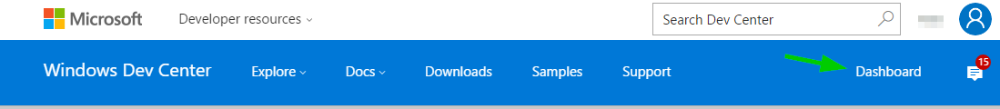
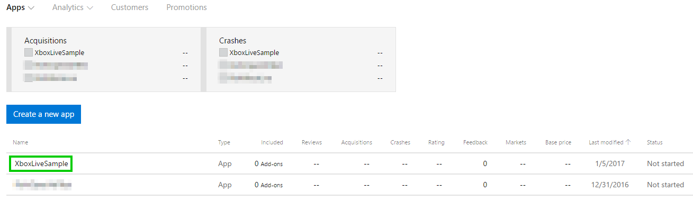
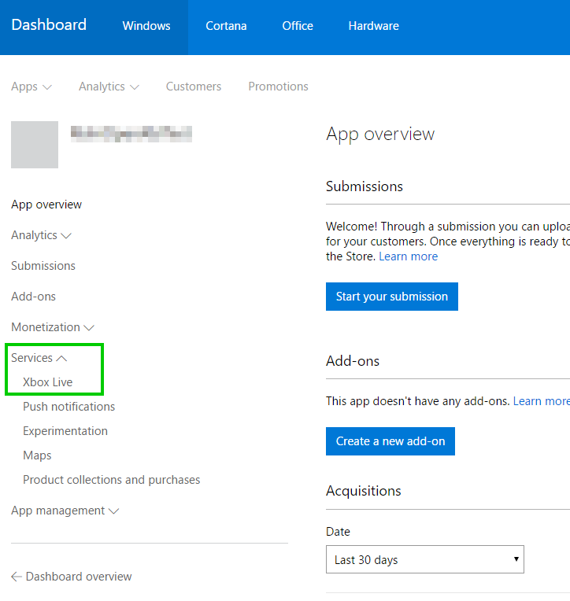

# Xbox Live Sandboxes Intro

In [Xbox Live Service Configuration](xbox-live-service-configuration.md), it was explained that you must configure information about your title online, usually on [Windows Dev Center](http://dev.windows.com).  This information includes things like the leaderboards your title wants to display, achievements that players can unlock, matchmaking configuration, etc.

When you make changes to your service configuration, these need to be published from Dev Center before the changes are picked up by the rest of Xbox Live and can be seen by your title.

You publish to what is called a development sandbox.  These allow you to work on changes to your title in an isolated environment.  These offer several benefits described in the below section.

By default, Xbox One Consoles and Windows 10 PCs are in the RETAIL sandbox.

## Benefits

Development sandboxes offer a few benefits:


1. You can iterate on changes to an update for your title without affecting the currently available version.
2. Some tools only work in a development sandbox for security reasons.
3. Some developers on your team may want to "branch" and test service config changes without affecting your primary in-development service configuration.
4. Other publishers cannot see what you are working on without being granted access to your sandbox.

You can also **optionally** create test accounts.  You can use these if you don't want to use your regular Xbox Live account for testing your title, or you need several accounts to test scenarios such as social interaction (eg: view a friend's stats) or multiplayer.

Test accounts can only sign-in to development sandboxes, and will be explained in a section below.

## Finding out about your Sandbox

The vast majority of developers need only one sandbox.  Fortunately a sandbox is created for you when you create a title.

1. You find out about your sandbox by going to the Dev Center dashboard here:


1. Then click on your title:


1. Finally click on Services->Xbox Live in the left menu


1. You can now see your sandbox listed as follows


## How your Sandbox impacts your workflow

Typically you work with sandboxes in the following ways:

1. (One-time) Switch your PC or Xbox One to your development sandbox.
2. (Many-times) As you make changes to your service configuration, you will publish changes to your development sandbox.  Service configuration changes are things such as defining achievements, adding leaderboards, or modifying a Multiplayer Session Template.
3. (A few times) If you are working with other team members, you can give them access to your sandbox
4. (One-time) If you need to test something in RETAIL, or want to take a break to play your favorite Xbox game, you will need to switch your sandbox back to RETAIL.

These scenarios will be described in more detail below.  The process has some differences on PC and Console, so there are separate sections for each.

## Switch your PC's development sandbox

If you want to switch your PC's development sandbox, the recommended way to do so is using Windows Device Portal (WDP).  You may also do so via the Command Line.  We will describe both ways.

### Windows Device Portal

If you have not already enabled WDP on your PC, please follow these instructions to do so. [Setup Device Portal on Windows Desktop](https://msdn.microsoft.com/en-us/windows/uwp/debug-test-perf/device-portal-desktop)

Once you have done so, open Windows Dev Portal by connecting to it in your web browser as described in the above article.

Then you click on "Xbox Live" to go the appropriate section as shown below.


Then you can enter your sandbox which you got via the steps in the *Finding Out Your Sandbox* and click "Change".

To switch back to RETAIL, you can enter RETAIL here.

### PowerShell module

[Xbox Live PowerShell Module](https://github.com/Microsoft/xbox-live-powershell-module/blob/master/docs/XboxLivePsModule.md)
XboxlivePSModule contains various utilities to help Xbox Live development including changing sandboxes on the PC or console.

* To consume it from [PowerShell Gallery](https://www.powershellgallery.com/packages/XboxlivePSModule), open a PowerShell window:
    1. Download and install the module: `Install-Module XboxlivePSModule -Scope CurrentUser`
    2. Start using by running `Import-Module XboxlivePSModule`
    3. Run cmdlets, i.e. Set-XblSandbox XDKS.1, or Get-XblSandbox

* To consume it from a zip file at [https://aka.ms/xboxliveuwptools](https://aka.ms/xboxliveuwptools), open a PowerShell window,
    1. Run `Import-Module <path to unzipped folder>\XboxLivePsModule\XboxLivePsModule.psd1`
    2. Run cmdlets, i.e. Set-XblSandbox XDKS.1, or Get-XblSandbox

### Command Prompt Script

Download the Xbox Live Tools Package at [https://aka.ms/xboxliveuwptools](https://aka.ms/xboxliveuwptools) and unzip.  You will find a SwitchSandbox.cmd batch file within.

Run this in Administrator mode to switch your sandbox.  The first argument is the sandbox.  For example if you are trying to switch to the XDKS.1 sandbox, you would do:

```
SwitchSandbox.cmd XDKS.1
```

To switch back to RETAIL, you simply provide that as the second argument.

```
SwitchSandbox.cmd RETAIL
```

## Switch your Xbox One console development sandbox

### Using Windows Dev Portal

You can use the Windows Dev Portal to change the sandbox on your console.  To do this, go to "Dev Home" on your console and enable it.

After that you can type in the IP address on the web browser on your PC to connect to your console.  You can then click on "Xbox Live" and enter the sandbox in the textbox there.

### Using Xbox One Manager

Xbox One Manager lets you administer certain aspects of your console from your PC.  This includes rebooting, managing installed apps, and changing your sandbox.

Right click on the console you want to change the sandbox for and go to "Settings..."

You can then enter a sandbox there.

### Using Xbox One console UI

If you want to change your development sandbox right from your console, you can go to "Settings".  Then go to "Developer Settings" and you will see an option to change your sandbox.

## Sandbox uses

### Data that is sandboxed
You can use the sandbox features to manage access between developers on your team during the development process.  For example, you may want to isolate data between your development team and testers.

Sandboxed data includes:
- Achievements, Leaderboards and Stats for a user.  Achievements accumulated for a user in one sandbox do not translate to another sandbox.
- Multiplayer and Matchmaking.  Users cannot play a multiplayer game with someone is a different sandbox.
- Service configuration.  If you add a new achievement to a title in one sandbox, it is not visible in a different sandbox.  This applies to all service configuration data.

Non-sandboxed data is predominantly social information.  So for example if a user follows another user, that relationship is sandbox agnostic.

### Examples
Some examples will be provided below to help illustrate some of the benefits of why you might want to use multiple sandboxes.

> **Note**: If you are in the Xbox Creators Program, you may only have one sandbox.  If you have need to create multiple sandboxes, please apply to the ID@Xbox program.

#### Service config isolation
As mentioned above, service configuration is sandbox specific.  So you might have a *Development* sandbox, and a *Testing* sandbox.  When you give a build of your title to your testers, you would publish your [service configuration](xbox-live-service-configuration.md) to the *Testing* sandbox.

Then in the meantime, you could add achievements, or different multiplayer session types to your *Development* sandbox without affecting the service configuration that your testers are seeing.

#### Multiplayer
Take the above example with a *Development* and *Testing* sandbox.  Maybe your service configuration is the same between sandboxes, but your developers are creating multiplayer features and want to testing matchmaking with each other.  Your testers are also testing multiplayer.

In a case like this, your developers might not want the Xbox Live Matchmaking service to match them with testers, because they are debugging issues separately.  A good way to prevent this would be for your developers to be in the *Development* sandbox and testers to be in a separate *Testing* sandbox.  This keeps both groups isolated.

## Advanced

To keep your development process simple, start off with your default sandbox and add new sandboxes judiciously.

Once you find your access control and data isolation needs growing, you can see [Advanced Xbox Live Sandboxes](advanced-xbox-live-sandboxes.md) article.  
