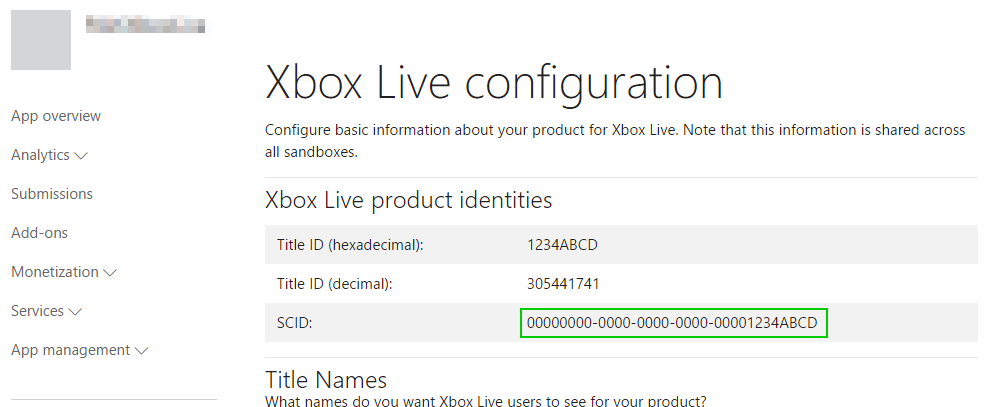
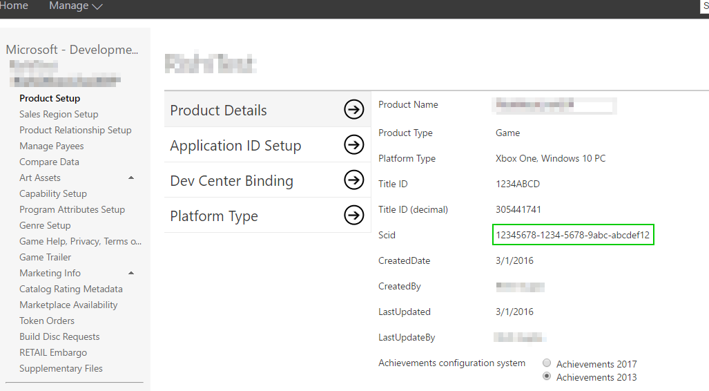

# Xbox Live service configuration

## What is Service Configuration?

You may be familiar with some of the Xbox Live features such as [Achievements](achievements-2017/achievements.md), [Leaderboards](leaderboards-and-stats-2017/leaderboards.md) and [Matchmaking](multiplayer/multiplayer-concepts.md#smartmatch-matchmaking).

In case you are not, we'll briefly explain Leaderboards as an example. Leaderboards allow players to see a value representing an accomplishment, in comparison to other players.  For example high scores in an arcade game, lap times in a racing game, or headshots in a first-person shooter. But unlike an arcade machine which only shows the top scores from the players who have played on that physical machine, with Xbox Live it is possible to display high scores from around the world.

But for this to happen, you need to perform some one-time configuration so that Xbox Live knows about your leaderboard. For example whether the values should be sorted in ascending or descending value, and what piece of data it should be sorting.

This configuration happens on [Dev Center](http://dev.windows.com) most of the time. But certain developers will use [Xbox Developer Portal (XDP)](http://xdp.xboxlive.com).

If you are a developing your title as part of the Xbox Live Creators Program, you use [Dev Center](http://dev.windows.com), and you can read [Getting Started With Xbox Live](get-started-with-creators/get-started-with-xbox-live-creators.md) to learn how to get set up.

If you are an ID@Xbox Developer or working with a publisher that is a Microsoft Partner, please read on.

## Choose your development portal

As mentioned above, there are two different portals that can be used to configure Xbox Live Services. Windows Dev Center at [http://dev.windows.com](http://dev.windows.com) and the Xbox Development Portal (XDP) at [http://xdp.xboxlive.com](http://xdp.xboxlive.com).

Windows Dev Center is recommended for all titles going forward, but for certain features, you may still want to use XDP. This section will help advise you where to configure your title.

If you already have a title configured, you can scroll down to [Get your IDs](#get_ids) to learn how to get the various identifiers required to setup your title.

### Xbox One XDK only
If you are developing a game using the Xbox One XDK, then you must use XDP to ingest, configure, and publish your game. Support for configuring XDK titles on Windows Dev Center will be coming soon.

### PC/Mobile UWP game only
Windows Dev Center is recommended for configuring and managing UWP games that run only on Windows 10 PCs and/or Windows 10 mobile devices.

#### Using XDP to configure UWP titles

You may want to use XDP to configure UWP titles if you have one of the following requirements:

1. You are using Arena.
2. You have existing users, groups, and permissions setup on XDP that you want to keep using.
3. You are using tools which only work on XDP such as the Tournaments Tool or Multiplayer Session Directory session history viewer.
4. You are developing a title that will have cross-platform play between an Xbox One XDK based game and UWP PC/mobile version of the same game.

If you don't fall into one of those categories, then you should use Windows Dev Center. Otherwise you can see below for how to use XDP to configure a UWP title.

Using XDP to configure Xbox Live Services for UWP applications has a few important caveats:

* **Once a game's Xbox Live service configuration is published to CERT/RETAIL in XDP, there is no going back!** The Xbox Live service configuration for that game needs to remain in XDP for the life of the game title.
* **There is no migration path from XDP to Windows Dev Center.** If you start your Xbox Live configuration in XDP, you must manually recreate it in Windows Dev Center if you want to move it.

Given these two considerations, we recommended using Windows Dev Center for PC/Mobile games, unless you fall into one of the categories described above.

### Cross-play between Xbox One and PC/Mobile games ###
Cross-device gaming between the Xbox One and the PC, known as cross-play, is a showcase Windows 10 experience. In this scenario, both the Xbox One and PC versions of a game share the same Xbox Live configuration.

This scenario also covers the case where you have an existing Xbox One XDK game, and want to add cross-play support for a UWP version of your game.

In order to implement cross-play, do the following:

* **Use XDP to configure and publish your XDK game.** The Windows Dev Center does not support Xbox One XDK games at this time.
* **Use a single Xbox Live service configuration that you created in XDP for both the XDK and the UWP versions of a game.** XDP now has new features that allow a game to share a single Xbox Live service configuration between the XDK version and the UWP version of a game.
* **Use the Windows Dev Center to ingest and publish your UWP game.** However, do not use the Windows Dev Center to configure Xbox Live services, as your game will use the service configuration that you created in XDP.
* **Do not split Xbox Live service configuration between XDP and the Windows Dev Center.** XDP and the Windows Dev Center are not aware of each other, and publishing a service configuration from one source overwrites the configuration published from the other source. This could cause user data to be lost (missing achievements, erased game saves, etc.) which can create a bad user experience. For this reason, **we require that 100% of Xbox Live service configuration is done in XDP for cross-play XDK + UWP games.**

There's more detail on this process, including items which are *not* self-service in the [Getting started with cross-play games](get-started-with-partner/get-started-with-cross-play-games.md) guide

### Separate versions of Xbox One and PC/Mobile games that are not cross-play
You may decide to keep your Xbox One version of a game separate from the PC/Mobile version of the same game. In this case, you create two separate products, and follow the guidance for Xbox One XDK only and PC/Mobile UWP game only respectively.

You cannot use the same service configuration for both versions in this case, and you must manually create the service configuration for each separate version of your game, either in XDP or in the Windows Dev Center appropriately.

## Get your IDs

To enable Xbox Live services, you will need to obtain several IDs to configure your development kit and your title. These can be obtained by doing Xbox Live service configuration.

If you do not currently have a title in XDP or Dev Center, see the above section [Xbox Live Service Configuration portals](#xbox_live_portals) for guidance.

### Critical IDs

There are three IDs which are critical for development of titles and applications for Xbox One: the sandbox ID, the Title ID, and the SCID.

While it is necessary to have a sandbox ID to use a development kit, the Title ID and SCID are not required for initial development but are required for any use of Xbox Live services. We therefore recommend that you obtain all three at once.

#### Sandbox IDs

The sandbox provides content isolation for your development kit during development, ensuring that you have a clean environment for developing and testing your title. The Sandbox ID identifies your sandbox. A console may only access one sandbox at any one time, though one sandbox may be accessed by multiple consoles.

Sandbox IDs are case sensitive.

**Dev Center**

If you are configuring your title on Dev Center, you get your Sandbox ID on the "Xbox Live" root configuration page as shown below:

**XDP**

If you are configuring your title on XDP, you get your Sandbox ID on the the overview page for your product as shown below:

#### Service Configuration ID (SCID)

As a part of development, you will create events, achievements, and a host of other online features. These are all part of your service configuration, and require the SCID for access.

SCIDs are case sensitive.

**Dev Center**

To retrieve your SCID on Dev Center, navigate to the Xbox Live Services section and go to *Xbox Live Setup* . Your SCID is displayed in the table shown below:

**XDP**

To retrieve your SCID on XDP, navigate to the "Product Setup" section under your title and you will see both the Title ID and SCID.

#### Title ID

The Title ID uniquely identifies your title to Xbox Live services. It is used throughout the services to enable your users to access your title's Live content, their user statistics, achievements, and so forth, and to enable Live multiplayer functionality.

Title IDs can be case sensitive, depending on how and where they are used.

**Dev Center**

Your Title ID on Dev Center is found in the same table as the SCID in the *Xbox Live Setup* page.

**XDP**

Your Title ID on XDP is obtained from the same location as the SCID is.

