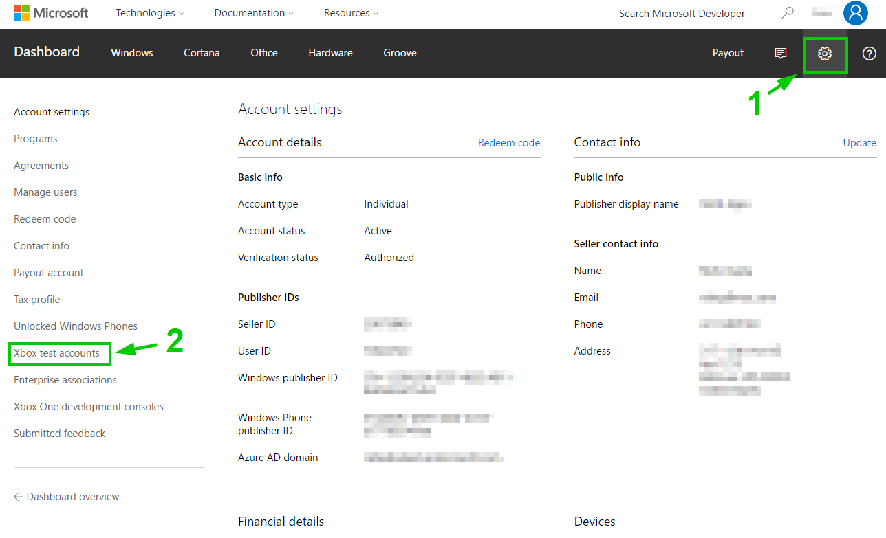
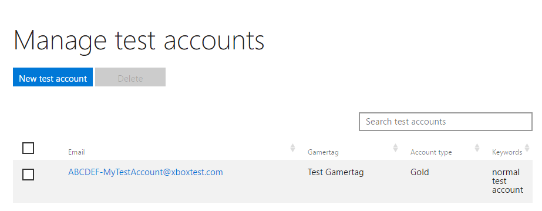
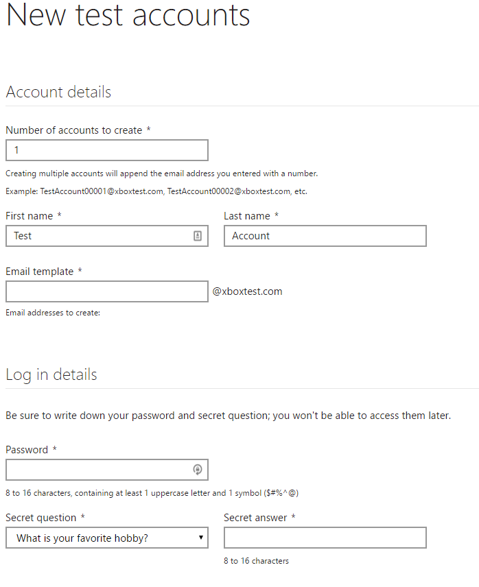

# Xbox Live test accounts

When testing functionality in your title during development, it can be helpful to create additional Xbox Live accounts.  For example, you might want a fresh account with no achievements.  Or you might want to make several accounts and make them friends of each other for testing Social scenarios.

It can be time consuming to create multiple Microsoft Accounts (MSA) so an easy way to create many test accounts at once is provided.

Test accounts have some other benefits also.  They can sign into your *Development Sandbox*, whereas a regular MSA cannot due to security restrictions.  If you don't know what a *Development Sandbox* is, then please see [Xbox Live Sandboxes](xbox-live-sandboxes.md)

## Types of test accounts

There are two options of test accounts.  Regular MSAs that are provisioned to work in your Development Sandbox, or test accounts that only work in a development sandbox.

If you are developing a title with the Creators Program, you may only use Regular MSAs that are provisioned for your Development Sandbox.

Below we will discuss how to create both types.

## Provisioning Regular MSAs

If you have a pre-existing Xbox Live Account, a good starting point would be to provision it for use with your Development Sandbox.

If you do not have an existing Xbox Live Account or require additional MSAs, you can create some at [https://account.microsoft.com/account](https://account.microsoft.com/account).

## Creating Test Accounts

If you are an ID@Xbox developer, then you may also create test accounts exclusively for use in your development sandboxes.  You can also create multiple test accounts at once.

To go to the Test Account management page on Dev Center.
1. Go to the Dev Center dashboard
2. Click on the gear icon at the top right to go to account Settings
3. Click on "Test Accounts".

See below for a screenshot showing where to find this

Once you click on "Test Accounts", you will see a summary of any existing test accounts if you have any.  You also have the option to create new test accounts.

You can click on "New Test Account" and you will be presented with a form you can use to create test accounts.

Any test accounts you create will be prefixed with the name of your development sandbox, and will automatically have access to your development sandbox.
